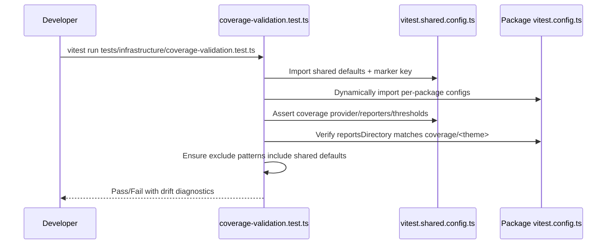
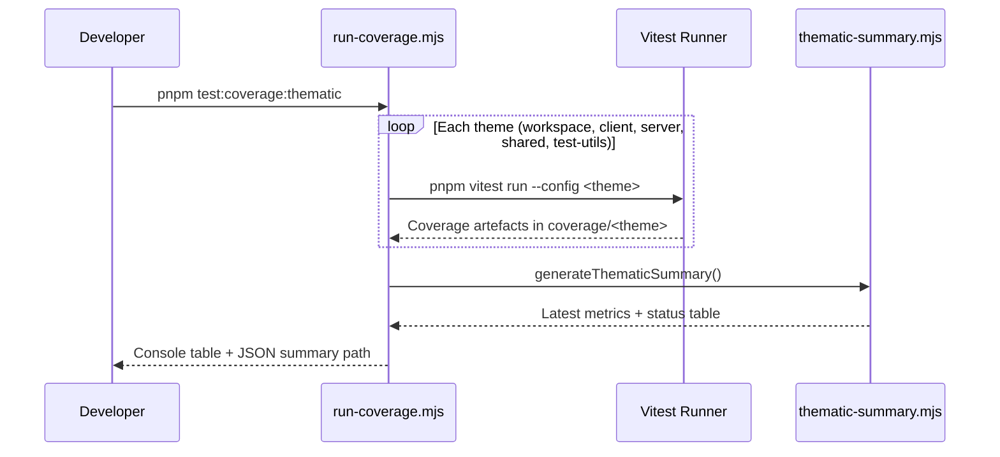
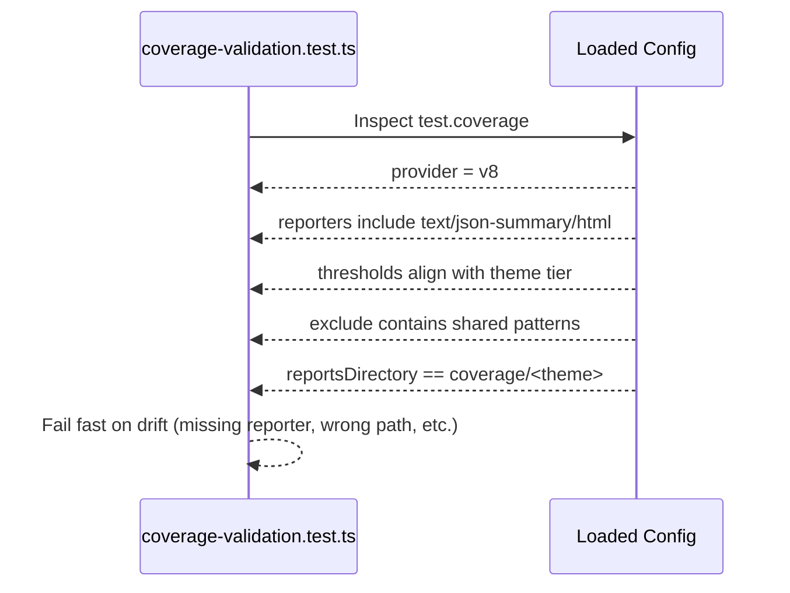

# Coverage System Guide

This guide documents the CritGenius Listener Vitest coverage system, including the shared
configuration, thematic directory layout, orchestration commands, and validation guarantees.

## System Overview

- Coverage provider is pinned to V8 via `@vitest/coverage-v8`.
- Tiered minimum thresholds: workspace/test-utils 30%, client/server 50%, shared 75%.
- Reporters are `text`, `json-summary`, and `html` for every run.
- Shared config enforces consistent exclude patterns (fixtures, mocks, build outputs, config files).
- All Vitest projects opt in via `createVitestConfig()` and `assertUsesSharedConfig()`.
- Thematic reports write to `coverage/<theme>` and an aggregate workspace report sits at
  `coverage/workspace`.

## Thematic Directory Layout

```
coverage/
├── workspace/              # Aggregate workspace report
├── client/                 # @critgenius/client coverage
├── server/                 # @critgenius/server coverage
├── shared/                 # @critgenius/shared coverage
├── test-utils/             # @critgenius/test-utils coverage
└── thematic-summary.json   # Consolidated metrics snapshot
```

Each directory contains `index.html`, `coverage-summary.json`, and provider-specific artefacts.
`thematic-summary.json` captures the latest percentages, coverage status (pass/fail/missing), and
threshold expectations for CI auditing.

## Orchestration Commands

Run from the repository root:

| Command                         | Purpose                                                   |
| ------------------------------- | --------------------------------------------------------- |
| `pnpm test:coverage:workspace`  | Workspace aggregate coverage using `vitest.config.ts`.    |
| `pnpm test:coverage:client`     | Theme-only run for `@critgenius/client`.                  |
| `pnpm test:coverage:server`     | Theme-only run for `@critgenius/server`.                  |
| `pnpm test:coverage:shared`     | Theme-only run for `@critgenius/shared`.                  |
| `pnpm test:coverage:test-utils` | Theme-only run for `@critgenius/test-utils`.              |
| `pnpm test:coverage:thematic`   | Sequentially runs all themes plus workspace.              |
| `pnpm test:coverage:summary`    | Regenerates `thematic-summary.json` and prints the table. |

The orchestrator lives at `scripts/coverage/run-coverage.mjs` and always refreshes the thematic
summary after execution.

## Configuration Verification Workflow



## Thematic Coverage Orchestration



## Validation Test Assertions



## CI/CD Enforcement Strategy

- Coverage runs inside dedicated CI workflows (pre-merge) instead of pre-commit hooks.
- Fast local commits are preserved; developers opt in to coverage runs when appropriate.
- Required status checks gate merges, using `thematic-summary.json` plus HTML artefacts for review.
- Summary table exposes missing reports (e.g., skipped package) and threshold regressions.

## Interpreting Results

1. Run `pnpm test:coverage:thematic` or a targeted command.
2. Open `coverage/<theme>/index.html` for visual drill-down.
3. Review terminal table or `coverage/thematic-summary.json` for quick comparisons.
4. Investigate failing themes—CI will block merges until thresholds recover.

## Troubleshooting

| Symptom                                     | Resolution                                                                        |
| ------------------------------------------- | --------------------------------------------------------------------------------- |
| `provider` missing in summary               | Ensure package config imports `createVitestConfig()` (validation test will fail). |
| Coverage written to package-local directory | Update `coverageOverrides.reportsDirectory` for that package.                     |
| Missing HTML report                         | Verify reporters include `html`; run validation test for drift.                   |
| Summary shows `missing`                     | Theme coverage was not run; rerun specific command or full thematic suite.        |
| Threshold regression                        | Expand tests in the failing theme, then rerun coverage and regenerate summary.    |

## Related Artifacts

- Shared configuration: `vitest.shared.config.ts`
- Orchestration scripts: `scripts/coverage/run-coverage.mjs`, `scripts/coverage/print-summary.mjs`
- Thematic summary generator: `scripts/coverage/thematic-summary.mjs`
- Validation test: `tests/infrastructure/coverage-validation.test.ts`
- Threshold tiers: `tests/infrastructure/coverage-thresholds.test.ts`
- CI integration: add coverage job referencing `pnpm test:coverage:thematic`
