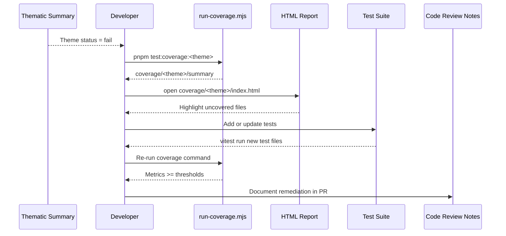
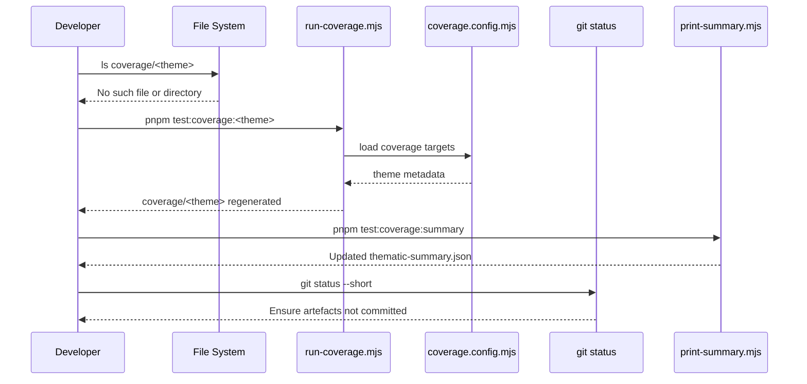
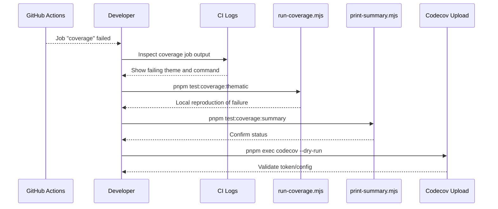
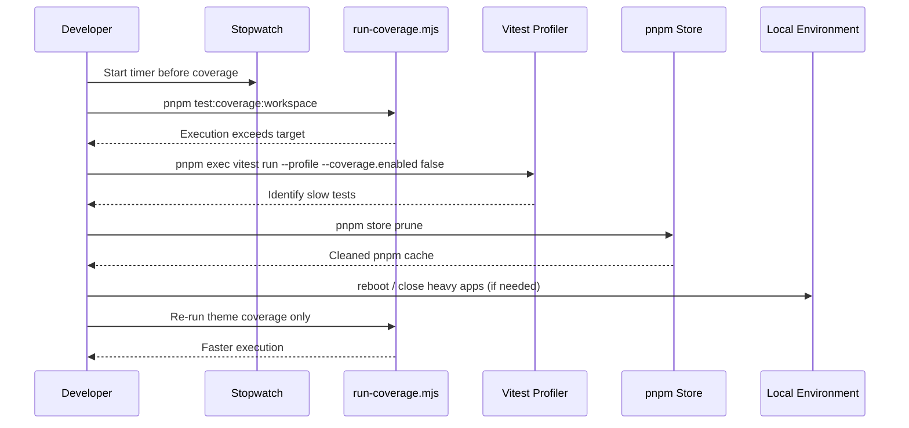

# Coverage Troubleshooting Guide

**Version:** 1.0.0  
**Last Updated:** 2025-10-17  
**Audience:** Developers triaging coverage failures in CritGenius Listener  
**Status:** Draft (developer preview)

> Start with `docs/coverage-workflow-guide.md` for routine workflows. When thresholds fail or
> reports go missing, use this guide to diagnose and recover quickly.

---

## Table of Contents

1. [How to Use This Guide](#1-how-to-use-this-guide)
2. [Diagnostic Toolkit](#2-diagnostic-toolkit)
3. [Scenario Playbooks](#3-scenario-playbooks)
   - [3.1 Threshold Failure](#31-threshold-failure)
   - [3.2 Missing Coverage Artefacts](#32-missing-coverage-artefacts)
   - [3.3 CI Coverage Failure](#33-ci-coverage-failure)
   - [3.4 Slow Coverage Execution](#34-slow-coverage-execution)
4. [Reference Tables](#4-reference-tables)
5. [Related Documentation](#5-related-documentation)

---

## 1. How to Use This Guide

- Start with the scenario that best describes the observed symptom (e.g., failed CI step).
- Follow the sequence diagram to reproduce and isolate the issue locally.
- Capture root cause and prevention strategies in the team retro doc when resolved.
- For unlisted symptoms, append a new playbook referencing this structure.

## 2. Diagnostic Toolkit

| Purpose                         | Command                                                |
| ------------------------------- | ------------------------------------------------------ |
| Remove stale artefacts          | `rimraf coverage`                                      |
| Run targeted theme coverage     | `pnpm test:coverage:<theme>`                           |
| Regenerate summary table        | `pnpm test:coverage:summary`                           |
| Inspect coverage thresholds     | `node scripts/coverage/print-summary.mjs --thresholds` |
| Validate coverage orchestration | `pnpm validate:coverage-orchestration`                 |
| Open HTML report                | `pnpm exec open-cli coverage/<theme>/index.html`       |
| List coverage directories       | `ls coverage`                                          |

## 3. Scenario Playbooks

### 3.1 Threshold Failure

**Symptom:** `pnpm test:coverage:summary` marks a theme as `fail` or `<missing>`.

- **Root Causes:** new code without tests, defensive branches lacking assertions, deleted tests.
- **Fix:** write targeted tests, ensure guard branches are exercised, rerun theme coverage, then
  regenerate summary.
- **Prevention:** add coverage step to personal checklist before staging.

### 3.2 Missing Coverage Artefacts

**Symptom:** `coverage/<theme>/index.html` does not exist or HTML report is blank.

- **Root Causes:** manual deletion, `pnpm run clean`, permission issues on Windows, or reports
  moved.
- **Fix:** rerun relevant coverage command, ensure `coverage/` remains in `.gitignore`, avoid
  copying reports outside the directory.
- **Prevention:** never move reports manually; always use commands in the quick reference.

### 3.3 CI Coverage Failure

**Symptom:** GitHub Actions `coverage` job fails even though local runs appear green.

- **Root Causes:** failing theme not run locally, differences in env vars, stale cache on CI.
- **Fix:** rerun `pnpm test:coverage:thematic` locally, ensure `scripts/coverage/run-coverage.mjs`
  matches repository state, re-run CI after pushing fixes.
- **Prevention:** include coverage status in PR description, avoid forcing green by editing summary
  manually.

### 3.4 Slow Coverage Execution

**Symptom:** Workspace coverage takes longer than 5 minutes or stalls.

- **Root Causes:** new integration tests without proper mocking, insufficient hardware resources,
  Node watchers running concurrently.
- **Fix:** profile slow tests, limit concurrency, offload heavy integration suites to targeted runs.
- **Prevention:** use thematic coverage during iteration; run workspace coverage when idle.

## 4. Reference Tables

### Common Error Messages

| Message                             | Interpretation                            | Resolution                                                                            |
| ----------------------------------- | ----------------------------------------- | ------------------------------------------------------------------------------------- |
| `Error: coverage provider mismatch` | Local config drifted from shared defaults | Run `pnpm test:coverage:summary`; ensure `vitest.config.ts` uses `createVitestConfig` |
| `spawn ENOENT coverage`             | Node cannot locate `run-coverage.mjs`     | Confirm working directory is repo root; rerun `pnpm install`                          |
| `Coverage summary file missing`     | Summary generator cannot read JSON        | Delete `coverage/thematic-summary.json` and regenerate                                |
| `Codecov upload failed`             | Missing `CODECOV_TOKEN` or network issue  | Retry with `pnpm exec codecov --dry-run` locally                                      |

### Prevention Checklist

- [ ] Run theme coverage before opening PR
- [ ] Attach HTML report screenshot when coverage barely meets thresholds
- [ ] Keep coverage scripts untouched unless updating infrastructure tests
- [ ] Document new troubleshooting scenarios in this guide
- [ ] Avoid committing coverage artefacts (`.gitignore` already excludes them)

## 5. Related Documentation

- `docs/coverage-workflow-guide.md` — daily routines and quick start workflows
- `docs/coverage-system-guide.md` — coverage architecture, thresholds, orchestration
- `docs/developer-onboarding.md` — onboarding tasks including coverage expectations
- `docs/comprehensive-testing-guide.md` — testing philosophy and metrics
- `tests/infrastructure/coverage-documentation.test.ts` — automated validation of these docs
