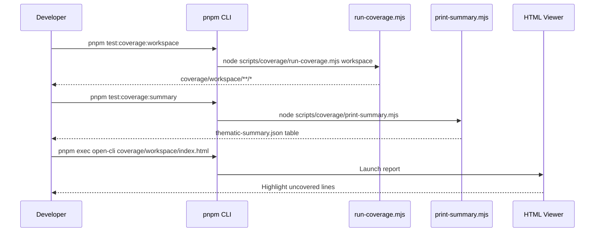
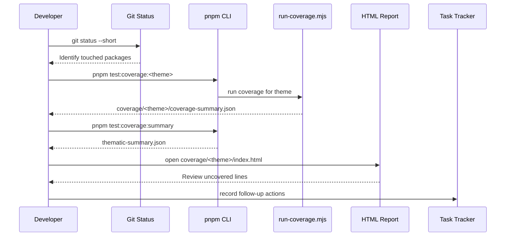
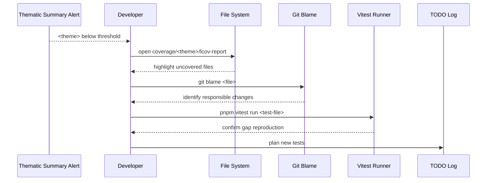
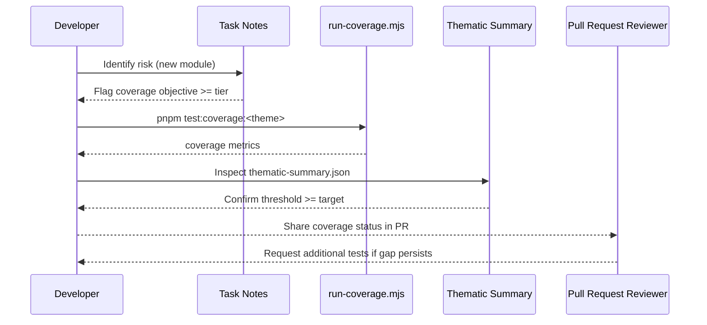
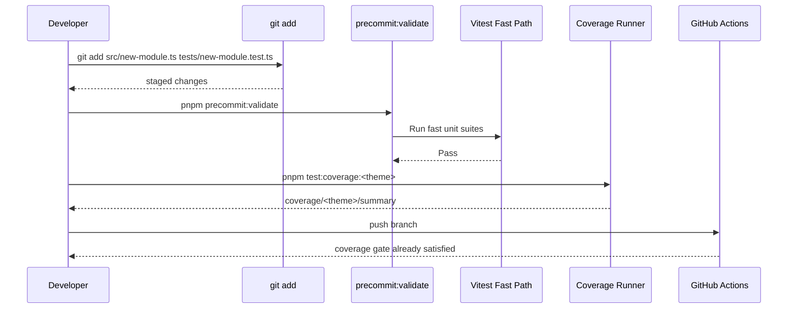
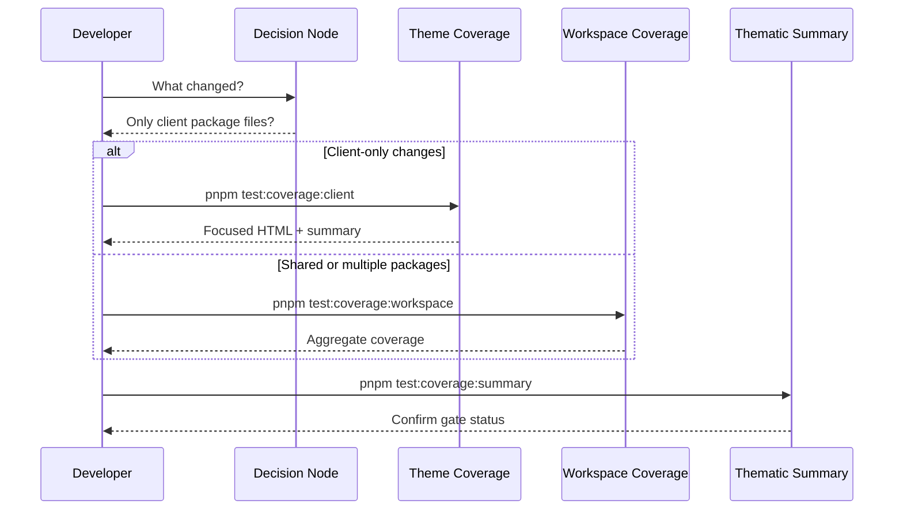
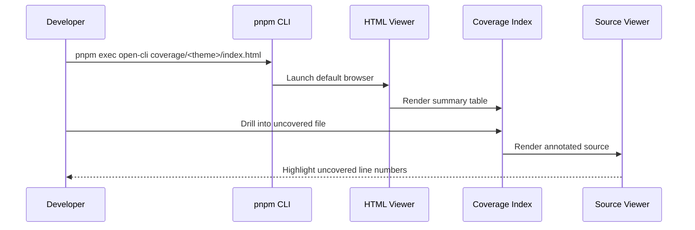

# Coverage Workflow Guide

**Version:** 1.0.0  
**Last Updated:** 2025-10-17  
**Audience:** CritGenius Listener developers building and validating code coverage  
**Status:** Draft (developer preview)

> This guide connects the shared coverage architecture to daily developer workflows. Pair it with
> `docs/coverage-system-guide.md` for deep configuration details and
> `docs/coverage-troubleshooting.md` when issues arise.

---

## Table of Contents

1. [Purpose & Goals](#1-purpose--goals)
2. [Five-Minute Quick Start](#2-five-minute-quick-start)
3. [Daily Development Workflow](#3-daily-development-workflow)
4. [Investigating Coverage Gaps](#4-investigating-coverage-gaps)
5. [Meeting Threshold Requirements](#5-meeting-threshold-requirements)
6. [Pre-commit Coverage Safeguards](#6-pre-commit-coverage-safeguards)
7. [Thematic vs Workspace Coverage](#7-thematic-vs-workspace-coverage)
8. [HTML Report Navigation](#8-html-report-navigation)
9. [Practical Examples](#9-practical-examples)
10. [Common Scenarios & Solutions](#10-common-scenarios--solutions)
11. [Quick Reference](#11-quick-reference)
12. [Related Documentation](#12-related-documentation)

---

## 1. Purpose & Goals

- Provide a repeatable coverage workflow that keeps thresholds ≥ required tier values.
- Highlight commands that work on macOS, Linux, and Windows (Git Bash).
- Show when to run workspace vs thematic coverage to conserve time.
- Document artefacts (`coverage/<theme>/*`, `coverage/thematic-summary.json`) and how to interpret
  them.
- Call out recovery paths before CI fails.

## 2. Five-Minute Quick Start

1. Install dependencies: `pnpm install`
2. Generate shared coverage once: `pnpm test:coverage:workspace`
3. Inspect the thematic summary: `pnpm test:coverage:summary`
4. Open the HTML report: `pnpm exec open-cli coverage/workspace/index.html`
5. Capture TODOs for uncovered lines before coding deeper



## 3. Daily Development Workflow



**Checklist:**

- Pick the narrowest theme matching the packages you touched.
- Run workspace coverage once per day (or before PR) to validate aggregate thresholds.
- Keep `thematic-summary.json` in version control; do not delete between runs.
- Annotate TODOs inline with `// coverage-ignore` only after reviewer approval.

## 4. Investigating Coverage Gaps

Use this process when `thematic-summary.json` marks a target as below threshold or missing.



**Guidance:**

- Prefer 1-2 targeted unit tests before writing integration tests.
- Use `pnpm exec vitest run path/to/file.test.ts --coverage.enabled false` to debug exclusive lines.
- Update `tests/infrastructure/coverage-validation.test.ts` only when thresholds or directories
  change.

## 5. Meeting Threshold Requirements



**Threshold Targets:**

| Theme                    | Statement | Branch | Function | Line |
| ------------------------ | --------- | ------ | -------- | ---- |
| `workspace`              | 30% min   | 30%    | 30%      | 30%  |
| `@critgenius/client`     | 50%       | 50%    | 50%      | 50%  |
| `@critgenius/server`     | 50%       | 50%    | 50%      | 50%  |
| `@critgenius/shared`     | 75%       | 75%    | 75%      | 75%  |
| `@critgenius/test-utils` | 30%       | 30%    | 30%      | 30%  |

Values originate from `config/coverage.config.mjs`. Update the config and infrastructure tests when
thresholds evolve.

## 6. Pre-commit Coverage Safeguards

Pre-commit validation (`pnpm precommit:validate`) does not run full coverage but ensures targeted
unit suites stay green. Run thematic coverage before staging large changes to avoid CI surprises.



**Recommendation:** Configure your editor task runner to execute `pnpm test:coverage:<theme>` before
pushing a branch that modifies business logic.

## 7. Thematic vs Workspace Coverage

Use the decision tree below to pick the fastest command.



**Time Savers:**

- Theme coverage completes 30-40% faster than workspace coverage.
- Always regenerate the summary after any run to keep metrics fresh.
- If multiple themes changed, run `pnpm test:coverage:thematic` (sequential). Use when preparing
  PRs.

## 8. HTML Report Navigation



**Tips:**

- Use keyboard shortcuts (`j`/`k`) in the HTML report to jump between uncovered lines.
- Toggle the _Show only uncovered_ switch to focus on gaps.
- Export PDF snapshots for PR evidence when coverage is tight.

## 9. Practical Examples

### Run coverage for a single package

```bash
pnpm test:coverage:server
```

### Filter tests to isolate a coverage hole

```bash
pnpm exec vitest run packages/server/src/session/session-manager.test.ts --coverage.enabled false
```

### Load summary metrics programmatically

```typescript
import { readFileSync } from 'node:fs';
import { resolve } from 'node:path';

const summaryPath = resolve(process.cwd(), 'coverage', 'thematic-summary.json');
const summary = JSON.parse(readFileSync(summaryPath, 'utf8')) as {
  themes: Record<string, { statement: number; status: string }>;
};

for (const [theme, metrics] of Object.entries(summary.themes)) {
  if (metrics.status !== 'pass') {
    console.info(`[coverage] ${theme} requires attention`);
  }
}
```

### Debug uncovered lines with inline logging

```bash
pnpm exec vitest run packages/shared/src/transcript/normalizer.test.ts --runInBand --coverage.enabled false
```

## 10. Common Scenarios & Solutions

| Scenario                                | Diagnosis                                   | Action                                                        |
| --------------------------------------- | ------------------------------------------- | ------------------------------------------------------------- |
| Coverage dropped below 90% for `shared` | New module missing tests                    | Add unit tests; re-run `pnpm test:coverage:shared`            |
| Summary shows files you did not touch   | Stale artefacts in `coverage/`              | Remove directory (`rimraf coverage`) then rerun coverage      |
| Unsure which coverage command to run    | Multiple packages changed                   | Run `pnpm test:coverage:thematic` for full sweep              |
| Coverage is slow                        | Running workspace coverage during iteration | Switch to thematic coverage; run workspace nightly            |
| HTML report missing                     | Browser blocked local file                  | Use `pnpm exec http-server coverage/<theme>` to serve locally |

## 11. Quick Reference

| Purpose                      | Command                         |
| ---------------------------- | ------------------------------- |
| Workspace coverage           | `pnpm test:coverage:workspace`  |
| Sequential thematic coverage | `pnpm test:coverage:thematic`   |
| Client coverage              | `pnpm test:coverage:client`     |
| Server coverage              | `pnpm test:coverage:server`     |
| Shared coverage              | `pnpm test:coverage:shared`     |
| Test-utils coverage          | `pnpm test:coverage:test-utils` |
| Summary table                | `pnpm test:coverage:summary`    |
| Clean coverage artefacts     | `pnpm run clean`                |

## 12. Related Documentation

- `docs/coverage-system-guide.md` — architecture, thresholds, and orchestration internals
- `docs/coverage-troubleshooting.md` — deep troubleshooting playbooks
- `docs/developer-onboarding.md` — onboarding checklist including coverage expectations
- `docs/comprehensive-testing-guide.md` — testing philosophy and coverage relationship
- `tests/infrastructure/coverage-documentation.test.ts` — validation suite for this guide
