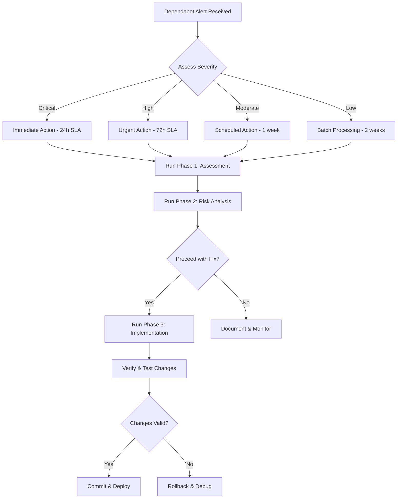

# GitHub Dependabot Alert Validation Quick Start

**Source**: Extracted from `docs/dependabot-guide.md` (Version 2.1)

**Version**: 2.1  
**Optimized for**: AI-driven dependency management  
**Priority Order**: Reliability → Maintainability → Scalability  
**Last Updated**: 2025-10-20

---

## Quick Start for AI Assistants

### AI Decision Framework



### Execution Command Sequence

```bash
# 1. Assessment
pnpm audit --json > audit-report.json
pnpm list [package-name] --json > dependency-tree.json

# 2. Implementation
pnpm add -D [package]@[version]  # or use override

# 3. Validation
pnpm install && pnpm build && pnpm test

# 4. Deployment
git add . && git commit -m "fix(security): ..." && git push
```

---

## Overview and Objectives

### Purpose

This guide provides a systematic, AI-optimized approach to validating and implementing GitHub
Dependabot security alerts with emphasis on:

1. **Reliability**: Ensuring changes don't break existing functionality
2. **Maintainability**: Creating sustainable, well-documented fixes
3. **Scalability**: Establishing reusable patterns for future alerts

### Real-World Example

Throughout this guide, we reference: **Vite CVE allowing `server.fs.deny` bypass via backslash on
Windows**

- **Alert**: https://github.com/jonahkeegan/critgenius-listener/security/dependabot/8
- **Package**: vite (npm)
- **Affected Version**: 5.4.20
- **Patched Version**: 5.4.21+
- **Severity**: Moderate (CVSS 5.3)
- **Type**: Transitive dev dependency

### AI Assistant Guidelines

**Critical Rules for AI Execution:**

1. ✅ **Always validate before proceeding**: Check success of each step
2. ✅ **Document decisions**: Record why choices were made
3. ✅ **Test comprehensively**: Run build and test suite after changes
4. ✅ **Plan rollback**: Have reversion strategy ready
5. ✅ **Communicate clearly**: Report status at each phase

---

## Summary of the Full Playbook

### Phase 1: Alert Assessment

- Retrieve and analyze alert details
- Verify current installation
- Research vulnerability specifics
- Document findings

### Phase 2: Risk Analysis

- Calculate quantified risk score
- Evaluate update complexity
- Plan rollback strategy
- Make go/no-go decision

### Phase 3: Implementation

- Select optimal update method
- Execute implementation
- Verify changes
- Create documented commit

---

## Key Principles

**Reliability** (Primary Priority):

- ✅ Comprehensive risk assessment before changes
- ✅ Rollback planning and trigger conditions
- ✅ Multi-step verification process
- ✅ Error handling at each phase

**Maintainability** (Secondary Priority):

- ✅ Override removal planning
- ✅ Clear documentation templates
- ✅ Cleanup procedures defined
- ✅ Knowledge capture for future reference

**Scalability** (Tertiary Priority):

- ✅ Reusable TypeScript interfaces
- ✅ Template-based workflows
- ✅ Automation-ready commands
- ✅ AI-optimized decision points

---

## Next Steps Checklist

After completing the implementation:

1. **Create Pull Request** using the PR template
2. **Request Code Review** from team members
3. **Monitor CI/CD Pipeline** for automated checks
4. **Deploy to Staging** (if applicable) for validation
5. **Deploy to Production** after approval
6. **Monitor Post-Deployment** for any issues
7. **Close Dependabot Alert** once merged

---

## Additional Resources

- **GitHub Dependabot Documentation**: https://docs.github.com/en/code-security/dependabot
- **pnpm Overrides**: https://pnpm.io/package_json#pnpmoverrides
- **npm Overrides**: https://docs.npmjs.com/cli/v9/configuring-npm/package-json#overrides
- **CVSS Calculator**: https://www.first.org/cvss/calculator/
- **GitHub Advisory Database**: https://github.com/advisories
- **Snyk Vulnerability Database**: https://security.snyk.io/

---

## Related Documentation

- [Dependabot Alert Assessment Playbook](./dependabot-guide-alert-assessment.md)
- [Dependabot Risk Analysis Framework](./dependabot-guide-risk-analysis.md)
- [Dependabot Implementation Strategy Guide](./dependabot-guide-implementation.md)

---

**Maintained By**: Development Team  
**Review Cycle**: As needed for major updates
