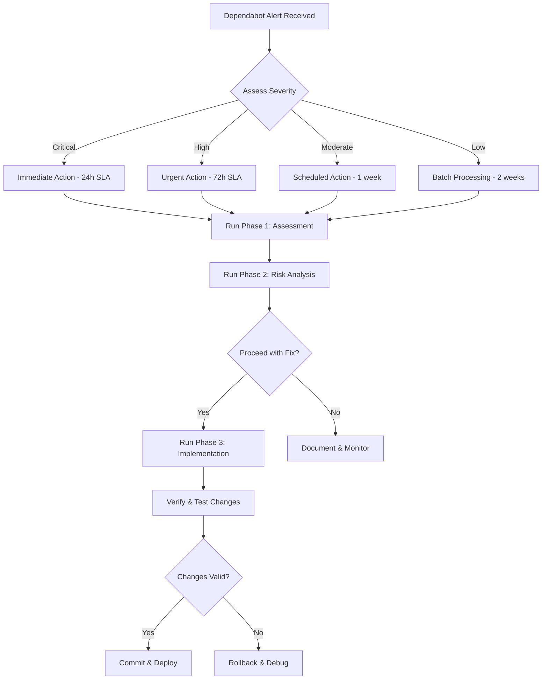

# GitHub Dependabot Alert Validation Guide for AI Coding Assistants

**Version**: 2.1  
**Optimized for**: AI-driven dependency management  
**Priority Order**: Reliability → Maintainability → Scalability  
**Last Updated**: 2025-10-20

---

## Table of Contents

1. [Quick Start for AI Assistants](#quick-start-for-ai-assistants)
2. [Overview and Objectives](#overview-and-objectives)
3. [Phase 1: Alert Assessment](#phase-1-alert-assessment)
4. [Phase 2: Risk Analysis](#phase-2-risk-analysis)
5. [Phase 3: Implementation Strategy](#phase-3-implementation-strategy)

---

## Quick Start for AI Assistants

### AI Decision Framework



### Execution Command Sequence

```bash
# 1. Assessment
pnpm audit --json > audit-report.json
pnpm list [package-name] --json > dependency-tree.json

# 2. Implementation
pnpm add -D [package]@[version]  # or use override

# 3. Validation
pnpm install && pnpm build && pnpm test

# 4. Deployment
git add . && git commit -m "fix(security): ..." && git push
```

---

## Overview and Objectives

### Purpose

This guide provides a systematic, AI-optimized approach to validating and implementing GitHub
Dependabot security alerts with emphasis on:

1. **Reliability**: Ensuring changes don't break existing functionality
2. **Maintainability**: Creating sustainable, well-documented fixes
3. **Scalability**: Establishing reusable patterns for future alerts

### Real-World Example

Throughout this guide, we reference: **Vite CVE allowing `server.fs.deny` bypass via backslash on
Windows**

- **Alert**: https://github.com/jonahkeegan/critgenius-listener/security/dependabot/8
- **Package**: vite (npm)
- **Affected Version**: 5.4.20
- **Patched Version**: 5.4.21+
- **Severity**: Moderate (CVSS 5.3)
- **Type**: Transitive dev dependency

### AI Assistant Guidelines

**Critical Rules for AI Execution:**

1. ✅ **Always validate before proceeding**: Check success of each step
2. ✅ **Document decisions**: Record why choices were made
3. ✅ **Test comprehensively**: Run build and test suite after changes
4. ✅ **Plan rollback**: Have reversion strategy ready
5. ✅ **Communicate clearly**: Report status at each phase

---

## Phase 1: Alert Assessment

### Workflow Overview

```sequenceDiagram
participant AI as AI Assistant
participant Alert as Dependabot Alert
participant PackageMgr as Package Manager
participant Analyzer as Analysis Engine
participant DocStore as Documentation

AI->>Alert: Retrieve alert metadata
Alert-->>AI: Return CVE, GHSA, severity, EPSS
AI->>PackageMgr: Query current package version
PackageMgr-->>AI: Return version info
AI->>PackageMgr: Get dependency tree
PackageMgr-->>AI: Return full dependency chain
AI->>Analyzer: Analyze impact scope
Analyzer->>Analyzer: Assess dependency type
Analyzer->>Analyzer: Check production exposure
Analyzer->>Analyzer: Evaluate exploitability
Analyzer-->>AI: Return impact assessment
AI->>DocStore: Record alert analysis
DocStore-->>AI: Confirm documentation
AI->>AI: Calculate priority score
AI->>AI: Determine action timeline
```

### Step 1.1: Retrieve Alert Details

**Objective**: Gather comprehensive information about the security vulnerability.

**AI Execution Instructions:**

```bash
# Retrieve alert via GitHub CLI
gh api repos/:owner/:repo/dependabot/alerts/[alert-number] > alert-details.json

# Extract key information
jq '.security_advisory | {ghsa_id, cve_id, severity, summary, description}' alert-details.json
jq '.security_vulnerability | {package, vulnerable_version_range, first_patched_version}' alert-details.json
```

**Information to Extract:**

| Field                      | Description                 | Example Value       |
| -------------------------- | --------------------------- | ------------------- |
| `ghsa_id`                  | GitHub Security Advisory ID | GHSA-xxxx-xxxx-xxxx |
| `cve_id`                   | Common Vulnerabilities ID   | CVE-2025-xxxxx      |
| `severity`                 | Alert severity level        | moderate            |
| `cvss_score`               | CVSS base score             | 5.3                 |
| `epss_score`               | Exploit probability         | 0.04%               |
| `package.name`             | Affected package            | vite                |
| `vulnerable_version_range` | Affected versions           | >=5.2.6, <=5.4.20   |
| `first_patched_version`    | Minimum safe version        | 5.4.21              |
| `dependency_scope`         | Runtime or development      | development         |

**Success Criteria:**

- ✅ Alert details retrieved successfully
- ✅ All required fields populated
- ✅ EPSS score obtained (if available)

### Step 1.2: Verify Current Installation

**Objective**: Confirm which version is currently installed and how it's included.

```sequenceDiagram
participant AI as AI Assistant
participant PackageMgr as Package Manager
participant LockFile as Lock File
participant Validator as Validator

AI->>PackageMgr: Check installed version
PackageMgr-->>AI: Return version info
AI->>PackageMgr: Get dependency chain
PackageMgr-->>AI: Return full tree
AI->>LockFile: Verify lock file state
LockFile-->>AI: Return integrity check
AI->>Validator: Validate dependency type
Validator->>Validator: Check if direct/transitive
Validator->>Validator: Determine dependency scope
Validator-->>AI: Return classification
AI->>AI: Document current state
```

**AI Execution Instructions:**

```bash
# For pnpm
pnpm list vite --json > current-version.json
pnpm why vite > dependency-chain.txt

# For npm
npm ls vite --json > current-version.json
npm explain vite > dependency-chain.txt

# Extract version
jq -r '.dependencies.vite.version // .devDependencies.vite.version' current-version.json
```

**Classification Logic:**

```typescript
interface DependencyClassification {
  isDirect: boolean; // Listed in package.json
  isTransitive: boolean; // Inherited from parent
  scope: 'production' | 'development';
  parentPackages: string[];
}

// Example for Vite
const classification: DependencyClassification = {
  isDirect: false,
  isTransitive: true,
  scope: 'development',
  parentPackages: ['vitest', '@vitest/ui', '@vitest/coverage-v8'],
};
```

**Success Criteria:**

- ✅ Current version confirmed
- ✅ Dependency type classified
- ✅ Parent packages identified (if transitive)
- ✅ Scope determined (production vs dev)

### Step 1.3: Research Vulnerability Details

**Objective**: Understand the technical nature and real-world impact of the vulnerability.

```sequenceDiagram
participant AI as AI Assistant
participant Advisory as Security Advisory
participant NVD as NVD Database
participant ReleaseNotes as Package Release Notes
participant KnowledgeBase as Internal KB

AI->>Advisory: Fetch GitHub Advisory
Advisory-->>AI: Return technical details
AI->>NVD: Query CVE database
NVD-->>AI: Return CVSS breakdown
AI->>ReleaseNotes: Read patch release notes
ReleaseNotes-->>AI: Return fix details
AI->>AI: Synthesize attack vector
AI->>AI: Assess exploitability conditions
AI->>KnowledgeBase: Check for similar issues
KnowledgeBase-->>AI: Return historical context
AI->>AI: Generate risk profile
```

**AI Execution Instructions:**

```bash
# Fetch GitHub Advisory
gh api advisories/[GHSA-ID] > advisory-full.json

# Query NVD (if CVE available)
curl "https://services.nvd.nist.gov/rest/json/cves/2.0?cveId=[CVE-ID]" > nvd-details.json

# Review package release notes
gh api repos/vitejs/vite/releases > vite-releases.json
jq '.[] | select(.tag_name | contains("5.4.21"))' vite-releases.json
```

**Key Details for Vite Example:**

```yaml
vulnerability_profile:
  root_cause: 'Improper backslash handling in URL paths on Windows'
  attack_vector: "curl --request-target /.env\ http://localhost:5173"
  prerequisites:
    - Windows operating system
    - Dev server exposed with --host flag
    - Target files in server.fs.deny patterns
  affected_files:
    - .env files
    - Certificate files (*.crt, *.pem)
    - Any patterns in server.fs.deny
  fix_mechanism: 'Path normalization for Windows compatibility'
  breaking_changes: 'None identified'
```

**Success Criteria:**

- ✅ Attack vector understood
- ✅ Prerequisites documented
- ✅ Fix mechanism confirmed
- ✅ Breaking changes identified

---

## Phase 2: Risk Analysis

### Workflow Overview

```sequenceDiagram
participant AI as AI Assistant
participant RiskAnalyzer as Risk Analyzer
participant ImpactAssessor as Impact Assessor
participant DecisionEngine as Decision Engine
participant Stakeholders as Stakeholders

AI->>RiskAnalyzer: Submit vulnerability data
RiskAnalyzer->>RiskAnalyzer: Calculate CVSS impact
RiskAnalyzer->>RiskAnalyzer: Assess EPSS probability
RiskAnalyzer->>RiskAnalyzer: Evaluate attack surface
RiskAnalyzer-->>AI: Return risk metrics

AI->>ImpactAssessor: Analyze business impact
ImpactAssessor->>ImpactAssessor: Check production exposure
ImpactAssessor->>ImpactAssessor: Assess dev environment risk
ImpactAssessor->>ImpactAssessor: Calculate downtime risk
ImpactAssessor-->>AI: Return impact analysis

AI->>DecisionEngine: Submit for decision
DecisionEngine->>DecisionEngine: Apply risk matrix
DecisionEngine->>DecisionEngine: Calculate weighted score
DecisionEngine->>DecisionEngine: Determine priority
DecisionEngine-->>AI: Return priority level

alt High Priority
    AI->>Stakeholders: Notify immediate action
    Stakeholders-->>AI: Acknowledge
    AI->>AI: Proceed to implementation
else Low Priority
    AI->>AI: Schedule for batch processing
    AI->>Stakeholders: Report in summary
end
```

### Step 2.1: Calculate Risk Score

**Objective**: Quantify the risk using a weighted scoring system.

**Risk Assessment Matrix:**

```typescript
interface RiskFactors {
  cvss_severity: number; // 1-5 scale
  epss_exploitability: number; // 1-5 scale
  dependency_scope: number; // 1-5 scale (prod=5, dev=2)
  production_impact: number; // 1-5 scale
  attack_complexity: number; // 1-5 scale (low=5, high=1)
}

interface RiskWeights {
  cvss_severity: number; // weight: 0.30
  epss_exploitability: number; // weight: 0.25
  dependency_scope: number; // weight: 0.20
  production_impact: number; // weight: 0.15
  attack_complexity: number; // weight: 0.10
}

function calculateRiskScore(factors: RiskFactors, weights: RiskWeights): number {
  return (
    factors.cvss_severity * weights.cvss_severity +
    factors.epss_exploitability * weights.epss_exploitability +
    factors.dependency_scope * weights.dependency_scope +
    factors.production_impact * weights.production_impact +
    factors.attack_complexity * weights.attack_complexity
  );
}
```

**Vite Example Calculation:**

| Factor                         | Score (1-5) | Weight | Weighted |
| ------------------------------ | ----------- | ------ | -------- |
| CVSS Severity (5.3 = Moderate) | 3           | 0.30   | 0.90     |
| EPSS (0.04% = Very Low)        | 1           | 0.25   | 0.25     |
| Dependency Scope (Dev)         | 2           | 0.20   | 0.40     |
| Production Impact (None)       | 1           | 0.15   | 0.15     |
| Attack Complexity (High)       | 2           | 0.10   | 0.20     |
| **Total Risk Score**           |             |        | **1.90** |

**Risk Level Classification:**

- **4.0 - 5.0**: Critical (Immediate action)
- **3.0 - 3.9**: High (24-72 hours)
- **2.0 - 2.9**: Moderate (1 week)
- **1.0 - 1.9**: Low (2 weeks, can batch)

**AI Decision Logic:**

```typescript
function determinePriority(riskScore: number): Priority {
  if (riskScore >= 4.0) return Priority.CRITICAL;
  if (riskScore >= 3.0) return Priority.HIGH;
  if (riskScore >= 2.0) return Priority.MODERATE;
  return Priority.LOW;
}

// Vite example result: Priority.LOW
```

**Success Criteria:**

- ✅ Risk score calculated
- ✅ Priority level assigned
- ✅ SLA timeline determined

### Step 2.2: Evaluate Update Complexity

**Objective**: Assess the technical complexity and risk of implementing the fix.

```sequenceDiagram
participant AI as AI Assistant
participant CompatChecker as Compatibility Checker
participant ChangeAnalyzer as Change Analyzer
participant StrategyEngine as Strategy Engine

AI->>CompatChecker: Check version compatibility
CompatChecker->>CompatChecker: Compare semver ranges
CompatChecker->>CompatChecker: Check parent package support
CompatChecker-->>AI: Return compatibility matrix

AI->>ChangeAnalyzer: Analyze version differences
ChangeAnalyzer->>ChangeAnalyzer: Review CHANGELOG
ChangeAnalyzer->>ChangeAnalyzer: Identify breaking changes
ChangeAnalyzer->>ChangeAnalyzer: Assess API modifications
ChangeAnalyzer-->>AI: Return change impact

AI->>StrategyEngine: Determine update strategy
StrategyEngine->>StrategyEngine: Evaluate options
StrategyEngine->>StrategyEngine: Score each approach
StrategyEngine-->>AI: Return recommended strategy

alt Direct Update Available
    AI->>AI: Plan direct dependency update
else Parent Update Needed
    AI->>AI: Plan parent package update
else Override Required
    AI->>AI: Plan version override
end
```

**Version Difference Analysis:**

```bash
# Compare versions
npm view vite@5.4.20 --json > v5.4.20.json
npm view vite@5.4.21 --json > v5.4.21.json

# Check parent package compatibility
npm view vitest@3.2.4 peerDependencies > vitest-peers.json
```

**Update Strategy Decision Tree:**

```typescript
enum UpdateStrategy {
  DIRECT_UPGRADE = 'direct_upgrade', // Best: Update direct dependency
  PARENT_UPGRADE = 'parent_upgrade', // Good: Update parent package
  VERSION_OVERRIDE = 'version_override', // Acceptable: Force version
  DIRECT_ADDITION = 'direct_addition', // Last resort: Add as direct dep
}

interface StrategyAssessment {
  strategy: UpdateStrategy;
  pros: string[];
  cons: string[];
  complexity: 'low' | 'medium' | 'high';
  maintainability: 'excellent' | 'good' | 'fair' | 'poor';
  recommendationScore: number;
}

// Vite example: Transitive dependency
const strategies: StrategyAssessment[] = [
  {
    strategy: UpdateStrategy.PARENT_UPGRADE,
    pros: ['Most maintainable', 'No overrides', 'Follows semver'],
    cons: ['May not be released yet', 'Could introduce other changes'],
    complexity: 'low',
    maintainability: 'excellent',
    recommendationScore: 9,
  },
  {
    strategy: UpdateStrategy.VERSION_OVERRIDE,
    pros: ['Quick fix', 'Precise control', 'Minimal changes'],
    cons: ['Requires maintenance', 'May conflict later', 'Needs removal plan'],
    complexity: 'low',
    maintainability: 'fair',
    recommendationScore: 7,
  },
  {
    strategy: UpdateStrategy.DIRECT_ADDITION,
    pros: ['Explicit control', 'Forces hoisting'],
    cons: ['May conflict with parent', 'Cleanup required later'],
    complexity: 'low',
    maintainability: 'good',
    recommendationScore: 6,
  },
];

// Selection logic
const selectedStrategy = strategies.sort(
  (a, b) => b.recommendationScore - a.recommendationScore
)[0];
```

**Success Criteria:**

- ✅ Update strategy selected
- ✅ Compatibility verified
- ✅ Breaking changes assessed
- ✅ Complexity level determined

### Step 2.3: Plan Rollback Strategy

**Objective**: Ensure a safe reversion path exists before proceeding.

```sequenceDiagram
participant AI as AI Assistant
participant VersionControl as Git
participant PackageManager as Package Manager
participant BackupStore as Backup Store

AI->>VersionControl: Create feature branch
VersionControl-->>AI: Branch created
AI->>PackageManager: Record current state
PackageManager-->>AI: Current package.json & lock file
AI->>BackupStore: Store pre-change snapshot
BackupStore-->>AI: Snapshot ID created
AI->>AI: Document rollback commands
AI->>AI: Define success/failure criteria
AI->>AI: Set rollback triggers
```

**Rollback Preparation Checklist:**

```bash
# 1. Create feature branch
git checkout -b security/vite-5.4.21-upgrade
git push -u origin security/vite-5.4.21-upgrade

# 2. Backup current state
cp package.json package.json.backup
cp pnpm-lock.yaml pnpm-lock.yaml.backup

# 3. Document rollback commands
cat > ROLLBACK.md << 'EOF'
# Rollback Instructions

## If tests fail:
git checkout package.json package.json.backup
cp pnpm-lock.yaml.backup pnpm-lock.yaml
pnpm install
pnpm test

## If deployed and issues found:
git revert <commit-sha>
git push origin main
EOF
```

**Rollback Trigger Conditions:**

```typescript
interface RollbackTriggers {
  buildFailure: boolean; // Build fails after update
  testFailures: number; // Critical test failures
  performanceDegradation: number; // >20% performance drop
  productionErrors: boolean; // Errors in production
  userImpact: boolean; // User-facing issues
}

function shouldRollback(triggers: RollbackTriggers): boolean {
  return (
    triggers.buildFailure ||
    triggers.testFailures > 0 ||
    triggers.performanceDegradation > 20 ||
    triggers.productionErrors ||
    triggers.userImpact
  );
}
```

**Success Criteria:**

- ✅ Feature branch created
- ✅ Current state backed up
- ✅ Rollback commands documented
- ✅ Trigger conditions defined

---

## Phase 3: Implementation Strategy

### Workflow Overview

```sequenceDiagram
participant AI as AI Assistant
participant PackageManager as Package Manager
participant LockFile as Lock File
participant Validator as Validator
participant Git as Version Control

AI->>PackageManager: Select update method
alt Method 1: Parent Package Update
    PackageManager->>PackageManager: Update parent packages
    PackageManager-->>AI: Parent packages updated
else Method 2: Version Override
    AI->>PackageManager: Configure override
    PackageManager->>PackageManager: Apply override
    PackageManager-->>AI: Override configured
else Method 3: Direct Addition
    AI->>PackageManager: Add as direct dependency
    PackageManager->>PackageManager: Install package
    PackageManager-->>AI: Package added
end

AI->>PackageManager: Run install
PackageManager->>LockFile: Update lock file
LockFile-->>PackageManager: Lock file updated
PackageManager-->>AI: Installation complete

AI->>Validator: Verify installation
Validator->>Validator: Check version resolution
Validator->>Validator: Verify no duplicates
Validator-->>AI: Validation complete

AI->>Git: Stage changes
Git-->>AI: Changes staged
AI->>Git: Create commit
Git-->>AI: Commit created
```

### Method 1: Update Parent Dependencies (Preferred)

**When to Use:**

- Parent packages have versions supporting the patched dependency
- No major version changes required
- Minimal side effects expected

**Implementation Sequence:**

```sequenceDiagram
participant AI as AI Assistant
participant Registry as Package Registry
participant PackageManager as Package Manager
participant TestRunner as Test Runner

AI->>Registry: Check parent package versions
Registry-->>AI: Return available versions
AI->>AI: Analyze compatibility
AI->>PackageManager: Update parent packages
Note over PackageManager: pnpm update vitest @vitest/ui @vitest/coverage-v8 --latest
PackageManager->>PackageManager: Resolve dependencies
PackageManager->>PackageManager: Update lock file
PackageManager-->>AI: Update complete
AI->>PackageManager: Verify vite version
PackageManager-->>AI: Confirm vite@5.4.21+
AI->>TestRunner: Run smoke tests
TestRunner-->>AI: Tests pass
```

**AI Execution Commands:**

```bash
# Step 1: Check for updates
pnpm outdated vitest @vitest/ui @vitest/coverage-v8

# Step 2: Update packages
pnpm update vitest @vitest/ui @vitest/coverage-v8 --latest

# Step 3: Verify vite version
pnpm list vite

# Expected output:
# vite 5.4.21 (or higher)

# Step 4: Run smoke tests
pnpm build
pnpm test --run
```

**Validation Logic:**

```typescript
async function validateParentUpdate(): Promise<boolean> {
  // Check vite version
  const viteVersion = await getInstalledVersion('vite');
  if (!satisfies(viteVersion, '>=5.4.21')) {
    return false;
  }

  // Verify no duplicate resolutions
  const viteResolutions = await getDependencyResolutions('vite');
  if (viteResolutions.length > 1) {
    return false;
  }

  // Run build
  const buildSuccess = await runCommand('pnpm build');
  if (!buildSuccess) {
    return false;
  }

  return true;
}
```

**Success Criteria:**

- ✅ Parent packages updated successfully
- ✅ Vite resolves to 5.4.21+
- ✅ No duplicate versions
- ✅ Build succeeds
- ✅ Smoke tests pass

### Method 2: Version Override (Quick Fix)

**When to Use:**

- Parent packages don't yet support patched version
- Need immediate security fix
- Temporary solution until parent packages update

**Implementation Sequence:**

```sequenceDiagram
participant AI as AI Assistant
participant PackageJSON as package.json
participant PackageManager as Package Manager
participant LockFile as Lock File
participant Validator as Validator

AI->>PackageJSON: Add pnpm.overrides
Note over PackageJSON: "vite@>=5.2.6 <=5.4.20": "5.4.21"
PackageJSON-->>AI: Configuration updated
AI->>PackageManager: Run install
PackageManager->>PackageManager: Apply overrides
PackageManager->>LockFile: Update resolutions
LockFile-->>PackageManager: Resolutions updated
PackageManager-->>AI: Install complete
AI->>Validator: Verify override applied
Validator->>Validator: Check vite version
Validator->>Validator: Confirm single resolution
Validator-->>AI: Override successful
AI->>AI: Document removal plan
```

**AI Execution Commands:**

```bash
# Step 1: Edit package.json (use jq for programmatic edit)
jq '.pnpm.overrides += {"vite@>=5.2.6 <=5.4.20": "5.4.21"}' package.json > package.json.tmp
mv package.json.tmp package.json

# Or manual edit:
# Add to package.json:
{
  "pnpm": {
    "overrides": {
      "vite@>=5.2.6 <=5.4.20": "5.4.21"
    }
  }
}

# Step 2: Install with override
pnpm install

# Step 3: Verify
pnpm list vite --depth=Infinity | grep vite | sort -u

# Should show only:
# vite@5.4.21
```

**Override Documentation Template:**

```json
{
  "pnpm": {
    "overrides": {
      // CVE-2025-XXXXX: Vite server.fs.deny bypass on Windows
      // GitHub Issue: https://github.com/jonahkeegan/critgenius-listener/security/dependabot/8
      // Temporary until vitest >= 3.3.0 is released (hypothetical)
      // Removal criteria:
      //   - vitest explicitly requires vite >=5.4.21
      //   - All transitive dependencies updated
      // Review date: 2026-01-20
      "vite@>=5.2.6 <=5.4.20": "5.4.21"
    }
  }
}
```

**Removal Plan Tracking:**

```typescript
interface OverrideRemovalPlan {
  package: string;
  overrideVersion: string;
  reason: string;
  criteria: string[];
  reviewDate: Date;
  issueUrl: string;
}

const removalPlan: OverrideRemovalPlan = {
  package: 'vite',
  overrideVersion: '5.4.21',
  reason: 'CVE-2025-XXXXX security fix',
  criteria: [
    'vitest >=3.3.0 released',
    'vitest requires vite >=5.4.21',
    'All transitive deps updated',
  ],
  reviewDate: new Date('2026-01-20'),
  issueUrl: 'https://github.com/.../security/dependabot/8',
};
```

**Success Criteria:**

- ✅ Override configured in package.json
- ✅ Single vite resolution to 5.4.21+
- ✅ Build succeeds
- ✅ Removal plan documented
- ✅ Review date set

### Method 3: Direct Dependency Addition

**When to Use:**

- Want explicit control over version
- Parent packages are compatible with new version
- Prefer hoisting over overrides
- Team policy allows direct specification

**Implementation Sequence:**

```sequenceDiagram
participant AI as AI Assistant
participant PackageManager as Package Manager
participant Hoisting as Hoisting Engine
participant Validator as Validator

AI->>PackageManager: Add vite as dev dependency
Note over PackageManager: pnpm add -D vite@^5.4.21
PackageManager->>PackageManager: Install package
PackageManager->>Hoisting: Resolve dependencies
Hoisting->>Hoisting: Hoist to workspace root
Hoisting-->>PackageManager: Hoisted successfully
PackageManager-->>AI: Installation complete
AI->>Validator: Verify hoisting
Validator->>Validator: Check vite resolution
Validator->>Validator: Confirm single version
Validator-->>AI: Hoisting confirmed
AI->>AI: Document cleanup procedure
```

**AI Execution Commands:**

```bash
# Step 1: Add as direct dev dependency
pnpm add -D vite@^5.4.21

# Step 2: Verify hoisting
pnpm why vite

# Expected output showing single resolution:
# vite 5.4.21
# └─┬ vitest 3.2.4
#   └── vite 5.4.21 (satisfied by direct dependency)

# Step 3: Check for duplicates
pnpm list vite --depth=Infinity
```

**Cleanup Procedure:**

```bash
# When parent packages eventually update:

# Step 1: Check if still needed
pnpm outdated vitest @vitest/ui @vitest/coverage-v8

# Step 2: Update parents
pnpm update vitest @vitest/ui @vitest/coverage-v8 --latest

# Step 3: Remove direct dependency
pnpm remove vite

# Step 4: Verify transitive resolution
pnpm list vite
# Should still show 5.4.21+ from parent packages
```

**Success Criteria:**

- ✅ Vite added as direct dev dependency
- ✅ Single version resolution
- ✅ Hoisting confirmed
- ✅ Cleanup procedure documented

### Step 3.4: Verify Changes and Create Commit

**Objective**: Validate the implementation and document changes with a comprehensive commit message.

```sequenceDiagram
participant AI as AI Assistant
participant BuildSystem as Build System
participant TestRunner as Test Runner
participant Git as Git
participant CommitValidator as Commit Validator

AI->>BuildSystem: Run build
BuildSystem->>BuildSystem: Compile and bundle
BuildSystem-->>AI: Build result

alt Build successful
    AI->>TestRunner: Run test suite
    TestRunner->>TestRunner: Execute tests
    TestRunner-->>AI: Test results

    alt Tests pass
        AI->>AI: Generate commit message
        AI->>Git: Stage changes
        Git-->>AI: Files staged
        AI->>CommitValidator: Validate commit message
        CommitValidator->>CommitValidator: Check conventional format
        CommitValidator->>CommitValidator: Verify completeness
        CommitValidator-->>AI: Validation passed
        AI->>Git: Create commit
        Git-->>AI: Commit created
        AI->>Git: Push to feature branch
        Git-->>AI: Push successful
    else Tests fail
        AI->>AI: Initiate rollback procedure
    end
else Build fails
    AI->>AI: Initiate rollback procedure
end
```

**AI Execution Commands:**

```bash
# Step 1: Run build
pnpm build

# Step 2: Run test suite
pnpm test --run

# Step 3: If successful, stage and commit
git add package.json pnpm-lock.yaml

# Step 4: Create commit with detailed message
git commit -m "fix(security): upgrade vite to 5.4.21 to address CVE-2025-XXXXX

Addresses server.fs.deny bypass vulnerability on Windows.

Impact:
- Scope: Development environment only
- Risk: Low (Windows-specific, requires --host flag)
- Method: [pnpm override|parent update|direct addition]
- Breaking Changes: None

Changes:
- vite: 5.4.20 → 5.4.21
- [Other affected packages if any]

Validation:
- ✅ Build succeeds
- ✅ Tests pass
- ✅ Version verified
- ✅ No duplicates

Closes: #8
Refs: GHSA-XXXX-XXXX-XXXX, CVE-2025-XXXXX"

# Step 5: Push to remote
git push origin security/vite-5.4.21-upgrade
```

**Commit Message Template:**

```
fix(security): upgrade <package> to <version> to address <CVE/GHSA>

<Brief description of vulnerability>

Impact:
- Scope: <production|development|both>
- Risk: <Critical|High|Moderate|Low>
- Method: <update strategy used>
- Breaking Changes: <None|List changes>

Changes:
- <package>: <old-version> → <new-version>
- <additional changes>

Validation:
- ✅ Build succeeds
- ✅ Tests pass
- ✅ Version verified
- ✅ No duplicates

Closes: #<issue-number>
Refs: <GHSA-ID>, <CVE-ID>
```

**Success Criteria:**

- ✅ Build completes successfully
- ✅ All tests pass
- ✅ Changes staged correctly
- ✅ Commit message follows conventional format
- ✅ Commit created successfully
- ✅ Pushed to remote branch

---

## Summary

This guide has covered the complete workflow for handling GitHub Dependabot security alerts in an
AI-optimized manner:

### Phase 1: Alert Assessment

- Retrieve and analyze alert details
- Verify current installation
- Research vulnerability specifics
- Document findings

### Phase 2: Risk Analysis

- Calculate quantified risk score
- Evaluate update complexity
- Plan rollback strategy
- Make go/no-go decision

### Phase 3: Implementation

- Select optimal update method
- Execute implementation
- Verify changes
- Create documented commit

### Key Principles

**Reliability** (Primary Priority):

- ✅ Comprehensive risk assessment before changes
- ✅ Rollback planning and trigger conditions
- ✅ Multi-step verification process
- ✅ Error handling at each phase

**Maintainability** (Secondary Priority):

- ✅ Override removal planning
- ✅ Clear documentation templates
- ✅ Cleanup procedures defined
- ✅ Knowledge capture for future reference

**Scalability** (Tertiary Priority):

- ✅ Reusable TypeScript interfaces
- ✅ Template-based workflows
- ✅ Automation-ready commands
- ✅ AI-optimized decision points

### Next Steps

After completing the implementation:

1. **Create Pull Request** using the PR template
2. **Request Code Review** from team members
3. **Monitor CI/CD Pipeline** for automated checks
4. **Deploy to Staging** (if applicable) for validation
5. **Deploy to Production** after approval
6. **Monitor Post-Deployment** for any issues
7. **Close Dependabot Alert** once merged

### Additional Resources

- **GitHub Dependabot Documentation**: https://docs.github.com/en/code-security/dependabot
- **pnpm Overrides**: https://pnpm.io/package_json#pnpmoverrides
- **npm Overrides**: https://docs.npmjs.com/cli/v9/configuring-npm/package-json#overrides
- **CVSS Calculator**: https://www.first.org/cvss/calculator/
- **GitHub Advisory Database**: https://github.com/advisories
- **Snyk Vulnerability Database**: https://security.snyk.io/

---

**Document Version**: 2.1  
**Last Updated**: 2025-10-20  
**Maintained By**: Development Team  
**Review Cycle**: As needed for major updates
