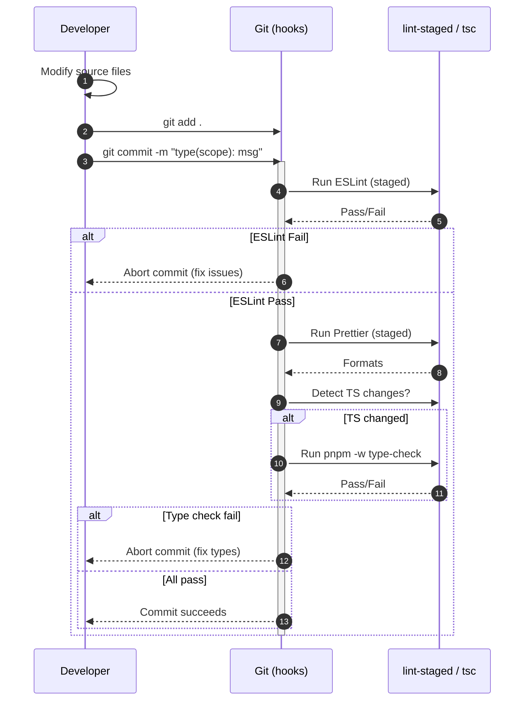
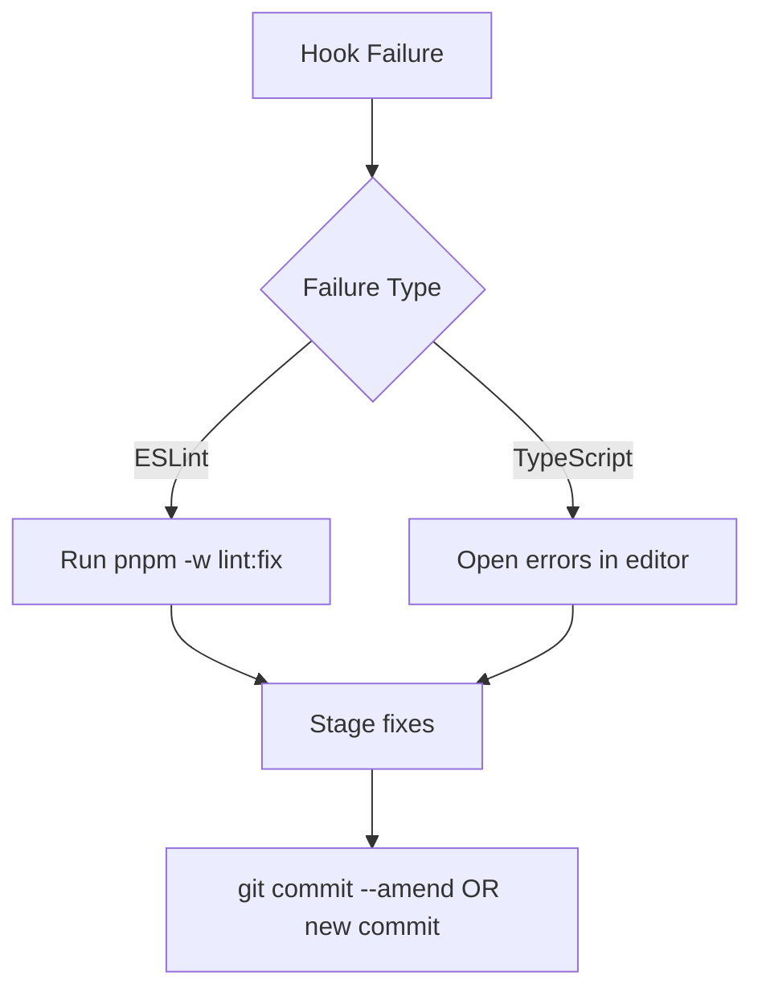

# Development Workflow Guide

Comprehensive, validated workflow for contributing to CritGenius Listener.

## Overview Sequence (Code ➜ Commit ➜ Push)

1. Edit / create code in package(s).
2. (Optional) Run fast local quality gate:
   - `pnpm -w lint && pnpm -w type-check && pnpm -w test`
3. Stage changes: `git add <paths>`
4. Commit: `git commit -m "feat(server): add session manager metrics"`
5. Pre-commit hook runs automatically:
   - lint-staged (ESLint fix, Prettier format)
   - Conditional TypeScript check if any staged TS/TSX
6. If all pass, commit is created; if failures, fix and recommit.
7. Push branch: `git push origin <branch>`
8. CI (future) re-runs lint, type-check, tests.

## Pre-Commit Validation Paths

| Path | Condition         | Action          | Result                                 |
| ---- | ----------------- | --------------- | -------------------------------------- |
| A    | ESLint errors     | Abort           | Developer fixes violations             |
| B    | Format drift only | Auto-fix        | Commit proceeds (unless later failure) |
| C    | No TS changes     | Skip type-check | Fast path                              |
| D    | TS changes + pass | Continue        | Commit success                         |
| E    | TS changes + fail | Abort           | Fix type issues                        |

## Error Recovery Flow

1. Read failing section output (ESLint vs TypeScript).
2. Apply fixes (or run `pnpm -w lint:fix`).
3. Re-stage only changed files (`git add -u`).
4. Re-attempt commit.

## Cross-Package Integration Verification

When changing shared types used by server/client:

1. Make change in `packages/shared`.
2. Run `pnpm --filter @critgenius/{shared,server,client} type-check` (or full `pnpm -w type-check`).
3. Run targeted tests: `pnpm --filter @critgenius/shared test` etc.
4. Ensure no downstream breakage before commit.

## Tooling Reference

| Script                  | Purpose                                                                  |
| ----------------------- | ------------------------------------------------------------------------ |
| `precommit:validate`    | Full pipeline (lint, format check, type-check) ignoring staged narrowing |
| `precommit:simulate`    | Scenario suite (clean, lint-error, format-error, type-error)             |
| `precommit:benchmark`   | Performance timing across iterations                                     |
| `dev:coordinated`       | Orchestrated server→client startup with health checks                    |
| `dev:coordinated:watch` | Orchestrated startup plus 5s interval health monitoring & auto-restart   |

## Validation Checklist (Task 2.8.5)

Mark each item ✅ when validated:

- [ ] Clean commit passes
- [ ] Lint error blocks commit
- [ ] Format drift auto-fixes (commit proceeds or next failure)
- [ ] TS error blocks commit
- [ ] Cross-package shared type change triggers type-check
- [ ] Simulation suite passes expectations
- [ ] Benchmark recorded baseline metrics (<30s each step avg)
- [ ] Documentation updated (`pre-commit-workflow.md`, this file)

## Advanced Troubleshooting Matrix

| Symptom                         | Probable Cause                        | Resolution                                                                   | Preventive Action                    |
| ------------------------------- | ------------------------------------- | ---------------------------------------------------------------------------- | ------------------------------------ |
| Hook extremely slow             | Cold caches or large dependency graph | Run `precommit:benchmark` to quantify; warm with manual `pnpm -w type-check` | Monitor benchmark deltas             |
| Type errors after shared change | Downstream packages not rebuilt       | Run full `pnpm -w type-check`                                                | Add pre-commit local check pre-stage |
| Format not auto-fixing          | File pattern missing in `lint-staged` | Update root `package.json` lint-staged config                                | Add test for new pattern             |
| Commit bypassed hook            | Used `--no-verify`                    | Avoid except emergencies                                                     | Scheduled audit of recent commits    |

## Performance Guidelines

Baseline target: Pre-commit end-to-end (with TS changes) < 10s typical on mid hardware.

Use `pnpm precommit:benchmark` before/after large refactors.

## Future CI Integration (Planned)

CI pipeline will mirror (not replace) local gate:

1. Install deps
2. `pnpm -w lint && pnpm -w format:check`
3. `pnpm -w type-check`
4. `pnpm -w test`

## Security & Privacy Note

No secrets handled in hooks; avoid echoing raw env values. Do not add API key checks in hooks.

---

Maintained by Infra. Keep diagrams current when logic changes.

---

## Coordinated Dev Orchestration (Task 2.9.3)

Purpose: Deterministic, observable startup order and optional resiliency loop for local development.

Key Features:

- Sequenced startup: server waits until `/api/health` returns (<500 response) before launching
  client.
- Readiness windows: server 30s, client 20s with 1s polling cadence.
- Clear console UX: pending indicator replaced by ✅ / ❌ with elapsed ms.
- Optional monitoring (`dev:coordinated:watch`): 5s probes, automatic process restart if unhealthy.
- Graceful shutdown: SIGINT/SIGTERM propagate to child processes and exit cleanly.

Non-Goals (MVP scope):

- WebSocket level synthetic pings.
- AssemblyAI external reachability tests (kept isolated to avoid network dependency in dev tests).
- Multi-service dependency graph beyond current server/client pair.

Testing Strategy:

- Smoke test `tests/orchestration/dev-orchestration.smoke.test.ts` validates server health precedes
  client readiness.
- Unit-style isolation not added to avoid brittleness around spawn timing; future refactor may
  abstract probe logic.

Extension Roadmap:

- Add structured JSON log mode for editor integration.
- Config-driven service manifest (YAML/JSON) for additional internal microservices.
- Exponential backoff metrics and restart counters surfaced via `/api/health` augmentation.

Security & Privacy:

- No secrets logged; only port numbers and generic status lines.
- Does not read or print full environment—delegates to underlying processes which already sanitize.
