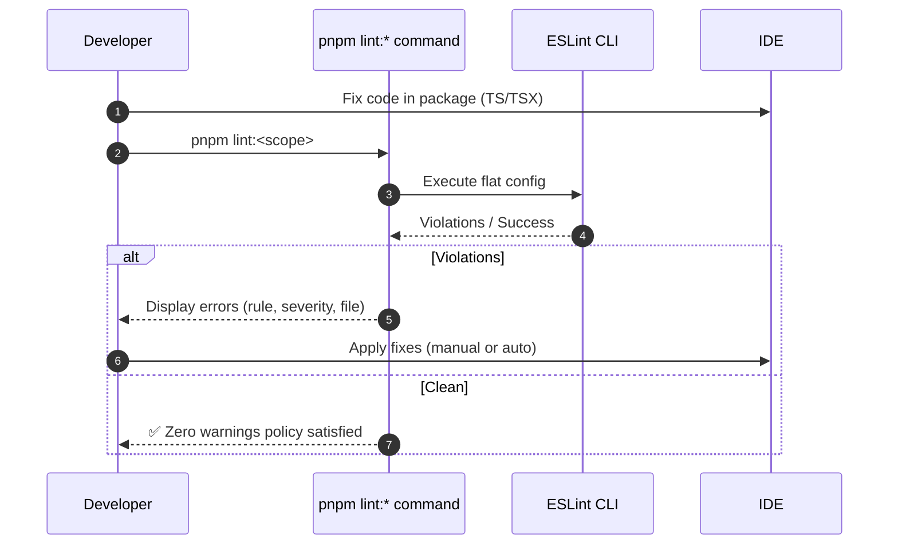
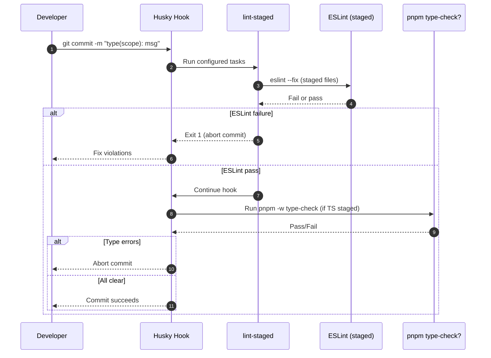
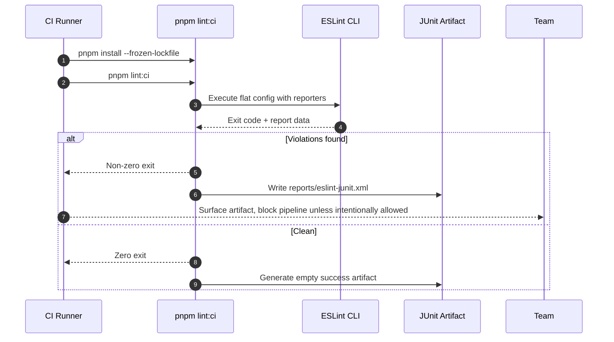
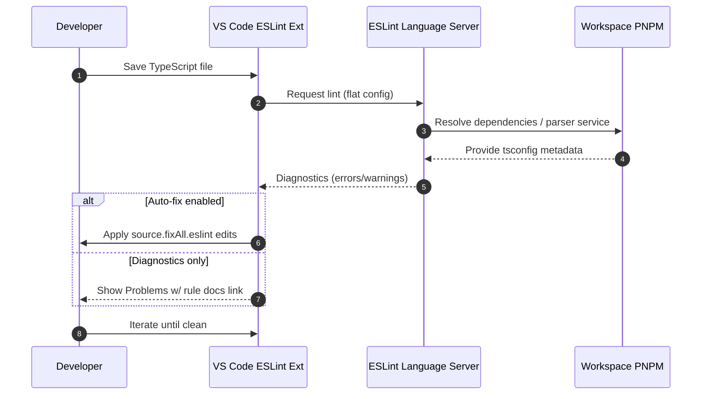
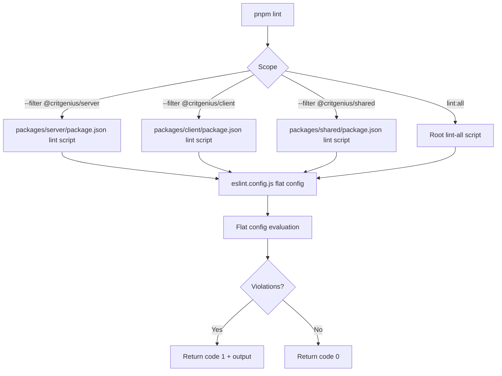
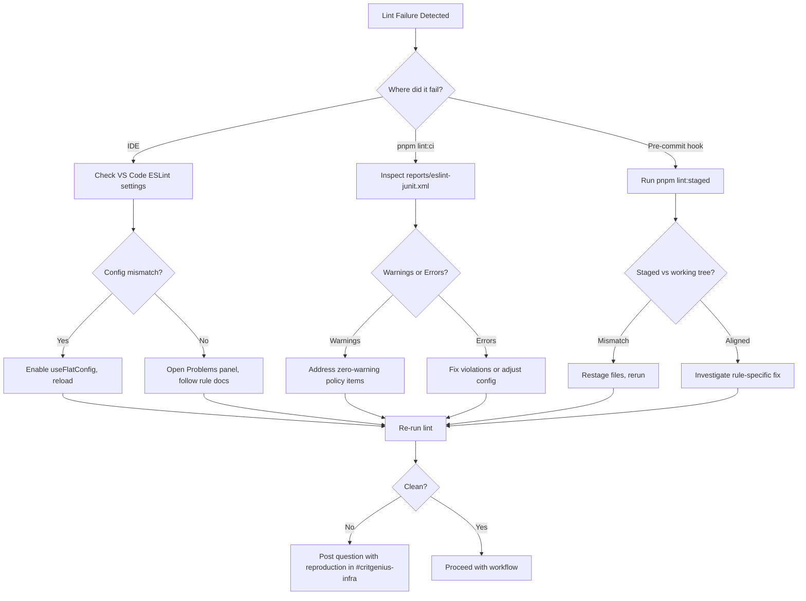

# ESLint Developer Guide

Status: Stable • Last Updated: 2025-10-25 • Owners: Infra Guild (contact via `#critgenius-infra`)

This guide consolidates all linting knowledge you need for day-to-day development in the CritGenius
Listener monorepo. Use it alongside [`docs/eslint-scripts.md`](./eslint-scripts.md) for script
internals and [`docs/audio-ui-accessibility-policy.md`](./audio-ui-accessibility-policy.md) for
detailed accessibility rationale.

---

## 1. Quick Start (Read This First)

- ESLint uses a single flat config (`eslint.config.js`) with TypeScript-aware linting and
  zero-warning policy.
- Run `pnpm -w lint` before pushing. Prefer `pnpm lint:server` / `pnpm lint:client` for focused
  loops.
- Auto-fix what you can with `pnpm lint:fix`, then re-run targeted commands to ensure clean results.
- Husky pre-commit hooks mirror the staged lint: failing locally means the commit is blocked.
- CI enforces the same standard and publishes JUnit artifacts for downstream analysis.

| Goal                | Command                                                      | Notes                                         |
| ------------------- | ------------------------------------------------------------ | --------------------------------------------- |
| Fast local sanity   | `pnpm lint:all`                                              | Uses shared flat config across packages.      |
| Package scoped      | `pnpm lint:server` / `pnpm lint:client` / `pnpm lint:shared` | Match package change set for faster feedback. |
| Auto-fix pass       | `pnpm lint:fix`                                              | Applies safe fixes; rerun lint to confirm.    |
| CI parity           | `pnpm lint:ci`                                               | Generates `reports/eslint-junit.xml`.         |
| Accessibility audit | `pnpm lint:accessibility`                                    | Enforces JSX A11y strictness across UI.       |

> Quick Tip: Keep `pnpm lint:staged` handy for verifying hook behavior without committing.

### Workflow Diagram: Local Lint Loop

---

## 2. Configuration Overview

### 2.1 Flat Config Layout

1. Base JavaScript + TypeScript recommended rules via `@eslint/js` and `typescript-eslint` presets.
2. Global language options: ECMAScript 2024 modules, Node globals, React runtime auto-detect.
3. TypeScript project service enabled to power `no-unsafe-*` rules without per-package tsconfig
   wiring.
4. React + Hooks + JSX A11y plugins layered for UI files.
5. Package-specific overrides for client components and server performance guidance.
6. Prettier config appended last to avoid stylistic conflicts.
7. Ignore list tuned to skip build artifacts, `.d.ts`, and lockfiles while linting ESM config
   scripts.

### 2.2 Severity Levels

| Severity | Expectation        | Notes                                                    |
| -------- | ------------------ | -------------------------------------------------------- |
| `error`  | Block merge/commit | Includes unused vars, critical accessibility issues.     |
| `warn`   | Address promptly   | Signals unsafe TypeScript patterns or performance hints. |
| `off`    | Accepted deviation | Applied only when UX or environment requires exceptions. |

> Reminder: Zero warnings tolerance in CI means warnings must be resolved or suppressed via
> justified config change.

### 2.3 Context-Aware Overrides

- **Tests (`*.test.*`, `__tests__`):** Unsafe TypeScript rules relaxed for ergonomic mocking.
- **Client components (`packages/client/src/components`):** Tight accessibility enforcement (focus
  management, keyboard parity).
- **Server (`packages/server/src`):** `no-console` disabled temporarily; async iteration rules
  elevated to warnings.
- **Shared package:** Inherits default strictness; treat as the source of truth for typed contracts.

### Diagram: Pre-Commit Lint Flow (Husky Hook)

---

## 3. Rule Rationales

### 3.1 TypeScript Safety Nets

- `@typescript-eslint/no-unused-vars` (error) keeps code lean and prevents accidental API leaks.
- `no-unsafe-*` rules (warnings) spotlight untyped surfaces while acknowledging transcriptions often
  require `any` bridges; graduate to errors once typed connectors land.
- `no-explicit-any` warning nudges toward precise types without blocking scaffolding work.

### 3.2 React & Accessibility

- Hooks rules (`react-hooks/rules-of-hooks`, `react-hooks/exhaustive-deps`) prevent subtle state
  regressions in audio capture flows.
- JSX A11y baseline ensures the CritGenius audio UI meets WCAG AA—see
  [audio UI policy](./audio-ui-accessibility-policy.md) for rubric.
- Disabled rules (`anchor-is-valid`, `media-has-caption`, `no-redundant-roles`) align with planned
  navigation patterns and real-time waveform components.

### 3.3 Server Performance Guidance

- `no-await-in-loop` warning surfaces high-latency hotspots (e.g., sequential AssemblyAI requests).
- `prefer-spread` encourages non-mutating patterns for request payload duplication.
- `no-console` remains off until structured logging replacement is delivered; avoid logging secrets.

### 3.4 Test File Relaxations

- Intentional `any` usage allowed to speed up fixture authoring; prefer targeted `unknown` when
  possible.
- Assertions around realtime payloads often need unsafe casts—validate with dedicated integration
  tests instead.

### Diagram: CI Lint Pipeline

---

## 4. Developer Workflows

### 4.1 Running Lint Locally

1. Select scope matching your changes (`pnpm lint:server` etc.).
2. If violations appear, inspect rule docs via `pnpm exec eslint --print-config <file>` when unsure.
3. Apply fixes manually or with `pnpm lint:fix` (rerun scoped lint afterwards).
4. Re-run tests impacted by the change to ensure behavioral safety.

### 4.2 IDE Integration Checklist

- Enable ESLint extension in VS Code; set `eslint.experimental.useFlatConfig` to `true`.
- Configure `"editor.codeActionsOnSave": { "source.fixAll.eslint": "explicit" }` for controlled
  auto-fix.
- Point the ESLint server to the workspace root; ensure PNPM environment is detected (see
  `docs/developer-onboarding.md`).
- Use Problems panel to triage warnings before they propagate to CI.

### 4.3 Accessibility-Focused Sprints

- Run `pnpm lint:accessibility` before UI handoff reviews.
- Pair findings with manual screen reader smoke tests (refer to policy §5).
- Document exceptions in code via `TODO(a11y)` with link to tracking ticket.

### 4.4 When Config Updates Are Needed

- Modify `eslint.config.js` and update this guide plus
  [`docs/eslint-scripts.md`](./eslint-scripts.md).
- Extend tests in `tests/infrastructure/eslint-audit-validation.test.ts` to cover new scenarios.
- Run `pnpm -w lint && pnpm -w test` to guard against regressions.
- Communicate changes in `#critgenius-infra` and add release note.

### Diagram: IDE Save-to-Feedback Loop

### Diagram: Monorepo Package Lint Routing

---

## 5. Monorepo Troubleshooting

| Symptom                                             | Probable Cause                               | Resolution                                                               | Preventive Hint                                  |
| --------------------------------------------------- | -------------------------------------------- | ------------------------------------------------------------------------ | ------------------------------------------------ |
| ESLint reports missing `project`                    | Cached VS Code server using legacy config    | Reload window; confirm `useFlatConfig` enabled.                          | Update onboarding doc if new editors added.      |
| Unexpected files linted (e.g., build output)        | Local script bypassed ignore patterns        | Run `pnpm lint:all` (respects flat ignores); fix custom script.          | Avoid ad-hoc `eslint` CLI flags in package.json. |
| `lint:ci` missing JUnit report                      | Script modified / dependency removed         | Ensure `scripts/lint-ci.mjs` intact; reinstall deps.                     | Lock delta with unit test in infra suite.        |
| Accessibility rule false-positive on audio controls | Custom waveform component missing ARIA hooks | Apply documented ARIA pattern from accessibility policy §4.              | Keep component templates updated.                |
| Lint extremely slow (>90s)                          | Type-aware rules hitting large file set      | Narrow scope (`pnpm lint:server`) and monitor; verify tsconfig includes. | Periodically prune dead TS files.                |
| Hook fails but `pnpm lint` succeeds                 | Staged files differ from working tree        | Run `pnpm lint:staged` to match hook context.                            | Stage after running formatters.                  |
| IDE shows duplicate diagnostics                     | Global + workspace ESLint servers active     | Disable global ESLint in VS Code settings.                               | Document IDE setup in onboarding.                |
| `no-unsafe-*` warnings on generated types           | Types derived from SDK lacking definitions   | Add wrapper types in `packages/shared` or augment declarations.          | Track upstream SDK typings.                      |
| `no-await-in-loop` on parallelizable jobs           | Legacy sequential processing                 | Refactor to `Promise.all` or deliberate concurrency limit.               | Add comment if intentionally sequential.         |
| `no-console` flagged in client tests                | Console spy left in source                   | Replace with `vi.spyOn(console, ...)` inside tests only.                 | Reset spies in afterEach.                        |
| `parser` crash on JSON files                        | `.json` accidentally included                | Add to ignore or move to `config/`.                                      | Keep config assets out of lint targets.          |
| ESLint fails in CI only                             | Case-sensitive path or OS-specific newline   | Normalize imports and rerun locally with `pnpm lint:ci`.                 | Use workspace path aliases.                      |

### Diagram: Troubleshooting Decision Tree

---

## 6. Accessibility Requirements Snapshot

- Audio UI must meet WCAG 2.2 AA for interactive controls; lint rules enforce keyboard parity and
  focus order.
- `jsx-a11y/interactive-supports-focus` and `click-events-have-key-events` are errors within
  `packages/client/src/components` to guarantee accessible dice rollers and session controls.
- `media-has-caption` disabled because live transcripts serve as textual alternative; revisit after
  async media playback lands.
- Use semantic elements for narration logs; `div` fallback requires `role` + ARIA labeling
  consistent with policy.
- Coordinate with Accessibility Champion before adding `eslint-disable` comments—document context in
  code review.

> For deep dives, reference
> [`docs/audio-ui-accessibility-policy.md`](./audio-ui-accessibility-policy.md) §3–§5 and ensure
> design tokens align with narrated UI patterns.

---

## Appendix A: Reference Links

- ESLint Flat Config docs: https://eslint.org/docs/latest/use/configure/configuration-files
- typescript-eslint project service guide: https://typescript-eslint.io/linting/typed-linting
- VS Code ESLint extension (flat config support): https://github.com/microsoft/vscode-eslint
- CritGenius infrastructure lint tests: `tests/infrastructure/eslint-audit-validation.test.ts`

## Appendix B: Maintenance Notes

- Review and update this guide whenever `eslint.config.js` changes or new scripts are added.
- Keep sequence diagrams synchronized with automation behavior; regenerate if workflows evolve.
- Validate cross references quarterly using `pnpm run docs:lint` (TBD) or manual `rg` checks.
- Record significant lint policy shifts in `docs/development-workflow.md` changelog section.

---

Maintainers: Infra Guild. Submit PRs with Conventional Commit prefix `docs(eslint)`. Questions →
`#critgenius-infra` (Slack).
