# HTTPS Development Setup Guide

Last Updated: 2025-09-29 | Maintainer: Infrastructure Guild | Status: Active

> Complete, sequence-diagram-backed walkthrough for enabling and validating HTTPS in local
> development. Covers certificate provisioning, configuration, secure startup, and integration
> verification across CritGenius Listener services.

---

## Table of Contents

1. Overview & Prerequisites
2. Certificate Generation Strategy
3. Certificate Provisioning Procedures
4. Environment Configuration
5. Vite HTTPS Integration
6. First Secure Startup Workflow
7. Integration Validation Suite
8. Certificate Maintenance & Rotation
9. Reference Matrix & Next Steps

---

## 1. Overview & Prerequisites

HTTPS is required to unlock browser secure-context features (microphone capture, Clipboard API) and
align local testing with production TLS expectations. The client dev server can run over HTTPS when
provided a trusted certificate pair.

| Requirement             | Recommended Version/State | Notes                                                    |
| ----------------------- | ------------------------- | -------------------------------------------------------- |
| Node.js                 | 18 LTS                    | Align with `.nvmrc` when introduced                      |
| pnpm                    | 8+                        | Monorepo package manager                                 |
| mkcert (preferred)      | Latest                    | Installs trusted root in local system store              |
| OpenSSL (fallback)      | 1.1+                      | Bundled with macOS/Linux; Windows via Git Bash or WinGet |
| CritGenius certificates | `certificates/dev/*`      | Git-ignored; auto-created by scripts                     |

Before running any setup commands, ensure repo dependencies are installed (`pnpm install`).

### Prerequisite Verification Workflow

1. Confirm Node.js and pnpm meet minimum versions.
2. Decide whether mkcert is available (preferred) or fallback to OpenSSL.
3. Verify `certificates/` directory is writable and ignored by Git.

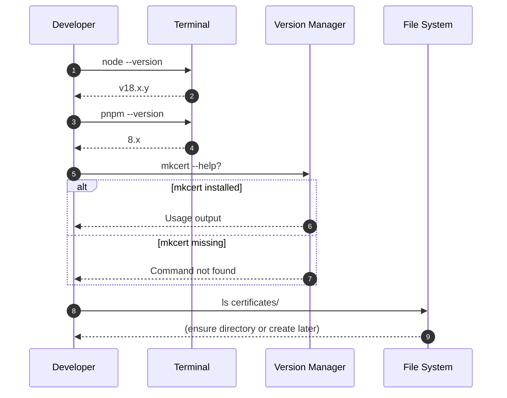

---

## 2. Certificate Generation Strategy

CritGenius provides npm scripts that prefer mkcert for trusted certificates and fall back to OpenSSL
when mkcert is unavailable. Choose the path based on your operating system permissions.

- **Use mkcert** when you can install a local root CA (macOS, Windows, most Linux desktops).
- **Fallback to OpenSSL** when mkcert installation is blocked (corporate policies, headless VMs).
- Certificates target `localhost`, `127.0.0.1`, and `::1` subject alternative names.

### Strategy Selection Sequence

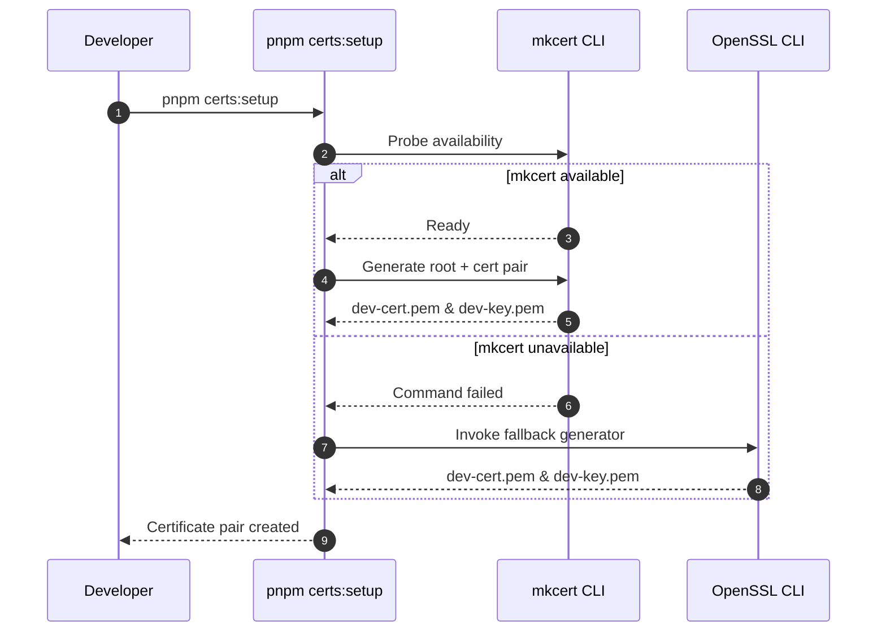

### Decision Considerations

- mkcert stores a local CA in your system trust store → browsers trust dev certs without warnings.
- OpenSSL-generated certificates require manual trust per browser/OS.
- Both scripts produce PEM-encoded files in `certificates/dev/`.

---

## 3. Certificate Provisioning Procedures

Two supported provisioning flows are shipped as pnpm scripts.

### 3.1 mkcert Provisioning (Preferred)

1. Install mkcert if missing ([mkcert official docs](https://github.com/FiloSottile/mkcert)).
2. Run the automated setup script from repo root:

   ```bash
   pnpm certs:setup
   ```

3. When prompted, allow mkcert to install the local development CA.
4. Verify outputs exist: `certificates/dev/dev-cert.pem`, `certificates/dev/dev-key.pem`.
5. (Optional) Inspect certificate subject with
   `openssl x509 -in certificates/dev/dev-cert.pem -text`.

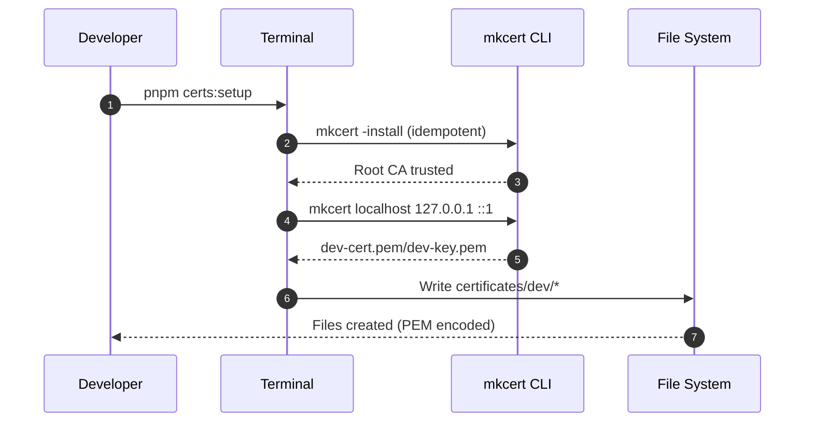

### 3.2 OpenSSL Provisioning (Fallback)

1. Ensure OpenSSL is installed (`openssl version`).
2. Force OpenSSL path to regenerate certificates:

   ```bash
   pnpm certs:setup:force -- --provider=openssl
   ```

3. Script creates self-signed cert/key pair with SAN entries.
4. Manually trust the certificate (see Section 6.3) before first browser load.

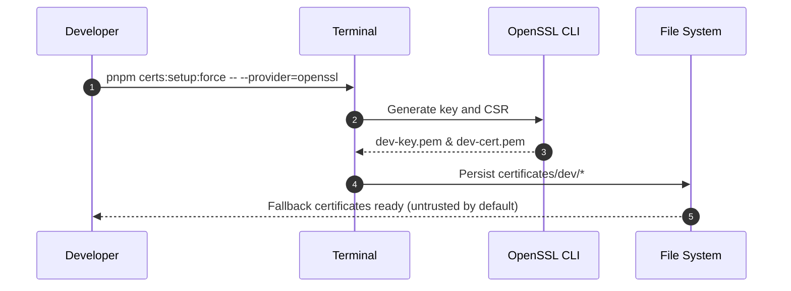

### 3.3 Certificate Verification Checklist

- Files present and readable?
- Private key permissions restricted (600 recommended on Unix systems)?
- SANs include all localhost aliases?
- Expiration > 30 days? (Use `pnpm certs:check`).

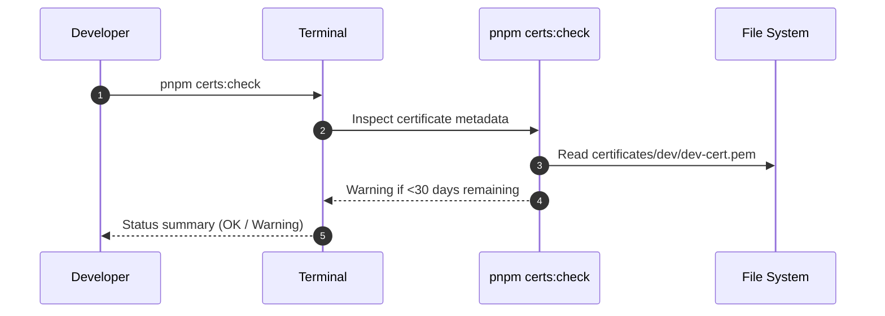

---

## 4. Environment Configuration

Configure the client dev server to use HTTPS by setting environment variables in `.env`.

1. Copy `.env.example` to `.env` if you have not already.
2. Append or update the following entries:

   ```bash
   HTTPS_ENABLED=true
   HTTPS_CERT_PATH=./certificates/dev/dev-cert.pem
   HTTPS_KEY_PATH=./certificates/dev/dev-key.pem
   HTTPS_PORT=5174
   ```

3. Commit `.env` updates **only** to local files (do not commit secrets or machine-specific paths).
4. Restart the dev server after modifying `.env` to reload configuration.

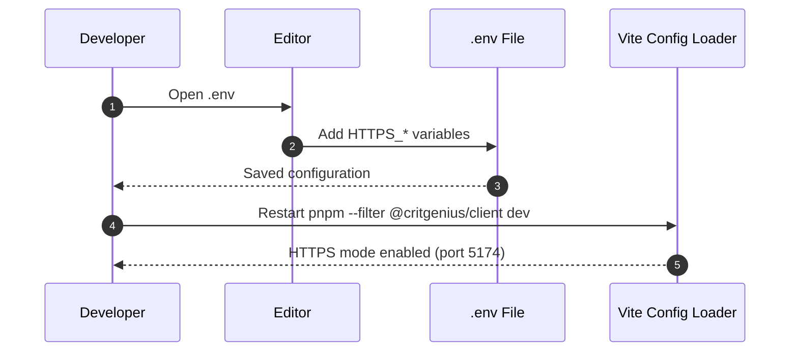

### 4.1 Environment Validation

Run the shared environment validation to confirm HTTPS values pass schema checks:

```bash
pnpm --filter @critgenius/shared test -- --runInBand environment/https-config.test.ts
```

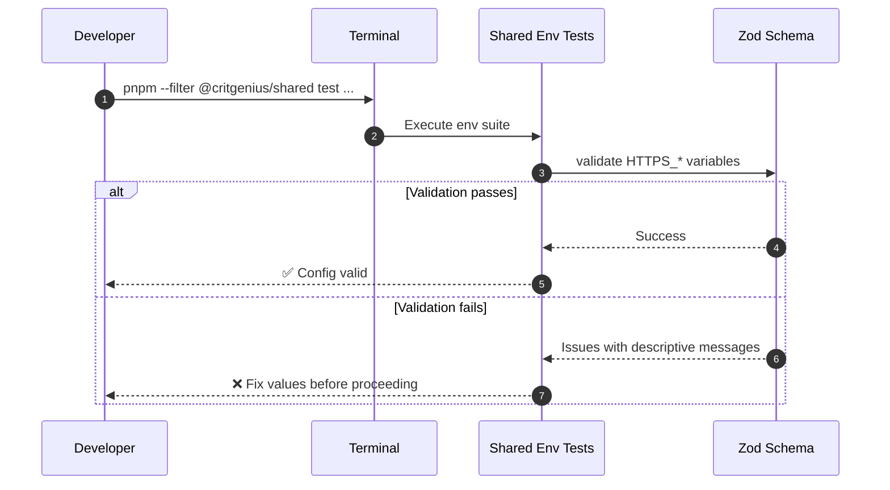

---

## 5. Vite HTTPS Integration

The client dev server reads HTTPS settings during startup. Ensure the configuration paths align with
certificate locations.

1. Review `packages/client/vite.config.ts` to confirm `HTTPS_ENABLED` toggles TLS.
2. Ensure certificate paths resolve relative to repo root or absolute path as desired.
3. When HTTPS is enabled, Vite listens on `HTTPS_PORT` (default 5174) while HTTP port remains idle.
4. If certificates are missing, Vite logs a warning and falls back to HTTP.

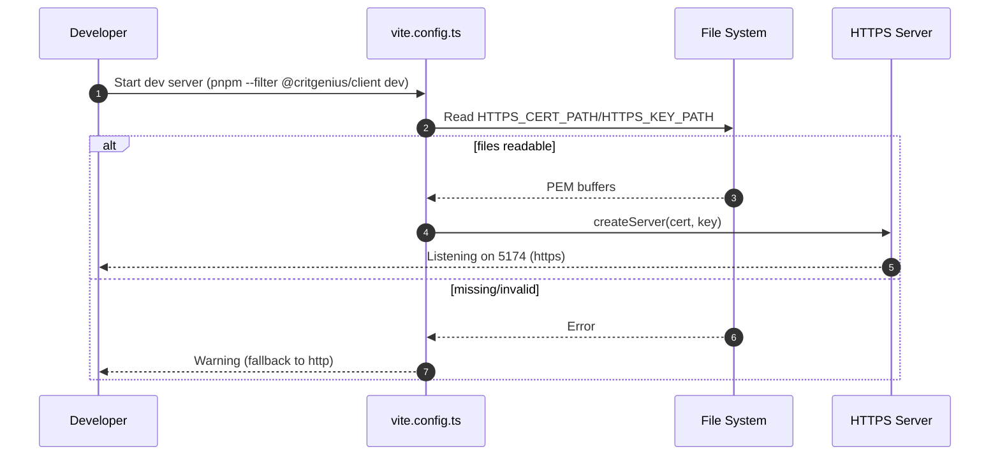

### 5.1 Proxy & Socket Considerations

- Socket.IO connects via `wss://localhost:5174/socket.io` automatically when HTTPS is active.
- Dev proxy inherits scheme from incoming request; ensure upstream endpoints support HTTPS or HTTP
  as configured in shared proxy registry.

---

## 6. First Secure Startup Workflow

Follow this workflow when running the HTTPS dev server for the first time after provisioning
certificates.

1. Ensure `.env` contains `HTTPS_ENABLED=true` and certificate paths.
2. Start the coordinated dev script or client-only dev server.
3. When the browser opens, accept the certificate trust prompt if using OpenSSL.
4. Verify the browser address bar shows a secure connection (lock icon).
5. Open DevTools console to confirm no TLS-related warnings.

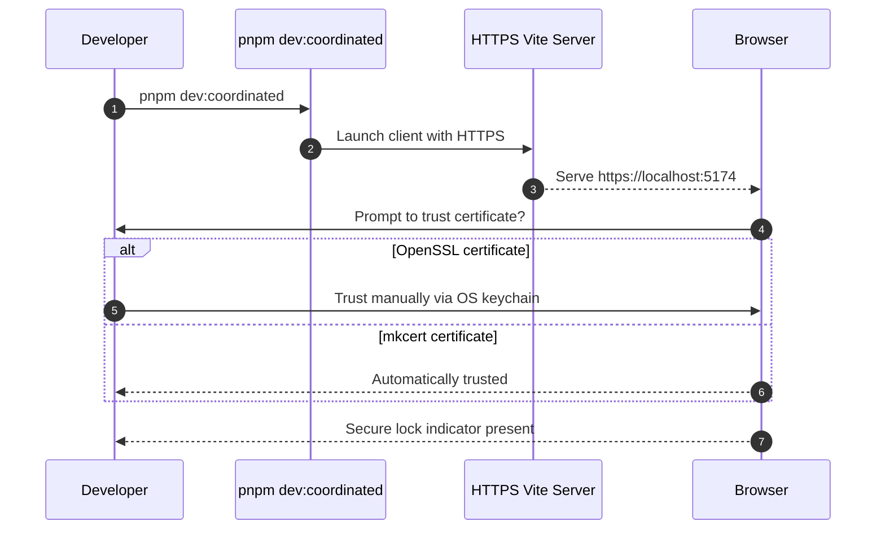

### 6.1 Browser Trust Establishment (OpenSSL Path)

Refer to OS-specific trust instructions:

- **macOS**: Double-click cert → add to login keychain → set Always Trust.
- **Windows**: `certmgr.msc` → Trusted Root Certification Authorities → Import.
- **Linux**: Add to `/usr/local/share/ca-certificates/` and run `sudo update-ca-certificates`.

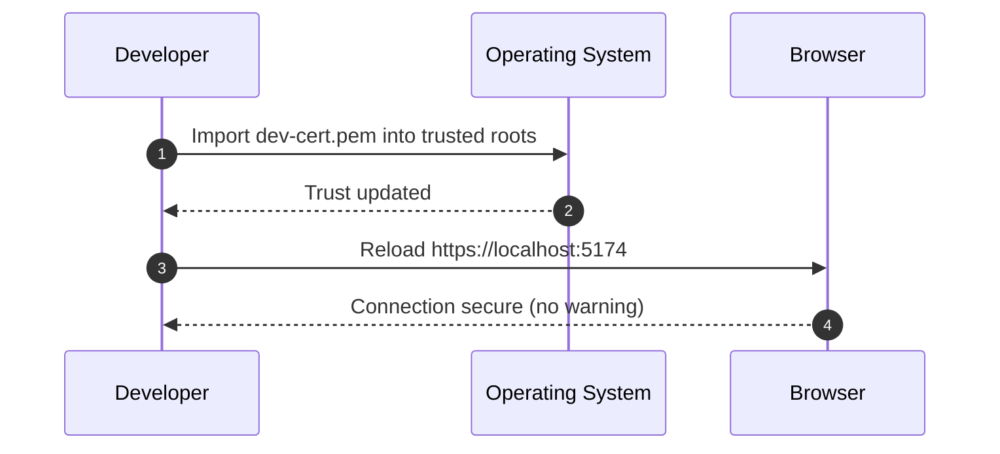

### 6.2 Microphone Permission Prompt

1. Navigate to a page that requests microphone access.
2. Browser verifies secure context before showing permission prompt.
3. Grant permission and confirm audio stream starts.

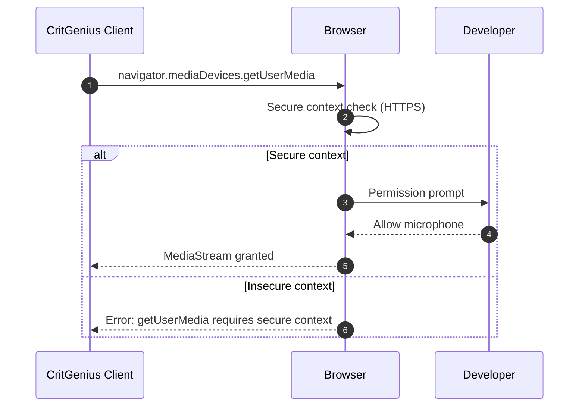

---

## 7. Integration Validation Suite

After initial startup, validate HTTPS integrations to catch configuration regressions.

### 7.1 Automated Test Harness

Run gated integration tests (requires certificates to exist).

```bash
RUN_CLIENT_IT=true pnpm --filter @critgenius/client test -- --runTestsByPath packages/client/src/__tests__/integration/https-socket.integration.test.ts
```

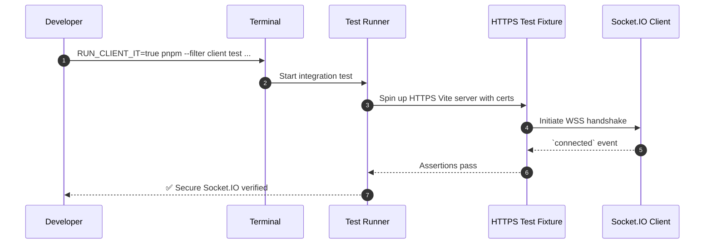

### 7.2 Manual Validation Checklist

- Reload page to confirm persistent HTTPS lock icon.
- Inspect Network tab: requests use `https://` and WebSocket shows `wss://`.
- Trigger Socket.IO event (e.g., start capture) and observe traffic.
- Validate no mixed-content warnings in console.

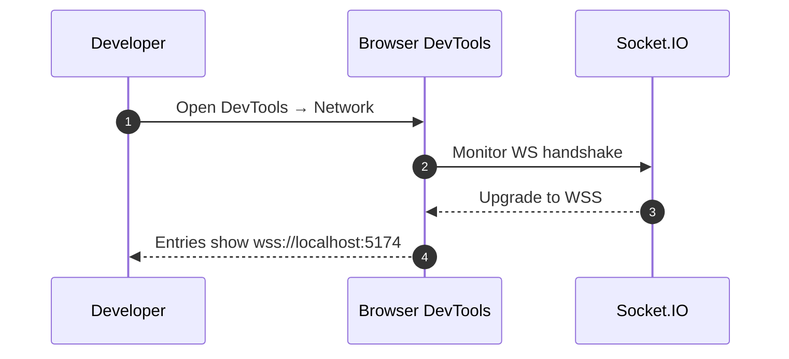

---

## 8. Certificate Maintenance & Rotation

Certificates expire; integrate renewal into regular maintenance.

1. Run `pnpm certs:check` weekly (add to personal cron or reminder).
2. If warning (<30 days) appears, regenerate using preferred provider.
3. Restart dev server after regeneration to load new certs.
4. Notify team via Slack/Docs if a shared ceremony (pairing session) is scheduled.

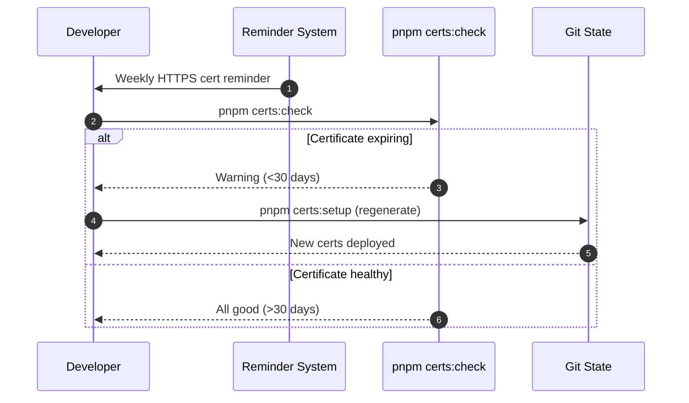

### 8.1 Cleanup & Revocation

- To revoke mkcert root: `mkcert -uninstall`.
- Remove `certificates/dev/*` before publishing branches to avoid accidental commits.
- Ensure `.gitignore` retains `certificates/` entry.

---

## 9. Reference Matrix & Next Steps

| Scenario                                | Reference Section | Related Docs                                       |
| --------------------------------------- | ----------------- | -------------------------------------------------- |
| First-time HTTPS setup                  | Sections 1–7      | `docs/development-server.md` §8                    |
| Troubleshooting certificate errors      | Section 8         | `docs/https-troubleshooting-guide.md` §2           |
| Browser trust instructions              | Section 6.1       | `docs/microphone-access-validation.md` (secure)    |
| Socket.IO secure handshake verification | Section 7         | `tests/docs/development-server-doc.test.ts` notes  |
| Certificate rotation policy             | Section 8         | `memory-bank/systemPatterns-003.md` (Secure HTTPS) |

### What to Do Next

- Bookmark the troubleshooting guide for quick reference during outages.
- Update onboarding docs if new OS/browser instructions emerge.
- File infra tickets if certificate scripts require new SAN entries.

---

## Change Log (Doc Specific)

- 2025-09-29: Initial publication (Task 2.10.6).
