# HTTPS Troubleshooting Guide

Last Updated: 2025-09-29 | Maintainer: Infrastructure Guild | Status: Active

> Diagnostic companion to the HTTPS setup guide. Provides structured workflows, sequence diagrams,
> and resolution playbooks for common TLS issues in CritGenius Listener development.

---

## Table of Contents

1. Troubleshooting Framework
2. Certificate Issues
3. Configuration & Environment Issues
4. Browser Security Warnings
5. Runtime & Integration Failures
6. Performance Considerations
7. Cross-Reference Matrix
8. Change Log

---

## 1. Troubleshooting Framework

Adopt a consistent methodology before diving into individual scenarios.

### 1.1 Intake Workflow

1. Capture the symptom (error message, screenshot, console output).
2. Identify whether the failure occurs at startup, browser load, or runtime event.
3. Check recent changes (file diffs, certificate regeneration, environment edits).
4. Choose the relevant scenario section below.

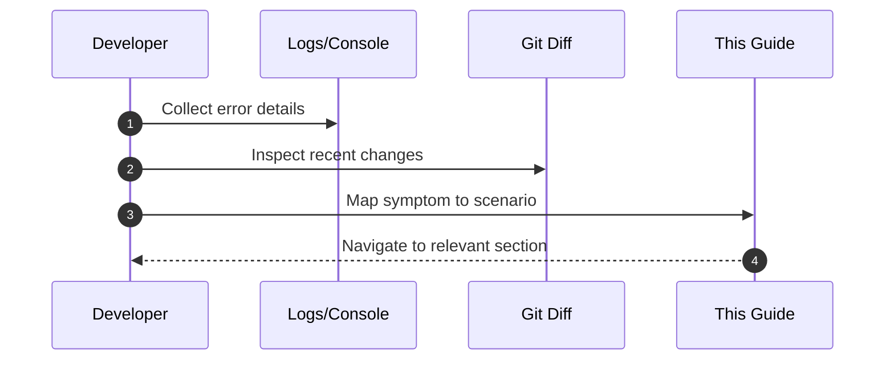

### 1.2 Diagnostic Tools

| Tool/Command                                            | Purpose                                         |
| ------------------------------------------------------- | ----------------------------------------------- | ---------------------------------------------- |
| `pnpm certs:check`                                      | Validate certificate freshness and SAN coverage |
| `openssl verify -CAfile <root> dev-cert.pem`            | Confirm trust chain                             |
| `pnpm --filter @critgenius/shared test -- https-config` | Run environment schema validation               |
| Browser DevTools → Security tab                         | Inspect TLS handshake and certificate details   |
| `lsof -i :5174` / `netstat -ano                         | findstr 5174` (Windows)                         | Detect port conflicts                          |
| `mkcert -uninstall` / reinstall                         | Reset corrupted local CA                        |
| `pnpm certs:setup:force -- --provider=<mkcert           | openssl>`                                       | Regenerate certificates with explicit provider |

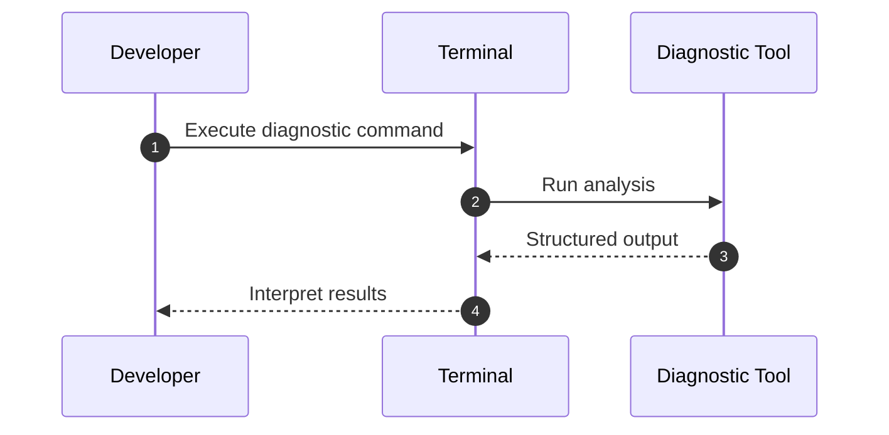

---

## 2. Certificate Issues

### 2.1 "Certificate Not Found" on Startup

**Symptom:** Vite logs `HTTPS certificate file not found` and falls back to HTTP.

1. Confirm paths in `.env` match actual file locations.
2. Run `pnpm certs:setup` to regenerate missing files.
3. Restart dev server and verify HTTPS is active.

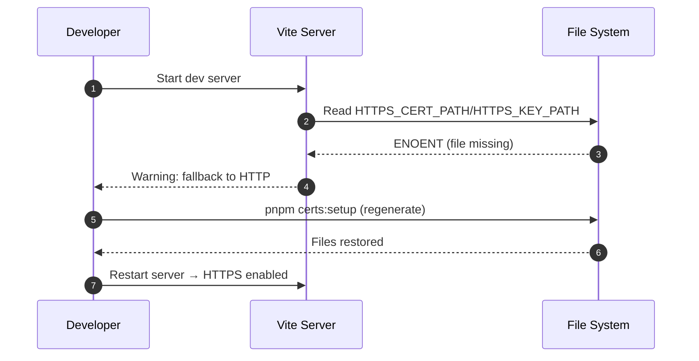

### 2.2 Certificate Expired Warning

**Symptom:** `pnpm certs:check` or browser reports certificate expiration.

1. Run `pnpm certs:setup:force` to generate fresh certs (mkcert preferred).
2. Restart dev server.
3. Clear browser cache for `localhost` to avoid stale chain.

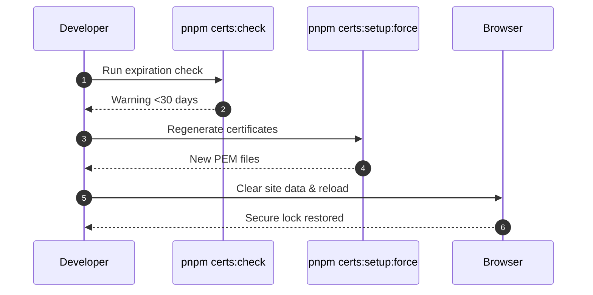

### 2.3 Certificate Invalid Hostname

**Symptom:** Browser shows `NET::ERR_CERT_COMMON_NAME_INVALID`.

1. Verify SAN entries include accessed host (`localhost`, `127.0.0.1`).
2. Regenerate certificates ensuring SAN list contains all needed hosts.
3. Access site via matching hostname.

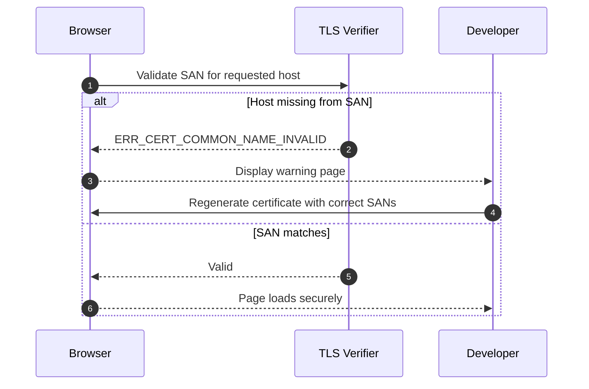

### 2.4 Mkcert Root Corruption

**Symptom:** mkcert-generated cert suddenly untrusted on all browsers.

1. Run `mkcert -uninstall` to remove corrupted root.
2. Execute `mkcert -install` to reinstall clean root.
3. Regenerate certificates (`pnpm certs:setup`).

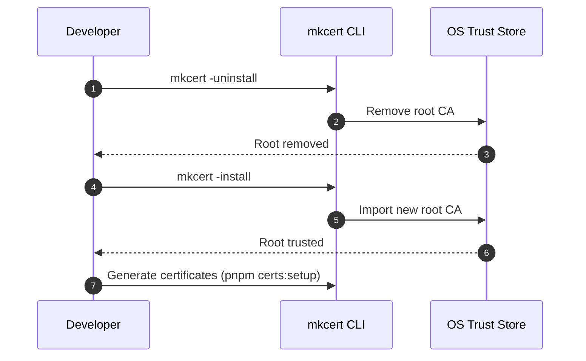

---

## 3. Configuration & Environment Issues

### 3.1 Environment Variables Not Loaded

**Symptom:** HTTPS remains disabled despite `.env` entries.

1. Ensure `.env` file resides at repo root and is not named `.env.example`.
2. Confirm variable names are uppercase and free of extra whitespace.
3. Restart dev server; Vite only reads `.env` on startup.

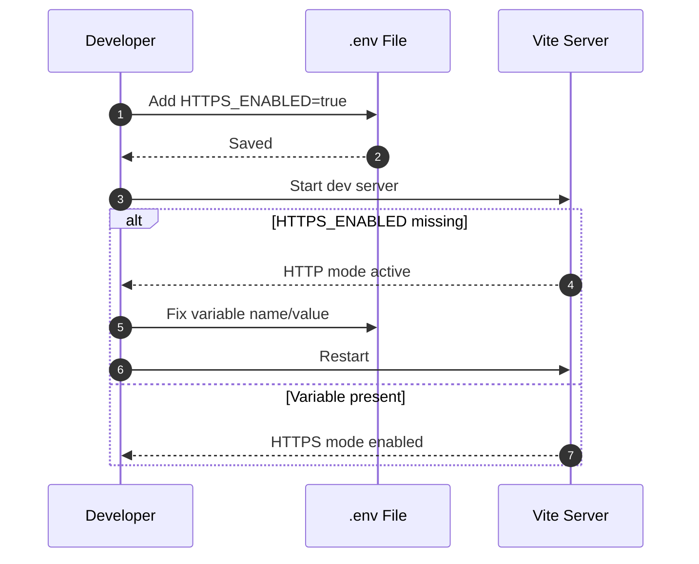

### 3.2 Port Conflict (EADDRINUSE)

**Symptom:** Startup fails with `Error: listen EADDRINUSE: 5174`.

1. Identify conflicting process (`lsof -i :5174` | Windows `netstat -ano | findstr 5174`).
2. Terminate or change port of conflicting service.
3. Update `HTTPS_PORT` if persistent conflict.

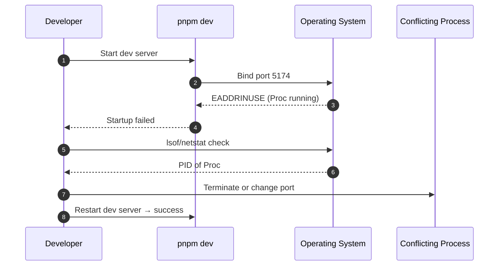

### 3.3 Path Resolution Errors on Windows

**Symptom:** Backslashes in `.env` paths cause file read failures.

1. Use forward slashes or escape backslashes (`C:/path/to/dev-cert.pem`).
2. Alternatively use relative paths (`./certificates/dev/dev-cert.pem`).
3. Restart dev server.

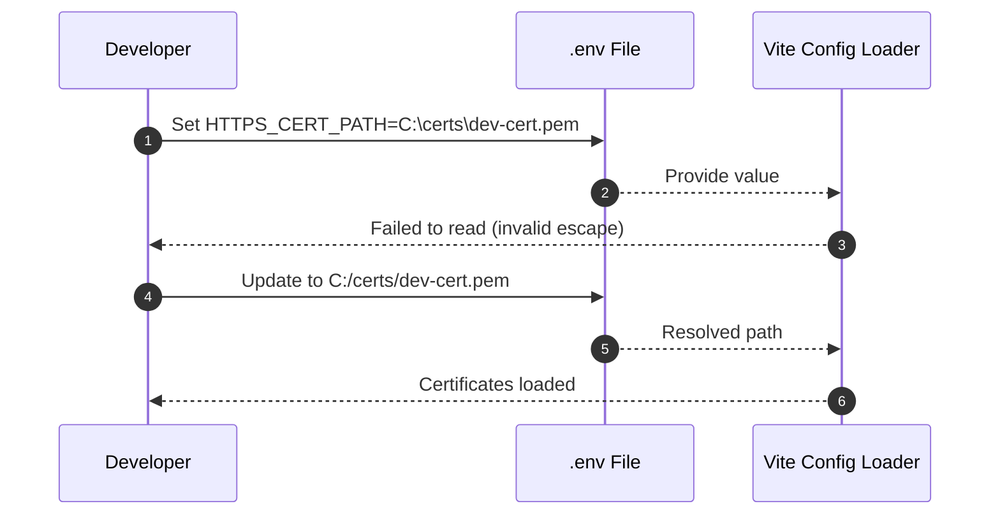

---

## 4. Browser Security Warnings

### 4.1 Chrome "Your Connection Is Not Private"

1. Click **Advanced** → **Proceed** only if certificate is your known dev cert.
2. Import certificate into system trust store (Section 6.1 of setup guide).
3. Reload page; warning should disappear once trust established.

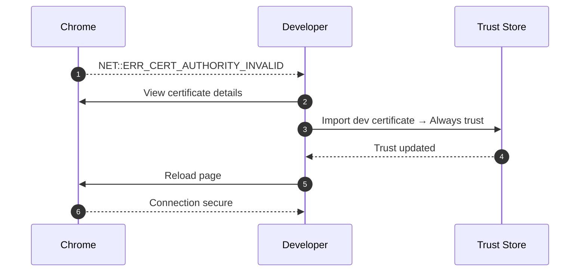

### 4.2 Firefox "Warning: Potential Security Risk Ahead"

1. Click **Advanced** → **View Certificate** to confirm fingerprint.
2. Add exception temporarily, then import certificate into Firefox certificate manager.
3. Remove temporary exception after trust established.

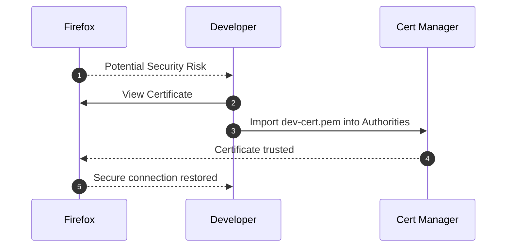

### 4.3 Edge/Safari Equivalent Warnings

Refer to OS-level trust instructions (same as Section 6.1). Safari requires keychain trust plus quit

- relaunch to pick up changes.

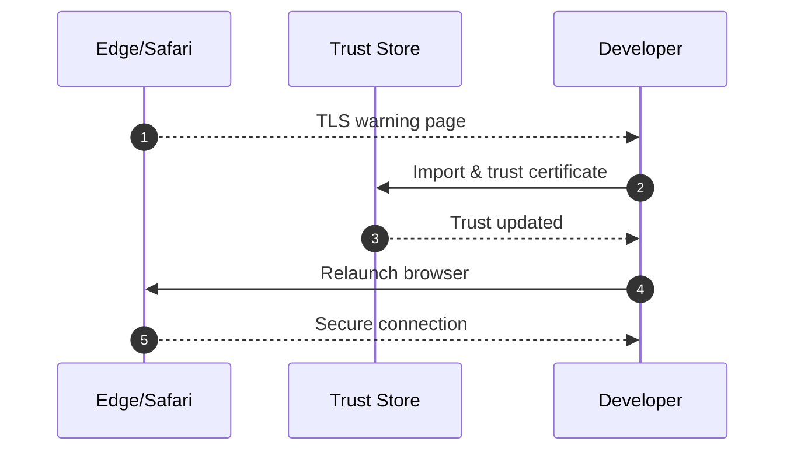

---

## 5. Runtime & Integration Failures

### 5.1 Socket.IO Connection Failure (`wss` handshake)

**Symptom:** Console shows `WebSocket connection to 'wss://localhost:5174/socket.io/?...' failed`.

1. Confirm HTTPS server is running and reachable.
2. Verify Socket.IO client not forced to HTTP (no `CLIENT_SOCKET_DISABLE_TLS_BYPASS=false`).
3. Inspect Network tab for TLS errors; regenerate certificates if handshake fails.

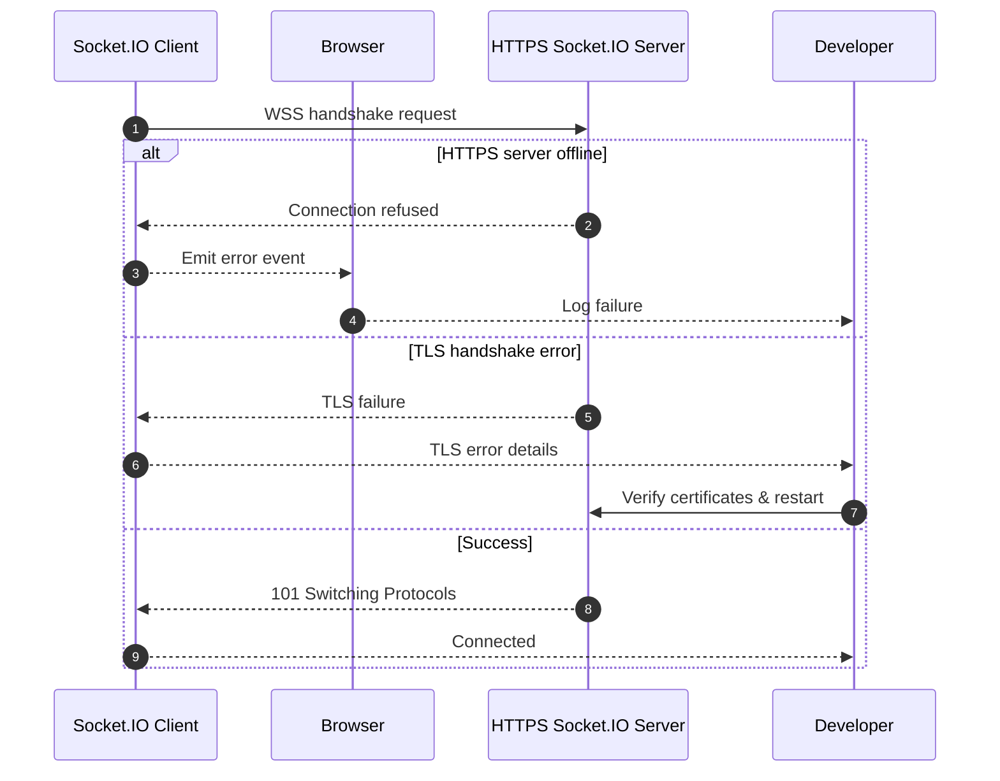

### 5.2 Mixed Content Warnings

**Symptom:** Browser console logs `Mixed Content` when fetching HTTP resources over HTTPS page.

1. Update resource URLs to use HTTPS or relative protocol (`//`).
2. Ensure dev proxy forwards HTTPS requests appropriately.
3. Rebuild bundle if assets are emitted with absolute HTTP URLs.

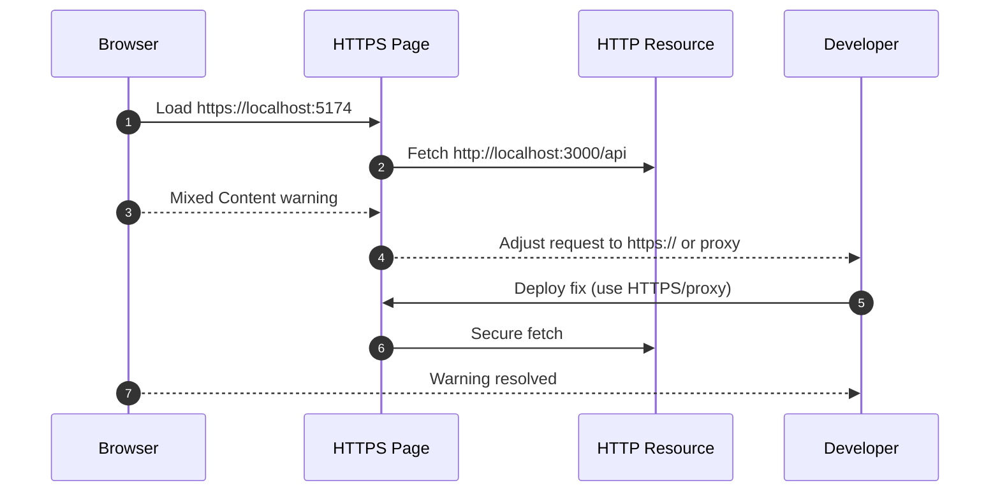

### 5.3 Microphone Permission Denied in HTTPS

**Symptom:** Even with HTTPS, `getUserMedia` rejects with `NotAllowedError`.

1. Check browser site permissions; ensure microphone allowed.
2. Confirm user gesture triggered request (some browsers require click event).
3. Clear site permissions and retry.

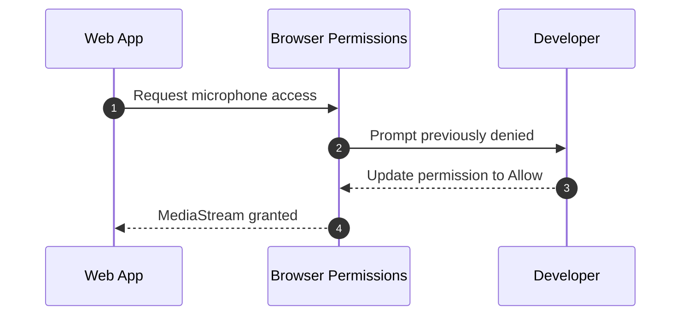

### 5.4 TLS Handshake Timeout

**Symptom:** Network tab shows `ERR_SSL_PROTOCOL_ERROR` with handshake timeout.

1. Ensure antivirus or corporate proxy not intercepting TLS; disable temporarily if safe.
2. Retry with mkcert (trusted root) to minimize MITM inspection friction.
3. Check system clock; large skew breaks TLS negotiations.

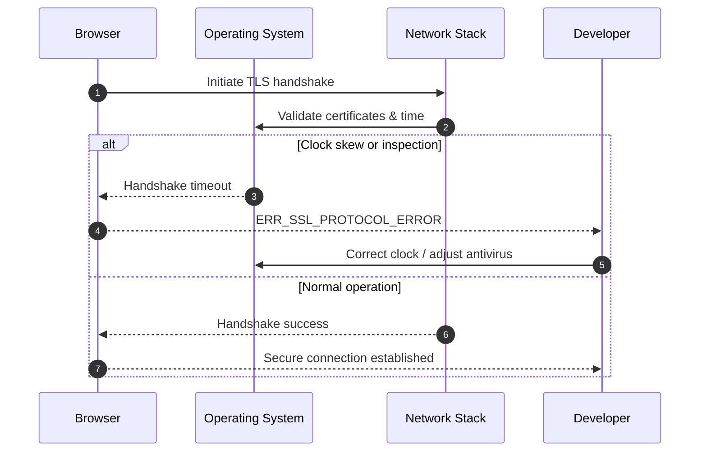

---

## 6. Performance Considerations

HTTPS introduces handshake overhead; keep an eye on performance symptoms.

### 6.1 Slow First Load (Cold TLS Cache)

1. Measure load time in DevTools Performance panel.
2. Enable HTTP/2 in future tasks (not yet configured) if repeated handshake overhead persists.
3. Keep certificate files on SSD for faster disk access.

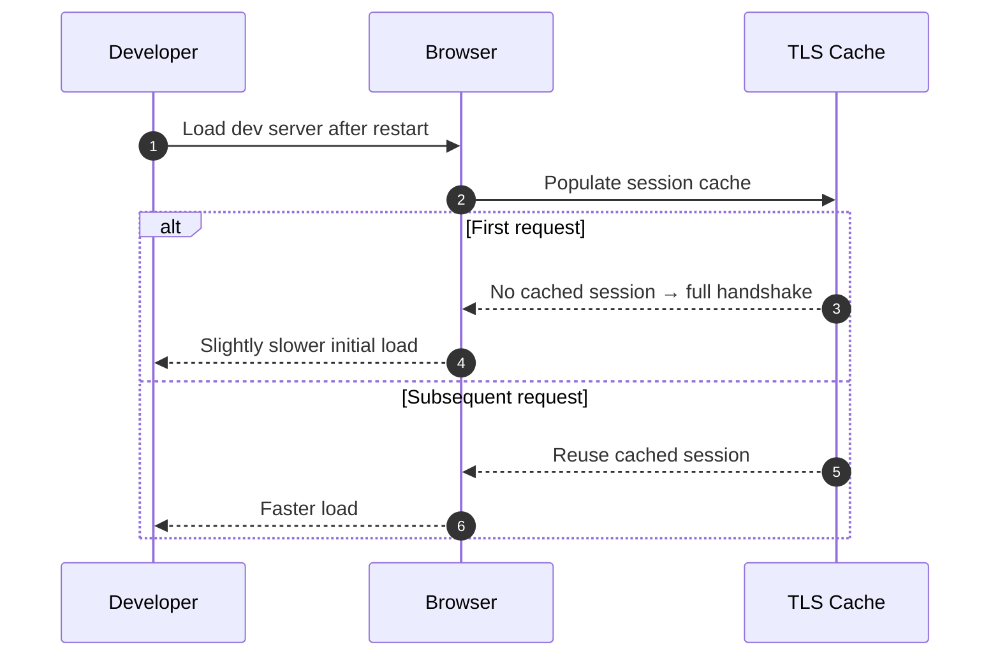

### 6.2 Excessive CPU from TLS Logging

1. Disable verbose logging in antivirus / proxy tooling while testing.
2. Keep console logging minimal to avoid compounding overhead.

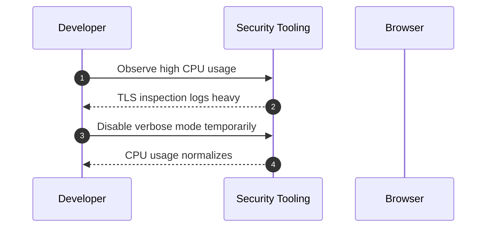

---

## 7. Cross-Reference Matrix

| Symptom/Goal                        | Resolution Section | Additional Resources                            |
| ----------------------------------- | ------------------ | ----------------------------------------------- |
| Certificate missing                 | §2.1               | `docs/https-development-setup.md` §3            |
| Certificate expired                 | §2.2               | `docs/https-development-setup.md` §8            |
| Browser trust prompt                | §4                 | `docs/https-development-setup.md` §6.1          |
| Socket.IO WSS failure               | §5.1               | `docs/development-server.md` §8                 |
| Mixed content warnings              | §5.2               | `docs/development-proxy.md`                     |
| Microphone permission errors        | §5.3               | `docs/microphone-access-validation.md`          |
| Port conflict (5174 already in use) | §3.2               | `scripts/dev-orchestration.mjs` inline help     |
| TLS handshake timeout               | §5.4               | Organization security docs (VPN/Proxy handling) |

---

## 8. Change Log

- 2025-09-29: Initial publication (Task 2.10.6).
