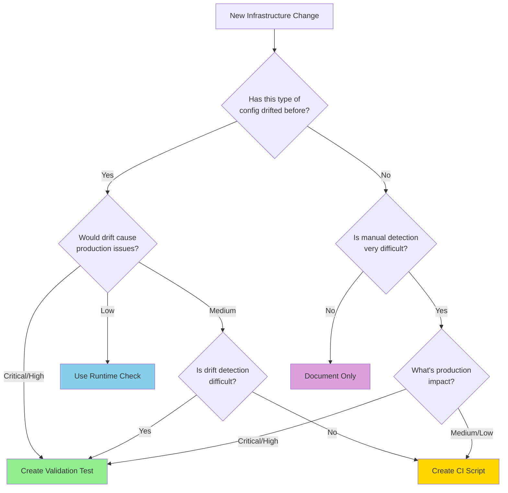

# Infrastructure Testing Overview

**Version:** 1.0.0  
**Last Updated:** 2025-11-04  
**Status:** Active  
**Target Audience:** All developers, infrastructure engineers, task planners, code reviewers

## Table of Contents

- [1. Executive Summary](#1-executive-summary)
- [2. The Problem We're Solving](#2-the-problem-were-solving)
- [3. Decision Framework](#3-decision-framework)
- [4. Quick Reference Decision Matrix](#4-quick-reference-decision-matrix)
- [5. Related Documentation](#5-related-documentation)

---

## 1. Executive Summary

### Core Principle

**Create validation tests only when there's proven history of configuration drift or when detection
difficulty justifies the maintenance cost.**

### Key Priorities

1. **Primary: Prevent production issues**
2. **Secondary: Minimize test maintenance burden**
3. **Tertiary: Catch infrastructure drift, provide fast feedback**

### The Reality

The CritGenius Listener project has accumulated 27 infrastructure validation tests totaling over
5,000 lines of code. Recent infrastructure tasks have consistently created 1-2 dedicated validation
tests per task, regardless of whether:

- The configuration has a history of drifting
- Manual detection would be difficult
- Production impact justifies test maintenance cost
- Alternative validation strategies would suffice

### The Solution

This guide provides a **decision framework** to help you choose between:

- **Validation Tests:** Full test suites for configurations with drift history
- **Runtime Checks:** Lightweight assertions at application startup
- **CI Scripts:** Simple shell scripts for configuration verification
- **Documentation Only:** Clear documentation for easy manual verification

---

## 2. The Problem We're Solving

### Current State Analysis

**Test Distribution Breakdown:**

```
Total Tests: 27 infrastructure validation tests
Total Lines: 5,194 lines of code
Average: 192 lines per test

Complexity Distribution:
  High Complexity (>300 lines): 5 tests (19%)
    - coverage-orchestration.test.ts: 486 lines
    - eslint-audit-validation.test.ts: 372 lines
    - windows-reserved-names.test.ts: 363 lines
    - vitest-config-consistency.test.ts: 333 lines
    - coverage-validation.test.ts: 283 lines

  Medium Complexity (100-300 lines): 11 tests (41%)
  Low Complexity (<100 lines): 11 tests (40%)
```

### Observed Patterns

**Pattern 1: Automatic Test Creation** Every infrastructure task creates dedicated validation,
regardless of:

- Whether the configuration has ever drifted
- Whether drift would be hard to detect manually
- Whether production impact justifies maintenance cost

**Pattern 2: Complex Fixture Management** Many tests include:

- Temporary directory creation and cleanup
- Complex mocking of child processes
- Extensive setup/teardown logic
- Fixture catalogs with version management

**Pattern 3: Potential Redundancy** Multiple tests validate related concerns:

- `eslint-audit-validation.test.ts` (372 lines) + `eslint-package-configs.validation.test.ts` (174
  lines)
- Multiple path validation tests
- Multiple performance documentation tests

### Real Cost Assessment

**High-Value Tests (Keep These!):**

- `test-naming-standards.test.ts` (22 lines): Simple wrapper, catches real violations
- `version-validation.test.mjs` (12 lines): Lightweight, critical for monorepo
- `comprehensive-testing-guide.test.ts` (250 lines): Prevents documentation drift

**Questionable-Value Tests (Evaluate These):**

- `coverage-orchestration.test.ts` (486 lines): Complex mocking, could be integration test
- `eslint-package-configs.validation.test.ts` (174 lines): Could consolidate with audit test
- `baseline-manager.security.test.ts` (223 lines): Security validation without drift history

### User's Core Concerns

> "I'm worried about spending time maintaining tests that rarely catch real issues. I want
> validation tests only when there's proven history of configuration drift."

This guide directly addresses this concern by providing clear criteria for test decisions.

---

## 3. Decision Framework

### The Four-Question Test

Before creating a validation test, answer these four questions:



### Detailed Decision Criteria

#### Question 1: Has this type of config drifted before?

**What counts as "drift":**

- Configuration was correct, then became incorrect without intentional change
- Inconsistencies emerged between related configurations
- Valid configuration was accidentally overwritten

**What doesn't count:**

- One-time setup that hasn't changed
- New configuration without history

**Evidence sources:**

- Git history showing unintended config changes
- Bug reports related to misconfiguration
- Task completion reports noting configuration issues

#### Question 2: Would drift cause production issues?

**Critical Impact:**

- Application won't start
- Data loss or corruption
- Security vulnerabilities
- Complete feature breakage

**High Impact:**

- Significant performance degradation
- Major feature degradation
- User-visible errors

**Medium Impact:**

- Development workflow disruption
- CI/CD failures
- Non-critical feature issues

**Low Impact:**

- Documentation inconsistencies
- Cosmetic issues
- Development convenience features

#### Question 3: Is manual detection very difficult?

**Very Difficult (Hard to detect):**

- Requires comparing multiple files across packages
- Involves complex patterns or regex
- Requires running application and observing runtime behavior
- Affects only edge cases or specific conditions

**Medium Difficulty:**

- Requires checking 2-3 related files
- Involves straightforward comparisons
- Can be found with simple file search

**Easy to Detect:**

- Single file to check
- Obvious at application startup
- Caught by linter or TypeScript compiler
- Clear error messages guide to problem

#### Question 4: Combined Assessment

Use this matrix to make final decisions:

| Drift History | Production Impact | Detection Difficulty | Recommendation                   |
| ------------- | ----------------- | -------------------- | -------------------------------- |
| Yes           | Critical          | Any                  | **Validation Test**              |
| Yes           | High              | Hard                 | **Validation Test**              |
| Yes           | High              | Medium               | **Validation Test**              |
| Yes           | High              | Easy                 | **Runtime Check**                |
| Yes           | Medium            | Hard                 | **Validation Test**              |
| Yes           | Medium            | Medium               | **CI Script**                    |
| Yes           | Medium            | Easy                 | **CI Script**                    |
| Yes           | Low               | Any                  | **CI Script** or **Document**    |
| No            | Critical          | Hard                 | **Validation Test** (preventive) |
| No            | Critical          | Medium               | **Runtime Check**                |
| No            | Critical          | Easy                 | **Runtime Check**                |
| No            | High              | Hard                 | **Runtime Check**                |
| No            | High              | Medium               | **CI Script**                    |
| No            | High              | Easy                 | **CI Script**                    |
| No            | Medium/Low        | Any                  | **Document Only**                |

### Decision Outcomes Explained

#### 🟢 Validation Test

**When:** Proven drift history + (Critical/High impact OR Hard detection)

**Characteristics:**

- Full Vitest test suite
- Comprehensive assertions
- Can use fixtures and mocks if needed
- Runs in CI pipeline
- Provides detailed failure diagnostics

**Example:** ESLint configuration consistency across packages (has drifted, high impact, hard to
detect manually)

#### 🔵 Runtime Check

**When:** Critical/High impact + Easy detection + No drift history yet

**Characteristics:**

- Lightweight assertion at application startup
- Fails fast with clear error message
- Zero test maintenance
- Prevents application from starting with bad config
- Great for "fail early" scenarios

**Example:** Required environment variables, critical service configurations

#### 🟡 CI Script

**When:** Medium impact OR Low detection difficulty + Some drift concern

**Characteristics:**

- Simple shell script in CI pipeline
- Basic file checks and comparisons
- No test framework overhead
- Easy to maintain
- Can use existing CLI tools

**Example:** Checking for unexpected config files, verifying file structure

#### 🟣 Document Only

**When:** No drift history + Low impact + Easy detection

**Characteristics:**

- Clear documentation of configuration requirements
- Manual verification during code review
- No automated validation
- Lowest maintenance burden

**Example:** Recommended IDE settings, optional optimizations

---

## 4. Quick Reference Decision Matrix

Use this matrix during task planning for quick validation strategy decisions:

| Scenario                              | Drift History | Impact   | Detection | Recommendation             | Rationale                                |
| ------------------------------------- | ------------- | -------- | --------- | -------------------------- | ---------------------------------------- |
| **New ESLint rule**                   | No            | Medium   | Easy      | Document + Code Review     | First-time config, easy to verify        |
| **Monorepo version consistency**      | Yes           | Critical | Hard      | Validation Test            | Proven drift, critical impact            |
| **Environment variable requirements** | No            | Critical | Easy      | Runtime Check              | Critical but easy - fail fast at startup |
| **File naming conventions**           | Yes           | Medium   | Medium    | Thin Wrapper Test          | Reusable script, proven violations       |
| **Package.json scripts naming**       | No            | Low      | Easy      | Document Only              | Low impact, easy manual check            |
| **Build output structure**            | No            | High     | Medium    | Runtime Check + CI Script  | High impact but no drift history yet     |
| **TypeScript compiler options**       | Yes           | High     | Hard      | Validation Test            | Complex multi-file validation            |
| **Code coverage thresholds**          | Yes           | Medium   | Easy      | Validation Test (existing) | Already have it, maintains value         |
| **README.md completeness**            | No            | Low      | Easy      | Documentation Only         | Low impact, code review sufficient       |
| **Test file structure**               | Yes           | Medium   | Medium    | Thin Wrapper Test          | Reusable validator exists                |

### Decision Tree (Simplified)

```
Is this a first-time configuration?
├─ Yes
│  └─ Would misconfiguration cause critical production issues?
│     ├─ Yes → Runtime Check
│     └─ No → Can you detect errors easily?
│        ├─ Yes → Document Only
│        └─ No → CI Script
├─ No (has drift history)
   └─ What's the production impact?
      ├─ Critical → Validation Test
      ├─ High → Is detection difficult?
      │  ├─ Yes → Validation Test
      │  └─ No → Runtime Check
      └─ Medium/Low → Is detection difficult?
         ├─ Yes → Validation Test
         └─ No → CI Script
```

---

## 5. Related Documentation

### Core Infrastructure Testing

- [Infrastructure Testing Strategies](./infrastructure-testing-strategies.md) - Detailed
  implementation strategies for runtime checks, CI scripts, and test consolidation
- [Infrastructure Testing Examples](./infrastructure-testing-examples.md) - Real-world examples,
  implementation guidelines, and common antipatterns
- [Infrastructure Testing Migration](./infrastructure-testing-migration.md) - Migration guidance for
  existing tests and assessment tools

### Testing Standards & Frameworks

- [Comprehensive Testing Guide](./comprehensive-testing-guide.md) - Complete testing strategy and
  practices
- [Testing Standards](./testing-standards.md) - Naming conventions and test structure
- [Integration Testing Standards](./integration-testing-standards.md) - Integration test patterns
- [Testing Utilities](../testing-utilities.md) - Shared testing utilities and helpers

### Validation & Decision Tools

- [Validation Test Decision Matrix](./validation-test-decision-matrix.md) - One-page decision
  reference
- [Coverage System Guide](./coverage-system-guide.md) - Coverage reporting and validation
- [CI/ESLint Integration](./ci-eslint-integration.md) - Code quality validation patterns

### Protocol Files

- [.clinerules/07-cline-continuous-improvement-protocol.md](../.clinerules/07-cline-continuous-improvement-protocol.md) -
  Continuous learning and improvement protocols
- [.clinerules/baby-steps-v-1-1.md](../.clinerules/baby-steps-v-1-1.md) - Methodical task execution
  approach
- [.clinerules/01-sequence-diagrams.md](../.clinerules/01-sequence-diagrams.md) - Workflow
  visualization protocols

### Task Planning & Workflow

- [Developer Onboarding](./developer-onboarding.md) - New developer guidance
- [Development Workflow](./development-workflow.md) - Standard development processes
- [Task Completion Report Guide](./task-completion-report-guide.md) - Documentation standards

---

## Version History

| Version | Date       | Changes                                                                           |
| ------- | ---------- | --------------------------------------------------------------------------------- |
| 1.0.0   | 2025-11-04 | Initial overview creation with decision framework and real-world problem analysis |
| 1.0.0   | 2025-10-21 | Original comprehensive guide creation (migrated content)                          |

---

**Last Updated:** 2025-11-04 16:53:21  
**Next Steps:** Refer to [Infrastructure Testing Strategies](./infrastructure-testing-strategies.md)
for detailed implementation approaches
