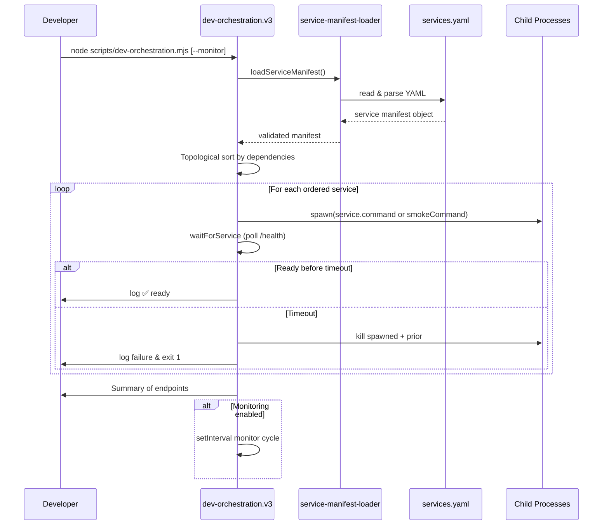
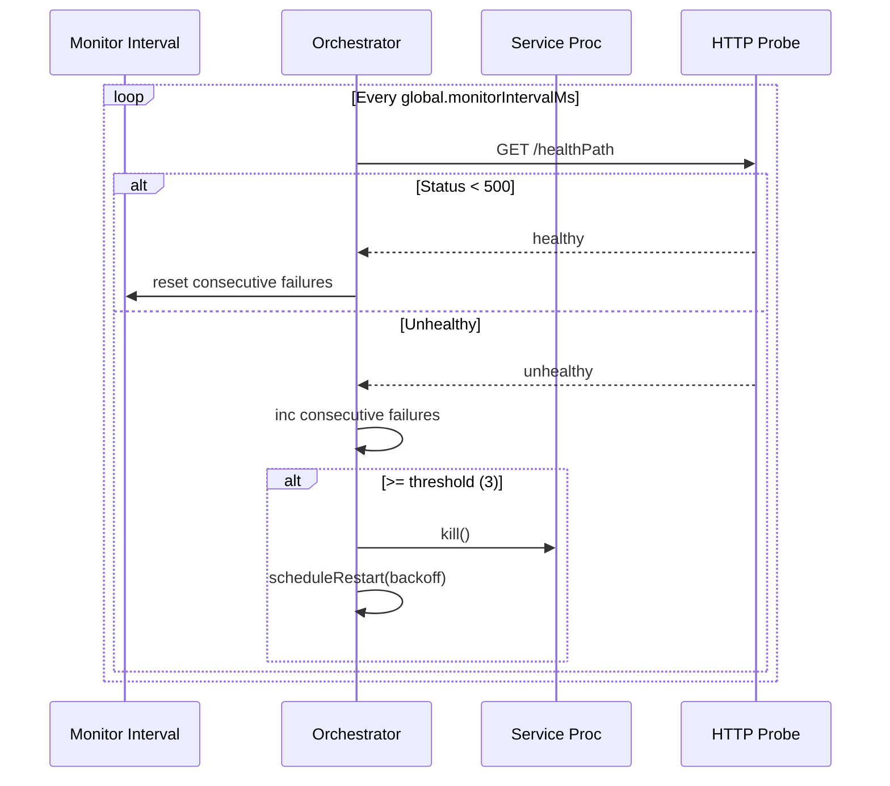
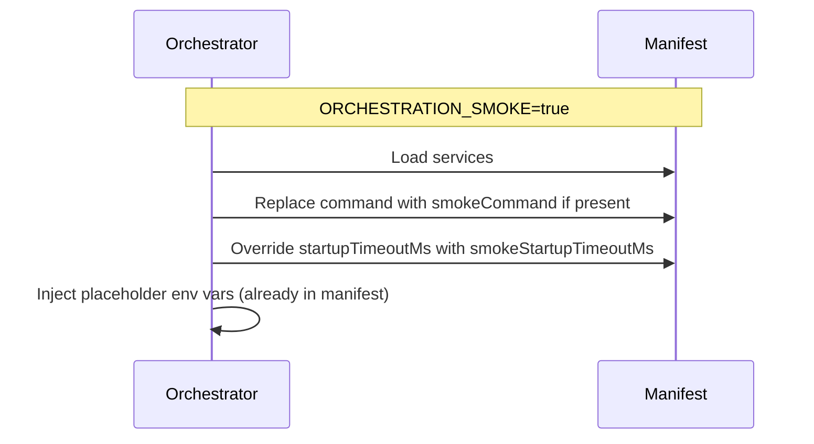

## Declarative Service Manifest Orchestration

This document describes the manifest-driven coordinated dev workflow introduced in `services.yaml`
and implemented by the promoted **v3 orchestrator** now exposed at `scripts/dev-orchestration.mjs`
(wrapper delegating to `dev-orchestration.v3.mjs`) plus `scripts/service-manifest-loader.mjs`.

### Goals

1. Decouple orchestration logic from hardcoded topology
2. Enable easy addition / modification of services without script edits
3. Provide smoke-mode overrides for fast CI validation
4. Preserve and extend health check + monitoring functionality (readiness + liveness)
5. Add structured restart/backoff with circuit breaker to prevent thrashing

### Manifest Overview (`services.yaml`)

Key sections:

- `version` / `metadata`: descriptive
- `global`: polling + monitoring intervals and restart backoff
- `services`: service map with commands, ports, health paths, timeouts, dependencies, environment

Environment values support `${port}` interpolation plus orchestrator injected convenience vars:
`SERVICE_NAME`, `TIMEOUT`, `DEV_PROXY_TIMEOUT_MS` (derived from global.defaultTimeout unless
overridden).

### Core Startup Sequence



### Monitoring & Restart Cycle (v3)



### Smoke Mode Flow Differences



### Restart Logic (Unhealthy -> Restart, v3)

```mermaid
flowchart TD
    A[Exit OR 3 consecutive failed probes OR readiness timeout] --> B[Compute backoff (exp)]
    B --> C[Spawn new process]
    C --> D[If success -> reset attempts]
    C --> E[If fail -> attempts++]
    E --> F{attempts > max?}
    F -->|Yes| G[Open circuit cooldown]
    F -->|No| B
```

### Error Handling (v3)

- Manifest validation failures: process exits with aggregated error list
- Cyclic dependencies: explicit cycle detection error before spawning
- Readiness timeout: abort start attempt & schedule restart under policy
- Liveness probe consecutive failures (>=3): triggers restart flow
- Circuit breaker: after maxAttempts reached, service enters cooldown (no restarts) until
  `circuitCooldownMs` expires

### Extending the Topology

1. Add new block under `services:` with unique key
2. Define `command`, `port`, `healthPath`, `startupTimeoutMs`
3. Optionally set `dependencies` (array of existing service keys)
4. (Optional) `smokeCommand` & `smokeStartupTimeoutMs` for CI quick path
5. Run `node scripts/service-manifest-loader.mjs` to verify load

### Future Enhancements (Deferred)

- Parallel startup of independent branches (requires concurrency & dependency gating)
- Structured JSON log / event stream (for UI dashboard)
- Configurable health probe strategy (HTTP / WebSocket / custom command)
- Declarative per-service consecutive failure thresholds
- Rich TUI / web dashboard

### Quick Verification Commands (Optional)

```
node scripts/service-manifest-loader.mjs
ORCHESTRATION_SMOKE=true node scripts/dev-orchestration.mjs --monitor
```

### Security / Privacy Notes

Manifest should not store real secrets—only development placeholders. Production secrets remain in
environment (.env) validated via existing environment loader.

---

Updated (Phase 4) – v3 orchestration promoted; legacy script removed after stabilization.
