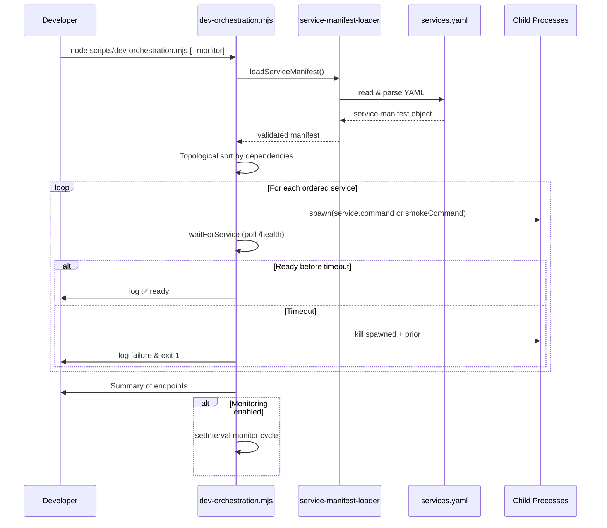
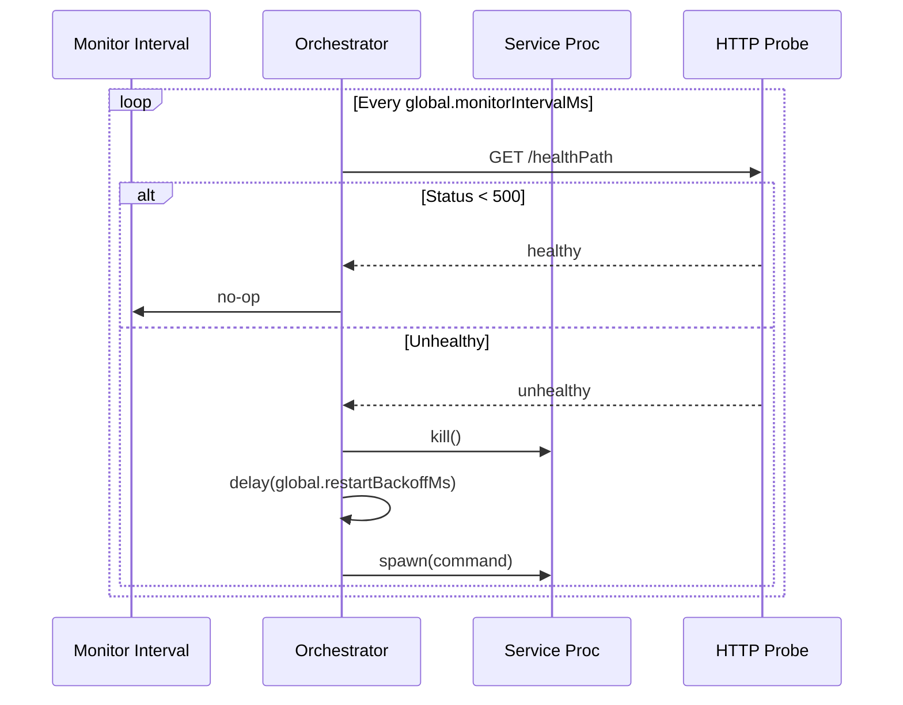
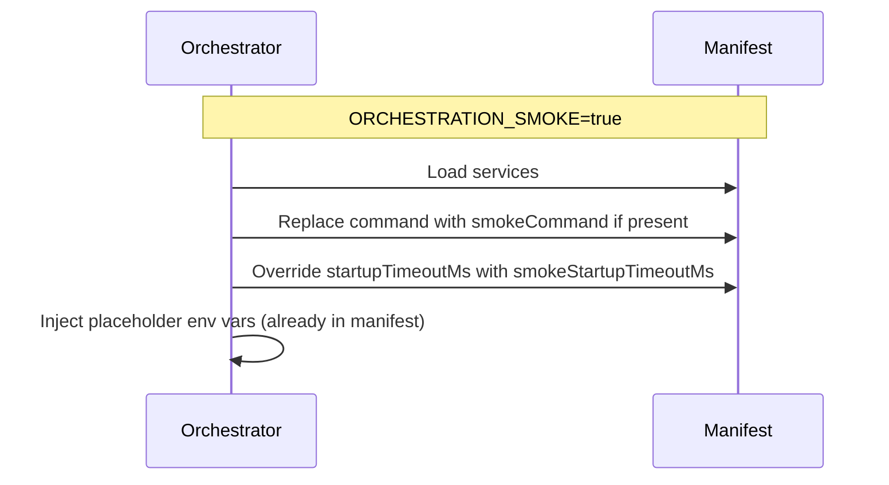
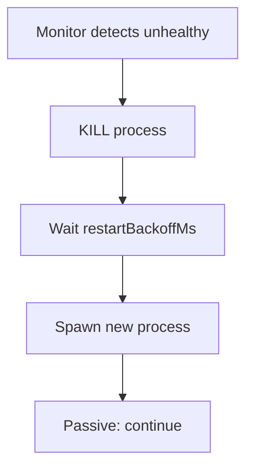

## Declarative Service Manifest Orchestration

This document describes the new manifest-driven coordinated dev workflow introduced in
`services.yaml` and implemented in `scripts/dev-orchestration.mjs` +
`scripts/service-manifest-loader.mjs`.

### Goals

1. Decouple orchestration logic from hardcoded topology
2. Enable easy addition / modification of services without script edits
3. Provide smoke-mode overrides for fast CI validation
4. Preserve existing health check + monitoring functionality

### Manifest Overview (`services.yaml`)

Key sections:

- `version` / `metadata`: descriptive
- `global`: polling + monitoring intervals and restart backoff
- `services`: service map with commands, ports, health paths, timeouts, dependencies, environment

Environment values support `${port}` interpolation.

### Core Startup Sequence



### Monitoring & Restart Cycle



### Smoke Mode Flow Differences



### Restart Logic (Unhealthy -> Restart)



### Error Handling

- Manifest validation failures: process exits with aggregated error list
- Cyclic dependencies: explicit cycle detection error before spawning
- Health timeout: abort + cleanup previously spawned services

### Extending the Topology

1. Add new block under `services:` with unique key
2. Define `command`, `port`, `healthPath`, `startupTimeoutMs`
3. Optionally set `dependencies` (array of existing service keys)
4. (Optional) `smokeCommand` & `smokeStartupTimeoutMs` for CI quick path
5. Run `node scripts/service-manifest-loader.mjs` to verify load

### Future Enhancements (Deferred)

- YAML schema validation via Zod + intermediate JSON transform
- Per-service custom monitor strategy (websocket ping, etc.)
- Parallel startup of independent branches (requires concurrency controls)
- Structured JSON log mode for machine parsing

### Quick Verification Commands (Optional)

```
node scripts/service-manifest-loader.mjs
ORCHESTRATION_SMOKE=true node scripts/dev-orchestration.mjs --monitor
```

### Security / Privacy Notes

Manifest should not store real secrets—only development placeholders. Production secrets remain in
environment (.env) validated via existing environment loader.

---

Generated as part of task 2-9-3: Enhance Declarative Service Manifest.
