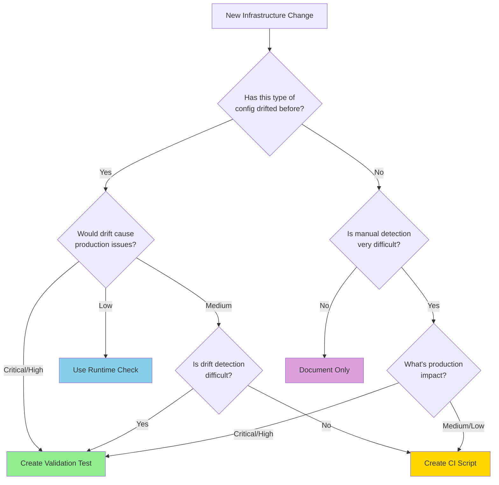

# Pragmatic Infrastructure Testing Guide

**Version:** 1.0.0  
**Last Updated:** 2025-10-21  
**Status:** Active  
**Target Audience:** Infrastructure engineers, task planners, code reviewers

## Table of Contents

- [1. Executive Summary](#1-executive-summary)
- [2. The Problem We're Solving](#2-the-problem-were-solving)
- [3. Decision Framework](#3-decision-framework)
- [4. Alternative Validation Strategies](#4-alternative-validation-strategies)
- [5. Consolidation Patterns](#5-consolidation-patterns)
- [6. Implementation Guidelines](#6-implementation-guidelines)
- [7. Real-World Examples from CritGenius](#7-real-world-examples-from-critgenius)
- [8. Integration with Task Planning](#8-integration-with-task-planning)
- [9. Quick Reference Decision Matrix](#9-quick-reference-decision-matrix)
- [10. Migration Path for Existing Tests](#10-migration-path-for-existing-tests)

---

## 1. Executive Summary

### Core Principle

**Create validation tests only when there's proven history of configuration drift or when detection
difficulty justifies the maintenance cost.**

### Key Priorities

1. **Primary: Prevent production issues**
2. **Secondary: Minimize test maintenance burden**
3. **Tertiary: Catch infrastructure drift, provide fast feedback**

### The Reality

The CritGenius Listener project has accumulated 27 infrastructure validation tests totaling over
5,000 lines of code. Recent infrastructure tasks have consistently created 1-2 dedicated validation
tests per task, regardless of whether:

- The configuration has a history of drifting
- Manual detection would be difficult
- Production impact justifies test maintenance cost
- Alternative validation strategies would suffice

### The Solution

This guide provides a **decision framework** to help you choose between:

- **Validation Tests:** Full test suites for configurations with drift history
- **Runtime Checks:** Lightweight assertions at application startup
- **CI Scripts:** Simple shell scripts for configuration verification
- **Documentation Only:** Clear documentation for easy manual verification

---

## 2. The Problem We're Solving

### Current State Analysis

**Test Distribution Breakdown:**

```
Total Tests: 27 infrastructure validation tests
Total Lines: 5,194 lines of code
Average: 192 lines per test

Complexity Distribution:
  High Complexity (>300 lines): 5 tests (19%)
    - coverage-orchestration.test.ts: 486 lines
    - eslint-audit-validation.test.ts: 372 lines
    - windows-reserved-names.test.ts: 363 lines
    - vitest-config-consistency.test.ts: 333 lines
    - coverage-validation.test.ts: 283 lines

  Medium Complexity (100-300 lines): 11 tests (41%)
  Low Complexity (<100 lines): 11 tests (40%)
```

### Observed Patterns

**Pattern 1: Automatic Test Creation** Every infrastructure task creates dedicated validation,
regardless of:

- Whether the configuration has ever drifted
- Whether drift would be hard to detect manually
- Whether production impact justifies maintenance cost

**Pattern 2: Complex Fixture Management** Many tests include:

- Temporary directory creation and cleanup
- Complex mocking of child processes
- Extensive setup/teardown logic
- Fixture catalogs with version management

**Pattern 3: Potential Redundancy** Multiple tests validate related concerns:

- `eslint-audit-validation.test.ts` (372 lines) + `eslint-package-configs.validation.test.ts` (174
  lines)
- Multiple path validation tests
- Multiple performance documentation tests

### Real Cost Assessment

**High-Value Tests (Keep These!):**

- `test-naming-standards.test.ts` (22 lines): Simple wrapper, catches real violations
- `version-validation.test.mjs` (12 lines): Lightweight, critical for monorepo
- `comprehensive-testing-guide.test.ts` (250 lines): Prevents documentation drift

**Questionable-Value Tests (Evaluate These):**

- `coverage-orchestration.test.ts` (486 lines): Complex mocking, could be integration test
- `eslint-package-configs.validation.test.ts` (174 lines): Could consolidate with audit test
- `baseline-manager.security.test.ts` (223 lines): Security validation without drift history

### User's Core Concerns

> "I'm worried about spending time maintaining tests that rarely catch real issues. I want
> validation tests only when there's proven history of configuration drift."

This guide directly addresses this concern by providing clear criteria for test decisions.

---

## 3. Decision Framework

### The Four-Question Test

Before creating a validation test, answer these four questions:



### Detailed Decision Criteria

#### Question 1: Has this type of config drifted before?

**What counts as "drift":**

- Configuration was correct, then became incorrect without intentional change
- Inconsistencies emerged between related configurations
- Valid configuration was accidentally overwritten

**What doesn't count:**

- One-time setup that hasn't changed
- New configuration without history

**Evidence sources:**

- Git history showing unintended config changes
- Bug reports related to misconfiguration
- Task completion reports noting configuration issues

#### Question 2: Would drift cause production issues?

**Critical Impact:**

- Application won't start
- Data loss or corruption
- Security vulnerabilities
- Complete feature breakage

**High Impact:**

- Significant performance degradation
- Major feature degradation
- User-visible errors

**Medium Impact:**

- Development workflow disruption
- CI/CD failures
- Non-critical feature issues

**Low Impact:**

- Documentation inconsistencies
- Cosmetic issues
- Development convenience features

#### Question 3: Is manual detection very difficult?

**Very Difficult (Hard to detect):**

- Requires comparing multiple files across packages
- Involves complex patterns or regex
- Requires running application and observing runtime behavior
- Affects only edge cases or specific conditions

**Medium Difficulty:**

- Requires checking 2-3 related files
- Involves straightforward comparisons
- Can be found with simple file search

**Easy to Detect:**

- Single file to check
- Obvious at application startup
- Caught by linter or TypeScript compiler
- Clear error messages guide to problem

#### Question 4: Combined Assessment

Use this matrix to make final decisions:

| Drift History | Production Impact | Detection Difficulty | Recommendation                   |
| ------------- | ----------------- | -------------------- | -------------------------------- |
| Yes           | Critical          | Any                  | **Validation Test**              |
| Yes           | High              | Hard/Medium          | **Validation Test**              |
| Yes           | High              | Easy                 | **Runtime Check**                |
| Yes           | Medium            | Hard                 | **Validation Test**              |
| Yes           | Medium            | Medium/Easy          | **CI Script**                    |
| Yes           | Low               | Any                  | **CI Script** or **Document**    |
| No            | Critical          | Hard                 | **Validation Test** (preventive) |
| No            | Critical          | Easy                 | **Runtime Check**                |
| No            | Critical          | Medium               | **Runtime Check**                |
| No            | High              | Hard                 | **Runtime Check**                |
| No            | High              | Medium/Easy          | **CI Script**                    |
| No            | Medium/Low        | Any                  | **Document Only**                |

### Decision Outcomes Explained

#### 🟢 Validation Test

**When:** Proven drift history + (Critical/High impact OR Hard detection)

**Characteristics:**

- Full Vitest test suite
- Comprehensive assertions
- Can use fixtures and mocks if needed
- Runs in CI pipeline
- Provides detailed failure diagnostics

**Example:** ESLint configuration consistency across packages (has drifted, high impact, hard to
detect manually)

#### 🔵 Runtime Check

**When:** Critical/High impact + Easy detection + No drift history yet

**Characteristics:**

- Lightweight assertion at application startup
- Fails fast with clear error message
- Zero test maintenance
- Prevents application from starting with bad config
- Great for "fail early" scenarios

**Example:** Required environment variables, critical service configurations

#### 🟡 CI Script

**When:** Medium impact OR Low detection difficulty + Some drift concern

**Characteristics:**

- Simple shell script in CI pipeline
- Basic file checks and comparisons
- No test framework overhead
- Easy to maintain
- Can use existing CLI tools

**Example:** Checking for unexpected config files, verifying file structure

#### 🟣 Document Only

**When:** No drift history + Low impact + Easy detection

**Characteristics:**

- Clear documentation of configuration requirements
- Manual verification during code review
- No automated validation
- Lowest maintenance burden

**Example:** Recommended IDE settings, optional optimizations

---

## 4. Alternative Validation Strategies

### Strategy 1: Runtime Validation Checks

Runtime checks provide zero-maintenance validation by failing at application startup if
configuration is invalid.

#### When to Use Runtime Checks

✅ **Use runtime checks when:**

- Configuration errors would prevent normal operation
- Errors are easy to detect programmatically
- Fast failure is preferable to silent misconfiguration
- You want zero test maintenance

❌ **Don't use runtime checks when:**

- Validation is computationally expensive
- Configuration is used only in specific scenarios
- Testing requires complex setup or mocking
- Build-time validation is sufficient

#### Implementation Pattern

```typescript
// scripts/runtime-validation-helpers.mjs

/**
 * Validates configuration at runtime with actionable error messages
 * @param {string} configPath - Path to config file
 * @param {function} validator - Validation function
 * @throws {Error} with descriptive message if validation fails
 */
export function validateConfigAtRuntime(configPath, validator) {
  try {
    const config = loadConfig(configPath);
    const result = validator(config);

    if (!result.valid) {
      throw new Error(
        `Configuration validation failed for ${configPath}:\n` +
          result.errors.map(e => `  - ${e}`).join('\n') +
          `\n\nFix: ${result.fix}`
      );
    }
  } catch (error) {
    console.error(`[Runtime Validation] ${error.message}`);
    process.exit(1);
  }
}

/**
 * Asserts required environment variables are present
 * @param {string[]} requiredVars - Array of required variable names
 * @throws {Error} if any required variable is missing
 */
export function assertRequiredEnvVars(requiredVars) {
  const missing = requiredVars.filter(varName => !process.env[varName]);

  if (missing.length > 0) {
    throw new Error(
      `Missing required environment variables:\n` +
        missing.map(v => `  - ${v}`).join('\n') +
        `\n\nRefer to .env.example for required variables`
    );
  }
}
```

#### Usage Example

```typescript
// packages/server/src/index.ts

import { assertRequiredEnvVars } from '../../../scripts/runtime-validation-helpers.mjs';

// Validate at startup before any other initialization
assertRequiredEnvVars(['DATABASE_URL', 'JWT_SECRET', 'API_KEY']);

// Application continues only if validation passes
startServer();
```

- Use `detectConfigDrift` when you need to ensure multiple configuration files stay aligned across
  packages without maintaining a full validation test suite.

**Benefits:**

- No test maintenance
- Immediate feedback in all environments (dev, staging, prod)
- Clear error messages guide developers to fixes
- Validates actual runtime configuration

**Trade-offs:**

- Only catches issues when application starts
- Can't validate complex multi-file scenarios
- May slow down startup if validation is expensive

### Strategy 2: CI Validation Scripts

Simple shell scripts provide lightweight validation without test framework overhead.

#### When to Use CI Scripts

✅ **Use CI scripts when:**

- Validation is simple file system checks
- Existing CLI tools can do the checking (find, grep, diff)
- Test framework would be overkill
- Quick feedback is valuable but not critical

❌ **Don't use CI scripts when:**

- Complex logic or TypeScript/JavaScript code needed
- Need fixture management or mocking
- Validation requires compilation
- Detailed failure diagnostics are important

#### Implementation Pattern

```bash
#!/usr/bin/env bash
# scripts/validate-package-structure.sh

set -euo pipefail

echo "Validating package structure..."

PACKAGES_DIR="packages"
REQUIRED_PACKAGES=("client" "server" "shared" "test-utils")

# Check each package has required files
for pkg in "${REQUIRED_PACKAGES[@]}"; do
  pkg_dir="${PACKAGES_DIR}/${pkg}"

  if [[ ! -d "${pkg_dir}" ]]; then
    echo "❌ Missing package directory: ${pkg_dir}"
    exit 1
  fi

  if [[ ! -f "${pkg_dir}/package.json" ]]; then
    echo "❌ Missing package.json in ${pkg_dir}"
    exit 1
  fi

  if [[ ! -f "${pkg_dir}/tsconfig.json" ]]; then
    echo "❌ Missing tsconfig.json in ${pkg_dir}"
    exit 1
  fi
done

# Check for unexpected ESLint configs in packages
unexpected_configs=$(find "${PACKAGES_DIR}" -type f \( \
  -name '.eslintrc*' -o \
  -name 'eslint.config.*' \
\) 2>/dev/null || true)

if [[ -n "${unexpected_configs}" ]]; then
  echo "❌ Found unexpected ESLint configs in packages (should use root config):"
  echo "${unexpected_configs}"
  exit 1
fi

echo "✅ Package structure validation passed"
```

#### Integration with CI

```yaml
# .github/workflows/ci.yml

- name: Validate Package Structure
  run: bash scripts/validate-package-structure.sh

- name: Validate No Config Drift
  run: bash scripts/validate-no-config-drift.sh
```

**Benefits:**

- Extremely low maintenance
- Fast execution
- Easy to understand and modify
- Leverages existing shell tools
- No test framework dependencies

**Trade-offs:**

- Limited to file system operations
- Harder to provide detailed diagnostics
- Shell scripting can be error-prone
- Less portable across platforms

### Strategy 3: Documentation-First Approach

For low-impact configurations, comprehensive documentation may be sufficient.

#### When to Use Documentation Only

✅ **Use documentation when:**

- Configuration is set once and rarely changes
- Easy to verify manually during code review
- Low production impact if misconfigured
- No history of drift

❌ **Don't use documentation when:**

- Configuration frequently changes
- Hard to verify manually
- Critical production impact
- Previous drift incidents

#### Documentation Pattern

````markdown
## Package Configuration Standards

### ESLint Configuration

**Rule:** All packages MUST use the root-level `eslint.config.js`. Package-level ESLint configs are
prohibited.

**Rationale:** Ensures consistent linting rules across the monorepo.

**Verification:**

1. Check `packages/*/` directories for `.eslintrc*` or `eslint.config.*` files
2. Only the root `eslint.config.js` should exist

**Common Mistakes:**

- Creating package-specific `.eslintrc.json` files
- Copy-pasting ESLint config from another project

**If You Need Package-Specific Rules:** Add overrides in the root `eslint.config.js`:

\```javascript export default [ // ... global rules { files: ['packages/client/**/*.ts'], rules: {
// Client-specific overrides } } ]; \```
````

**Benefits:**

- Zero maintenance cost
- Flexible for edge cases
- Serves as reference during code review
- Documents rationale

**Trade-offs:**

- Relies on human vigilance
- No automated enforcement
- May be ignored under time pressure
- Doesn't prevent mistakes

### Strategy 4: Consolidated Test Suites

Combine related validations into single test suites to reduce maintenance overhead.

#### When to Consolidate

✅ **Consolidate when:**

- Multiple tests validate related configurations
- Tests share setup/teardown logic
- Tests have similar structure
- Individual tests are simple

❌ **Don't consolidate when:**

- Tests have very different purposes
- Combined test would be over 400 lines
- Failure isolation would suffer
- Tests run at different times (unit vs infrastructure)

#### Consolidation Example

**Before:** Three separate test files

- `eslint-audit-validation.test.ts` (372 lines)
- `eslint-package-configs.validation.test.ts` (174 lines)
- `eslint-scripts.test.ts` (hypothetical 100 lines)

**After:** One consolidated file

- `eslint-configuration.validation.test.ts` (450 lines)

```typescript
// tests/infrastructure/eslint-configuration.validation.test.ts

describe('ESLint configuration validation', () => {
  describe('audit completeness', () => {
    // Tests from eslint-audit-validation.test.ts
  });

  describe('package configurations', () => {
    // Tests from eslint-package-configs.validation.test.ts
  });

  describe('npm scripts', () => {
    // Tests from eslint-scripts.test.ts
  });
});
```

**Benefits:**

- Single file to maintain
- Shared setup/teardown
- Related validations grouped logically
- Easier to understand full picture

**Trade-offs:**

- Larger files can be harder to navigate
- All tests run together (can't selectively run one subset easily)
- Merge conflicts more likely

---

## 5. Consolidation Patterns

### Pattern 1: Theme-Based Consolidation

Combine tests that validate different aspects of the same system.

**Example: Coverage System**

```
Before:
- coverage-validation.test.ts (283 lines)
- coverage-thresholds.test.ts (130 lines)
- coverage-documentation.test.ts (212 lines)
- ci-coverage-integration.test.ts (139 lines)

After:
- coverage-system.validation.test.ts (600 lines)
  - Configuration validation
  - Threshold validation
  - Documentation validation
  - CI integration checks
```

### Pattern 2: Technology-Stack Consolidation

Combine tests related to a specific technology across different concerns.

**Example: Vitest Configuration**

```
Before:
- vitest-config-consistency.test.ts (333 lines)
- vitest-workspace.test.ts (218 lines)

After:
- vitest-configuration.validation.test.ts (450 lines)
  - Workspace configuration
  - Per-package config consistency
  - Shared config validation
```

### Pattern 3: Thin Wrapper Pattern

For very simple validations, wrap existing validation scripts rather than duplicating logic.

**Example: Testing Standards**

```typescript
// tests/infrastructure/testing-standards.test.ts (22 lines)

describe('testing standards compliance', () => {
  it('has no outstanding naming or structure violations', async () => {
    const { collectTestingStandardsIssues } = await import(
      '../../scripts/validate-testing-standards.mjs'
    );
    const { issues } = await collectTestingStandardsIssues({ fix: false });

    expect(issues).toHaveLength(0);
  });
});
```

**Benefits:**

- Minimal test code
- Validation logic is reusable (can run outside tests)
- Easy to maintain
- Single source of truth

### Pattern 4: Fixture-Free Validation

Eliminate complex fixture management by validating actual project files.

**Before:**

```typescript
// Complex fixture management
const tempDir = await fs.mkdtemp(path.join(os.tmpdir(), 'test-'));
await fs.writeFile(path.join(tempDir, 'config.json'), '...');
// ... test logic ...
await fs.rm(tempDir, { recursive: true });
```

**After:**

```typescript
// Direct validation of actual files
const config = await loadProjectConfig('config.json');
expect(config.setting).toBe(expectedValue);
```

**Benefits:**

- No setup/teardown complexity
- Tests actual project state
- Faster execution
- Fewer moving parts

**When NOT to use:**

- Need to test error conditions
- Testing build processes that modify files
- Need isolation from actual project state

---

## 6. Implementation Guidelines

### Guideline 1: Start with the Lightest Approach

Always begin with the least complex validation that meets your needs:

1. Can documentation suffice? → Document it
2. Can a runtime check catch it? → Add runtime validation
3. Can a shell script verify it? → Create CI script
4. Need complex validation? → Create test

### Guideline 2: Prefer Runtime Checks for Critical Configs

If misconfiguration would cause:

- Application startup failure
- Data corruption
- Security issues

→ Use runtime validation to fail fast

### Guideline 3: Consolidate Before Adding

Before creating a new validation test:

1. Check if related tests exist
2. Consider adding to existing test suite
3. If adding new test, plan future consolidation path

### Guideline 4: Document Your Decision

In task implementation plans and completion reports, document:

- Which validation strategy you chose
- Why you chose it (reference decision framework)
- What alternative approaches you considered

**Example:**

```markdown
## Validation Strategy Decision

**Decision:** Create CI shell script for package structure validation

**Rationale:**

- No history of drift (new configuration)
- Medium production impact (CI failures)
- Easy to detect manually (simple file checks)
- Per decision framework: Medium impact + Easy detection = CI Script

**Alternatives Considered:**

- Validation test: Overkill for simple file checks
- Runtime check: Not critical enough for startup validation
- Documentation only: Want automated enforcement
```

### Guideline 5: Review and Refactor

Every 6 months, review infrastructure tests:

- Which tests have never failed?
- Which tests are high maintenance?
- Can any tests be consolidated or replaced?

### Guideline 6: Measure Value vs. Cost

For each test, track:

- **Value:** How many times has it caught real issues?
- **Cost:** Lines of code, setup complexity, CI time
- **Ratio:** Value / Cost

Consider removing or simplifying tests with low ratios.

---

## 7. Real-World Examples from CritGenius

### Example 1: High-Value Simple Test ✅

**Test:** `test-naming-standards.test.ts` (22 lines)

**What it does:** Wraps existing validation script to enforce test naming conventions

**Why it's valuable:**

- Very low maintenance (thin wrapper)
- Catches real violations (proven drift history)
- Medium production impact (test organization)
- Easy to understand

**Key Takeaway:** Thin wrappers around reusable validation logic provide high value with minimal
overhead.

```typescript
// Excellent pattern: Minimal test code
describe('testing standards compliance', () => {
  it('has no outstanding naming or structure violations', async () => {
    const { collectTestingStandardsIssues } = await import(
      '../../scripts/validate-testing-standards.mjs'
    );
    const { issues } = await collectTestingStandardsIssues({ fix: false });
    expect(issues).toHaveLength(0);
  });
});
```

### Example 2: High-Maintenance Complex Test ⚠️

**Test:** `coverage-orchestration.test.ts` (486 lines)

**What it does:** Tests coverage script orchestration with complex child process mocking

**Maintenance concerns:**

- Complex mocking of child processes, events, streams
- Extensive setup/teardown logic
- Tests internal implementation details
- High line count = high maintenance

**Alternative approach:**

```typescript
// Instead of complex mocking, use integration test:
describe('coverage orchestration (integration)', () => {
  it('runs all coverage targets successfully', async () => {
    // Actually run the coverage script
    const result = await exec('node scripts/coverage/run-coverage.mjs workspace');
    expect(result.exitCode).toBe(0);
    expect(result.stdout).toContain('✅');
  });
});
```

**Key Takeaway:** When tests become too complex, consider whether integration tests or runtime
checks would be more appropriate.

### Example 3: Good Consolidation Opportunity 🔄

**Current State:**

- `eslint-audit-validation.test.ts` (372 lines)
- `eslint-package-configs.validation.test.ts` (174 lines)

**Consolidation Potential:** Both tests validate ESLint configuration but from different angles.
Could consolidate into:

```typescript
// tests/infrastructure/eslint-configuration.validation.test.ts

describe('ESLint configuration validation', () => {
  describe('audit completeness', () => {
    // Fixture catalog and audit tests
  });

  describe('package configuration standards', () => {
    // Package-level config prohibition tests
  });

  describe('ignore patterns', () => {
    // Shared ignore pattern validation
  });
});
```

**Benefits:**

- Single file to maintain (easier updates)
- Shared ESLint instance setup
- Related validations grouped logically
- ~450 lines vs. 546 lines (some deduplication)

### Example 4: Runtime Check Alternative 🔵

**Current:** `version-validation.test.ts` (130 lines) + `version-validation.test.mjs` (12 lines)

**Could be replaced with:**

```typescript
// scripts/runtime-validation-helpers.mjs

export function validateToolingVersions() {
  const policy = loadVersionPolicy();
  const installed = detectInstalledVersions();

  for (const [tool, requiredVersion] of Object.entries(policy)) {
    if (!installed[tool]) {
      throw new Error(`Missing required tool: ${tool} ${requiredVersion}`);
    }

    if (!satisfiesVersion(installed[tool], requiredVersion)) {
      throw new Error(
        `Version mismatch for ${tool}:\n` +
          `  Required: ${requiredVersion}\n` +
          `  Installed: ${installed[tool]}\n` +
          `  Run: pnpm install -g ${tool}@${requiredVersion}`
      );
    }
  }
}
```

**Used at startup:**

```typescript
// scripts/dev-orchestration.mjs
validateToolingVersions(); // Fail fast if versions don't match
startDevServer();
```

**Benefits:**

- No test maintenance
- Validates in all environments
- Immediate feedback
- Clear fix instructions

### Example 5: CI Script Pattern 🟡

**Test:** Package structure validation

**Instead of 200-line test file:**

```bash
#!/usr/bin/env bash
# scripts/validate-package-structure.sh

find packages -type f -name 'eslint.config.*' -o -name '.eslintrc*' | \
  grep -v node_modules | \
  if read result; then
    echo "❌ Unexpected ESLint configs in packages:"
    echo "$result"
    exit 1
  fi

echo "✅ No unexpected ESLint configs"
```

**CI integration:**

```yaml
- name: Validate Package Structure
  run: bash scripts/validate-package-structure.sh
```

**Benefits:**

- ~10 lines vs 200 lines
- Easy to understand
- Fast execution
- Leverages Unix tools

---

## 8. Integration with Task Planning

### During Task Implementation Planning

When planning an infrastructure task, include a "Validation Strategy" section:

```markdown
## Task: Update Build Configuration

### Validation Strategy Decision

**Configuration Changes:**

- Build output directory
- Source maps generation
- Minification settings

**Drift History:** None (first time setting up)

**Production Impact:** High (affects all builds)

**Detection Difficulty:** Medium (need to check multiple files)

**Decision:** Runtime Check + Documentation

**Rationale:**

- High production impact suggests runtime validation
- Medium detection difficulty manageable with runtime check
- No drift history means full test is premature
- Will add test if drift occurs in future

**Implementation:**

1. Add runtime check in build script to validate config
2. Document configuration requirements in docs/build-system.md
3. Add to code review checklist

**Will NOT create:**

- Dedicated validation test (no drift history justifies it yet)
- Complex fixture-based testing (overkill for first-time setup)
```

### During Code Review

Reviewers should verify:

- [ ] Validation strategy decision is documented
- [ ] Decision aligns with decision framework in this guide
- [ ] If validation test created, drift history or justification provided
- [ ] Alternative approaches were considered

### In Task Completion Reports

Document validation approach:

```markdown
## Validation Implementation

**Strategy Used:** CI Script

**Justification:** Medium impact, easy detection, per pragmatic testing guide framework

**Files Created:**

- `scripts/validate-tsconfig-consistency.sh` (25 lines)
- Added to `.github/workflows/ci.yml`

**Why Not a Test:** Simple file comparisons don't justify test framework overhead. CI script
provides adequate validation with minimal maintenance.
```

---

## 9. Quick Reference Decision Matrix

Use this matrix during task planning for quick validation strategy decisions:

| Scenario                              | Drift History | Impact   | Detection | Recommendation             | Rationale                                |
| ------------------------------------- | ------------- | -------- | --------- | -------------------------- | ---------------------------------------- |
| **New ESLint rule**                   | No            | Medium   | Easy      | Document + Code Review     | First-time config, easy to verify        |
| **Monorepo version consistency**      | Yes           | Critical | Hard      | Validation Test            | Proven drift, critical impact            |
| **Environment variable requirements** | No            | Critical | Easy      | Runtime Check              | Critical but easy - fail fast at startup |
| **File naming conventions**           | Yes           | Medium   | Medium    | Thin Wrapper Test          | Reusable script, proven violations       |
| **Package.json scripts naming**       | No            | Low      | Easy      | Document Only              | Low impact, easy manual check            |
| **Build output structure**            | No            | High     | Medium    | Runtime Check + CI Script  | High impact but no drift history yet     |
| **TypeScript compiler options**       | Yes           | High     | Hard      | Validation Test            | Complex multi-file validation            |
| **Code coverage thresholds**          | Yes           | Medium   | Easy      | Validation Test (existing) | Already have it, maintains value         |
| **README.md completeness**            | No            | Low      | Easy      | Documentation Only         | Low impact, code review sufficient       |
| **Test file structure**               | Yes           | Medium   | Medium    | Thin Wrapper Test          | Reusable validator exists                |

### Decision Tree (Simplified)

```
Is this a first-time configuration?
├─ Yes
│  └─ Would misconfiguration cause critical production issues?
│     ├─ Yes → Runtime Check
│     └─ No → Can you detect errors easily?
│        ├─ Yes → Document Only
│        └─ No → CI Script
├─ No (has drift history)
   └─ What's the production impact?
      ├─ Critical → Validation Test
      ├─ High → Is detection difficult?
      │  ├─ Yes → Validation Test
      │  └─ No → Runtime Check
      └─ Medium/Low → Is detection difficult?
         ├─ Yes → Validation Test
         └─ No → CI Script
```

---

## 10. Migration Path for Existing Tests

### Phase 1: Assessment (No Changes)

**Goal:** Understand current test landscape without making changes

1. **Categorize existing tests** by value/maintenance ratio:
   - High value, low maintenance → Keep as-is
   - High value, high maintenance → Candidate for simplification
   - Low value, high maintenance → Candidate for replacement
   - Low value, low maintenance → Keep but don't expand

2. **Document drift history:**
   - Review git history for each configuration area
   - Note which tests have caught real issues
   - Identify tests that have never failed

3. **Measure maintenance burden:**
   - Lines of code per test
   - Complexity (mocking, fixtures, setup/teardown)
   - CI execution time
   - Frequency of maintenance updates

### Phase 2: Quick Wins (Low Risk)

**Goal:** Replace obvious candidates with lighter alternatives

**Candidates for replacement:**

- Tests with no failure history
- Tests validating first-time configurations
- Tests that could be simple runtime checks

**Example migration:**

```typescript
// Before: 130-line test file
// tests/infrastructure/env-var-validation.test.ts

// After: 15-line runtime check
// scripts/runtime-validation-helpers.mjs
export function assertRequiredEnvVars(vars) {
  /* ... */
}

// Used in application startup
assertRequiredEnvVars(['DATABASE_URL', 'JWT_SECRET']);
```

### Phase 3: Consolidation (Medium Risk)

**Goal:** Combine related tests to reduce maintenance overhead

**Approach:**

1. Identify test clusters (e.g., all ESLint-related tests)
2. Create consolidated test suite with clear sections
3. Migrate tests one at a time
4. Delete original files only after confirming new suite works

**Example consolidation:**

```bash
# Create new consolidated file
touch tests/infrastructure/eslint-configuration.validation.test.ts

# Move one test suite at a time
# Test that it works
# Delete original when confident
```

### Phase 4: Evaluation (Ongoing)

**Goal:** Continuously assess and optimize

**Regular reviews (quarterly):**

- Which tests have caught issues since last review?
- Which tests have required maintenance?
- Are there new consolidation opportunities?
- Can any tests be simplified or replaced?

**Metrics to track:**

- Test failure rate (catching real issues vs. false positives)
- Maintenance time spent
- CI execution time
- Test coverage of configurations

---

## Related Documentation

- [Comprehensive Testing Guide](./comprehensive-testing-guide.md) - Full testing strategy and
  practices
- [Testing Standards](./testing-standards.md) - Naming conventions and test structure
- [Integration Testing Standards](./integration-testing-standards.md) - Integration test patterns
- [Quick Reference Decision Matrix](./validation-test-decision-matrix.md) - One-page decision
  reference

---

## Version History

| Version | Date       | Changes                                                                                         |
| ------- | ---------- | ----------------------------------------------------------------------------------------------- |
| 1.0.0   | 2025-10-21 | Initial guide creation with decision framework, consolidation patterns, and real-world examples |

---

## Appendix A: Test Assessment Worksheet

Use this worksheet when planning validation for infrastructure changes:

```markdown
## Infrastructure Validation Assessment

**Configuration/Feature:** **********\_\_\_**********

### Drift History

- [ ] Has this configuration drifted before?
- [ ] Evidence: **********\_\_\_**********
- [ ] Date of last drift: **********\_\_\_**********

### Production Impact

- [ ] Critical (won't start, data loss, security)
- [ ] High (major degradation, user-visible errors)
- [ ] Medium (CI/CD issues, minor features)
- [ ] Low (documentation, cosmetic)

### Detection Difficulty

- [ ] Hard (multi-file, complex patterns, runtime-only)
- [ ] Medium (2-3 files, straightforward comparison)
- [ ] Easy (single file, obvious error messages)

### Decision

Based on the framework:

- [ ] Validation Test
- [ ] Runtime Check
- [ ] CI Script
- [ ] Document Only

**Rationale:** **********\_\_\_**********

### Implementation Plan

1. ***
2. ***
3. ***

### Alternatives Considered

- Alternative 1: **********\_\_\_********** (why not chosen: **\_\_\_**)
- Alternative 2: **********\_\_\_********** (why not chosen: **\_\_\_**)
```

---

## Appendix B: Code Review Checklist

When reviewing infrastructure changes, verify:

**Validation Strategy:**

- [ ] Validation strategy is documented
- [ ] Decision aligns with this guide's framework
- [ ] Drift history considered (if creating test)
- [ ] Production impact assessed
- [ ] Alternative approaches evaluated

**If Validation Test Created:**

- [ ] Test has clear purpose and failure scenarios
- [ ] Test is as simple as possible (no unnecessary complexity)
- [ ] Drift history or high impact justifies test
- [ ] Could this be a runtime check instead?
- [ ] Could this be a CI script instead?

**If Runtime Check Created:**

- [ ] Clear error messages with fix instructions
- [ ] Fails fast at startup
- [ ] Performance impact acceptable
- [ ] Covers critical configuration

**If CI Script Created:**

- [ ] Script is simple and maintainable
- [ ] Error messages are clear
- [ ] Handles edge cases
- [ ] Integrated into CI pipeline

**If Documentation Only:**

- [ ] Documentation is comprehensive
- [ ] Verification steps are clear
- [ ] Common mistakes documented
- [ ] Added to code review checklist

---

## Appendix C: Common Antipatterns to Avoid

### Antipattern 1: Automatic Test Creation

❌ **Don't:** Create a validation test for every infrastructure change by default

✅ **Do:** Use the decision framework to choose the appropriate validation strategy

### Antipattern 2: Testing Implementation Details

❌ **Don't:** Test how a script does something (mocking internals)

✅ **Do:** Test what the script achieves (integration tests or runtime checks)

### Antipattern 3: Complex Fixture Management

❌ **Don't:** Create elaborate temporary file structures for simple validations

✅ **Do:** Validate actual project files when possible

### Antipattern 4: Premature Validation

❌ **Don't:** Add validation tests for configurations that have never drifted

✅ **Do:** Start with documentation or runtime checks; add tests when drift occurs

### Antipattern 5: Validation Sprawl

❌ **Don't:** Create many small test files for related configurations

✅ **Do:** Consolidate related validations into cohesive test suites

### Antipattern 6: Ignoring Maintenance Cost

❌ **Don't:** Create tests without considering long-term maintenance burden

✅ **Do:** Assess maintenance cost vs. value before creating tests

### Antipattern 7: Test Framework for Everything

❌ **Don't:** Use Vitest for simple file existence checks

✅ **Do:** Use CI scripts for simple validations, tests for complex ones

---

## Summary

**Key Principles:**

1. **Validation tests only when justified** - Drift history or high impact + difficulty
2. **Start with the lightest approach** - Documentation → Runtime checks → CI scripts → Tests
3. **Consolidate related validations** - Reduce maintenance overhead
4. **Document your decisions** - Make rationale clear for future developers
5. **Review and optimize** - Regularly assess test value vs. maintenance cost

**Remember:** The goal is production reliability with minimal test maintenance burden. Every
validation approach should be chosen deliberately based on evidence, not habit.

For questions or suggestions about this guide, open an issue or discussion in the repository.
