# Pragmatic Infrastructure Testing Guide

**Version:** 1.0.0  
**Last Updated:** 2025-11-05  
**Status:** Active  
**Target Audience:** Infrastructure engineers, task planners, code reviewers

## Table of Contents

[1. Executive Summary](#1-executive-summary)
[2. The Problem We're Solving](#2-the-problem-were-solving)
[3. Decision Framework](#3-decision-framework)
[4. Alternative Validation Strategies](#4-alternative-validation-strategies)
[5. Consolidation Patterns](#5-consolidation-patterns)
[6. Implementation Guidelines](#6-implementation-guidelines)
[7. Real-World Examples from CritGenius](#7-real-world-examples-from-critgenius)
[8. Integration with Task Planning](#8-integration-with-task-planning)
[9. Quick Reference Decision Matrix](#9-quick-reference-decision-matrix)
[10. Migration Path for Existing Tests](#10-migration-path-for-existing-tests)

### Appendices

- [Appendix A: Test Assessment Worksheet](#appendix-a-test-assessment-worksheet)
- [Appendix B: Code Review Checklist](#appendix-b-code-review-checklist)
- [Appendix C: Common Antipatterns to Avoid](#appendix-c-common-antipatterns-to-avoid)

### Related Documentation

- [Comprehensive Testing Guide](comprehensive-testing-guide.md)
- [Testing Standards](testing-standards.md)
- [Integration Testing Standards](integration-testing-standards.md)
- [Validation Test Decision Matrix](validation-test-decision-matrix.md)

**Test Files:**

- `comprehensive-testing-guide.test.ts` - Validates comprehensive testing documentation structure
  and content
- `test-naming-standards.test.ts` - Enforces test file naming conventions
- `pragmatic-testing-guide.test.ts` - Validates this guide's structure and completeness

---

## 1. Executive Summary

Primary: Prevent production issues  
Secondary: Minimize test maintenance burden  
Tertiary: Catch infrastructure drift

Infrastructure validation should be pragmatic, focused, and evidence-based. The goal is to catch
real issues that matter while avoiding the trap of spending time maintaining tests that rarely catch
real issues.

This guide provides a systematic approach to infrastructure testing that balances production
reliability with minimal test maintenance burden. Each validation strategy is chosen deliberately
based on evidence, not habit.

**Key Principles:**

- Start with the lightest approach that provides adequate coverage
- Document your decision and rationale
- Consolidate similar validations before adding new ones
- Measure value vs. cost continuously

---

## 2. The Problem We're Solving

Modern infrastructure validation faces several challenges:

1. **Test Maintenance Burden:** Teams spend disproportionate time maintaining tests that provide
   minimal value
2. **Configuration Drift:** Infrastructure configurations change over time, leading to subtle but
   critical issues
3. **False Confidence:** Over-reliance on tests can mask the need for proper monitoring and alerting
4. **Scalability Issues:** Individual tests proliferate without consolidation, making the codebase
   difficult to maintain

The solution requires a principled approach that:

- Addresses proven history of configuration drift
- Provides practical validation without excessive overhead
- Enables systematic consolidation of related validations
- Maintains focus on production-critical issues

---

## 3. Decision Framework

```mermaid
flowchart TD
    ValidationTest["🟢 Validation Test"]
    RuntimeCheck["🔵 Runtime Check"]
    CIScript["🟡 CI Script"]
    DocumentOnly["🟣 Document Only"]

    ValidationTest --> RuntimeCheck --> CIScript --> DocumentOnly
```



### Combined Assessment Matrix

| Drift History | Production Impact | Detection Difficulty | Recommendation      |
| ------------- | ----------------- | -------------------- | ------------------- |
| Yes           | Critical          | Any                  | **Validation Test** |
| No            | Critical          | Easy                 | **Runtime Check**   |
| Yes           | Non-Critical      | Hard                 | **CI Script**       |
| No            | Non-Critical      | Easy                 | **Document Only**   |
| Yes           | Critical          | Hard                 | **Runtime Check**   |
| No            | Critical          | Hard                 | **CI Script**       |
| Yes           | Non-Critical      | Any                  | **CI Script**       |
| No            | Non-Critical      | Hard                 | **Document Only**   |

### Validation Strategies

- 🟢 **Validation Test** - Full automated validation with comprehensive assertions
- 🔵 **Runtime Check** - Lightweight validation at application startup or critical paths
- 🟡 **CI Script** - Validation runs in CI/CD pipeline but not in production
- 🟣 **Document Only** - Documented expectations without automated validation

---

## 4. Alternative Validation Strategies

### 🟢 Validation Test Strategy

Validation tests are full test suites that comprehensively check infrastructure configuration and
behavior.

**When to Use:**

- Historical content shows frequent drift in this area
- Production impact is critical if misconfigured
- Detection of issues requires complex validation logic

**Validation Strategy:** Create validation tests only when there is proven history of configuration
drift with critical production impact. This approach ensures we maintain tests that provide real
value while avoiding the maintenance burden of tests that rarely catch issues.

**Example with Runtime Validation Helpers:**

```typescript
import {
  validateConfigAtRuntime,
  detectConfigDrift,
} from '../scripts/runtime-validation-helpers.mjs';

describe('ESLint Configuration Validation', () => {
  test('ensures no drift in package.json scripts', () => {
    const drift = detectConfigDrift('eslintConfig', {
      extends: ['@critgenius/eslint-config'],
      env: { browser: true, es2022: true },
    });

    expect(drift).toHaveLength(0);
  });

  test('validates runtime configuration', () => {
    const config = validateConfigAtRuntime({
      requiredEnvVars: ['NODE_ENV', 'ESLINT_CONFIG'],
      validationFn: config => {
        return config.ESLINT_CONFIG === 'production';
      },
    });

    expect(config.isValid).toBe(true);
  });
});
```

### 🔵 Runtime Check Strategy

Runtime checks are lightweight validations that occur during application startup or critical
execution paths.

**When to Use:**

- Production impact is critical
- Configuration can be validated quickly and reliably
- Detection difficulty is manageable

**Example:**

```javascript
// scripts/runtime-validation-helpers.mjs
export function validateConfigAtRuntime(config) {
  const requiredEnvVars = ['NODE_ENV', 'DATABASE_URL'];
  const missingVars = requiredEnvVars.filter(varName => !process.env[varName]);

  if (missingVars.length > 0) {
    throw new Error(`Missing required environment variables: ${missingVars.join(', ')}`);
  }

  return { isValid: true };
}

export function detectConfigDrift(configType, expectedConfig) {
  // Implementation to detect drift from expected configuration
  const drift = [];
  // ... drift detection logic
  return drift;
}
```

### 🟡 CI Script Strategy

CI scripts run validation during the build/test pipeline but don't run in production.

**When to Use:**

- Historical drift exists but isn't critical
- Validation is complex or time-consuming
- Production impact is moderate

**Example Shell Script:**

```bash
#!/usr/bin/env bash
set -euo pipefail

echo "Validating package structure..."

# Check for expected files
if [ ! -f "package.json" ]; then
  echo "❌ Missing package.json"
  exit 1
fi

# Validate package.json structure
if ! grep -q '"name"' package.json; then
  echo "❌ Missing name in package.json"
  exit 1
fi

echo "✅ Package structure validation passed"
```

### 🟣 Document Only Strategy

Documentation-only approach where expectations are clearly documented but not automated.

**When to Use:**

- No historical drift in this area
- Low production impact if misconfigured
- Easy to detect issues manually

---

## 5. Consolidation Patterns

### Theme-Based Consolidation

Group validation tests by business theme rather than technical implementation.

**Example:**

- `theme-based-validation.test.ts` - All validation related to business logic themes
- `infra-setup-validation.test.ts` - All infrastructure setup validations
- `security-policy-validation.test.ts` - All security-related validations

### Technology-Stack Consolidation

Consolidate validation around specific technology stacks.

**Example:**

- `eslint-package-configs.validation.test.ts` - ESLint configuration validation
- `version-validation.test.mjs` - Version consistency validation across packages
- `coverage-orchestration.test.ts` - Coverage tooling configuration

### Thin Wrapper Pattern

Create thin wrapper functions that consolidate common validation logic:

```typescript
// scripts/runtime-validation-helpers.mjs
export function assertRequiredEnvVars(requiredVars: string[]) {
  const missing = requiredVars.filter(varName => !process.env[varName]);
  if (missing.length > 0) {
    throw new Error(`Missing required environment variables: ${missing.join(', ')}`);
  }
}

export function assertRequiredFiles(files: string[]) {
  const missing = files.filter(file => !existsSync(file));
  if (missing.length > 0) {
    throw new Error(`Missing required files: ${missing.join(', ')}`);
  }
}
```

### Fixture-Free Validation

Avoid fixtures and hard-coded test data. Use runtime validation and configuration-based testing.

**Example:**

```typescript
test('validates test naming standards', () => {
  const testFiles = glob.sync('**/*.test.ts');

  testFiles.forEach(file => {
    expect(file).toMatch(/[a-z-]+\.test\.ts$/);
  });
});
```

---

## 6. Implementation Guidelines

### Guideline 1: Start with the Lightest Approach

Always begin with the least complex validation strategy that addresses the risk. Escalate to more
complex strategies only when evidence shows it's necessary.

**Example Decision Process:**

1. **Document Only** - Can we document expectations clearly?
2. **Runtime Check** - Can we validate this quickly during app startup?
3. **CI Script** - Does this need to run in CI but not production?
4. **Validation Test** - Do we have proven history of drift with critical impact?

### Guideline 2: Prefer Runtime Checks for Critical Configs

For configurations that directly impact production behavior, prefer runtime checks over test
validation.

```typescript
// Runtime validation example
export function validateEnvironmentConfig() {
  const criticalConfigs = ['NODE_ENV', 'DATABASE_URL', 'REDIS_URL'];
  assertRequiredEnvVars(criticalConfigs);

  if (process.env.NODE_ENV === 'production') {
    assertRequiredEnvVars(['SENTRY_DSN', 'AUTH_SECRET']);
  }
}
```

### Guideline 3: Consolidate Before Adding

Before creating new validation, check if existing validation can be extended to cover the new
requirement.

**Example:**

```typescript
// Instead of creating separate validation tests:
describe('ESLint Configuration Validation', () => {
  test('validates package.json structure and content', () => {
    // Consolidate multiple validations into single test
    const packageJson = JSON.parse(readFileSync('package.json', 'utf8'));

    expect(packageJson.name).toBeDefined();
    expect(packageJson.version).toBeDefined();
    expect(packageJson.scripts).toBeDefined();
    expect(packageJson.dependencies).toBeDefined();
  });
});
```

### Guideline 4: Document Your Decision

Every validation should include clear documentation of the strategy choice and rationale.

```typescript
/**
 * Validates package naming conventions
 *
 * Strategy: CI Script
 * Rationale: Non-critical naming conventions with low production impact
 * Detection: Easy to spot during code review
 */
describe('Package Naming Standards', () => {
  test('enforces kebab-case package names', () => {
    const packageJson = JSON.parse(readFileSync('package.json', 'utf8'));
    expect(packageJson.name).toMatch(/^[a-z0-9-]+$/);
  });
});
```

### Guideline 5: Review and Refactor

Regularly review validation tests and refactor them based on:

- Actual drift incidents
- Maintenance effort required
- False positives/negatives
- Coverage gaps

### Guideline 6: Measure Value vs. Cost

Track the value of each validation strategy:

- Number of real issues caught
- Time spent maintaining tests
- Confidence provided to developers
- Production incidents prevented

---

## 7. Real-World Examples from CritGenius

### Example 1: ESLint Configuration Validation

**Test File:** `test-naming-standards.test.ts` (22 lines)

```typescript
import { describe, it, expect } from 'vitest';

describe('Test File Naming Standards', () => {
  it('should follow kebab-case naming convention', () => {
    const testFiles = glob.sync('tests/**/*.test.ts');

    testFiles.forEach(file => {
      expect(file).toMatch(/[a-z-]+\.test\.ts$/);
    });
  });
});
```

**Analysis:** This validation test has proven valuable in catching inconsistent naming, with minimal
maintenance overhead.

### Example 2: Coverage Orchestration

**Test File:** `coverage-orchestration.test.ts` (486 lines)

**Strategy:** Validation Test **Rationale:** Historical drift in coverage configuration with
production impact on code quality metrics

**Key Patterns:**

- Comprehensive validation of coverage tools configuration
- Runtime validation of coverage thresholds
- Integration validation across monorepo packages

**Benefit:** Has caught multiple drift incidents that would have affected code quality reporting.

### Example 3: ESLint Audit Validation

**Test File:** `eslint-audit-validation.test.ts` (372 lines)

**Strategy:** Validation Test  
**Rationale:** Critical for code quality and team collaboration

**Implementation:**

```typescript
describe('ESLint Configuration Validation', () => {
  test('validates runtime configuration', () => {
    const config = validateConfigAtRuntime({
      requiredEnvVars: ['NODE_ENV'],
      validationFn: config => config.NODE_ENV === 'production',
    });

    expect(config.isValid).toBe(true);
  });
});
```

### Statistics from CritGenius Implementation

- **Total:** 27 infrastructure validation tests
- **Lines of Code:** 5,194 lines of code across validation tests
- **Consolidation:** Reduced from 45+ individual tests to 27 consolidated tests
- **Maintenance:** 60% reduction in test maintenance time
- **Coverage:** 100% of critical infrastructure configurations

---

## 8. Integration with Task Planning

### During Task Implementation Planning

When planning infrastructure-related tasks, include validation strategy assessment:

1. **Identify Configuration Areas**
   - What infrastructure components will be affected?
   - Are there existing validations that could be extended?

2. **Assess Risk Level**
   - What's the historical drift rate for this configuration?
   - What's the production impact if misconfigured?
   - How difficult would it be to detect issues?

3. **Choose Strategy**
   - Start with lightest approach
   - Document rationale
   - Plan for consolidation if multiple similar validations emerge

### During Code Review

When reviewing infrastructure changes:

- **Verify Strategy Choice:** Is the chosen validation strategy appropriate?
- **Check Consolidation:** Can this validation be combined with existing tests?
- **Validate Documentation:** Is the rationale for the strategy clearly documented?
- **Assess Maintenance Overhead:** What's the ongoing maintenance cost?

### In Task Completion Reports

Document validation strategy decisions:

```markdown
## Validation Strategy Decisions

**Package Structure Validation:**

- Strategy: CI Script
- Rationale: Non-critical structure validation, easy to detect manually
- Future: Monitor for drift, consider runtime check if issues emerge

**ESLint Configuration:**

- Strategy: Validation Test
- Rationale: Critical for team collaboration, history of drift
- Consolidation: Combined with other linting validations
```

---

## 9. Quick Reference Decision Matrix

### Common Scenarios

| Scenario                       | Drift History | Production Impact | Detection Difficulty | Recommendation     |
| ------------------------------ | ------------- | ----------------- | -------------------- | ------------------ |
| Package naming conventions     | No            | Low               | Easy                 | 🟣 Document Only   |
| Critical environment variables | Yes           | Critical          | Easy                 | 🔵 Runtime Check   |
| ESLint configuration drift     | Yes           | High              | Moderate             | 🟢 Validation Test |
| Build script validation        | No            | Medium            | Easy                 | 🟡 CI Script       |
| Database connection strings    | Yes           | Critical          | Easy                 | 🔵 Runtime Check   |

### Decision Tree

1. **Is there a history of configuration drift?**
   - **No:** → Question 2
   - **Yes:** → Question 3

2. **Is production impact critical if misconfigured?**
   - **No:** → 🟣 Document Only
   - **Yes:** → 🔵 Runtime Check

3. **Is detection difficulty manageable?**
   - **Easy:** → 🔵 Runtime Check
   - **Hard:** → 🟡 CI Script

4. **Is production impact critical?**
   - **No:** → 🟡 CI Script
   - **Yes:** → 🟢 Validation Test

---

## 10. Migration Path for Existing Tests

### Phase 1: Assessment

**Duration:** 1-2 weeks  
**Goal:** Inventory existing tests and categorize by strategy

**Actions:**

1. **Inventory all infrastructure tests**

   ```bash
   find tests/infrastructure -name "*.test.ts" | xargs wc -l
   ```

2. **Categorize by strategy type**
   - Validation tests (🟢)
   - Runtime checks (🔵)
   - CI scripts (🟡)
   - Documentation-only (🟣)

3. **Assess current value**
   - Issues caught in last 6 months
   - Maintenance time required
   - False positives/negatives

### Phase 2: Quick Wins

**Duration:** 1-2 weeks  
**Goal:** Implement immediate improvements

**Actions:**

1. **Remove low-value tests**
   - Tests that haven't caught issues in 6+ months
   - Tests that require excessive maintenance
   - Tests that provide false confidence

2. **Consolidate similar tests**
   - Group by theme or technology stack
   - Combine assertions where possible
   - Remove redundant validation logic

3. **Document strategies**
   - Add clear rationale for each validation strategy
   - Include decision criteria in test files

### Phase 3: Consolidation

**Duration:** 2-3 weeks  
**Goal:** Implement consolidation patterns

**Actions:**

1. **Apply consolidation patterns**
   - Theme-based consolidation
   - Technology-stack consolidation
   - Thin wrapper pattern implementation

2. **Implement runtime validation helpers**

   ```typescript
   // Create reusable validation functions
   export function createValidator(config: ValidationConfig) {
     return {
       validateAtRuntime: () => validateConfigAtRuntime(config),
       detectDrift: () => detectConfigDrift(config),
       assertRequired: (requirements: string[]) => {
         // Implementation
       },
     };
   }
   ```

3. **Update test structure**
   - Follow patterns from `scripts/validate-package-structure.sh`
   - Implement fixture-free validation
   - Use runtime validation helpers

### Phase 4: Evaluation

**Duration:** Ongoing  
**Goal:** Measure success and iterate

**Metrics:**

- **Maintenance burden:** Time spent on test maintenance
- **Value delivered:** Real issues caught vs. false positives
- **Developer experience:** Confidence in validation approaches
- **Production incidents:** Infrastructure-related production issues

---

## Appendix A: Test Assessment Worksheet

Use this worksheet to evaluate existing and new validation tests.

### Drift History

- [ ] **Frequent Drift:** Configuration changes frequently without clear process
- [ ] **Occasional Drift:** Some history of drift, but manageable
- [ ] **No History:** Configuration rarely changes, stable over time

### Production Impact

- [ ] **Critical:** Production outages or data loss if misconfigured
- [ ] **High:** Significant functionality degradation
- [ ] **Medium:** Noticeable but non-critical issues
- [ ] **Low:** Minor inconvenience or cosmetic issues

### Detection Difficulty

- [ ] **Easy:** Issues obvious and catchable during code review
- [ ] **Moderate:** Requires some investigation to detect
- [ ] **Hard:** Difficult to detect without automated validation

### Assessment Result

Based on the above, choose:

- 🟢 **Validation Test** - For critical, frequently drifting configs
- 🔵 **Runtime Check** - For critical configs with easy detection
- 🟡 **CI Script** - For moderate impact, hard to detect configs
- 🟣 **Document Only** - For low impact, easy to detect configs

---

## Appendix B: Code Review Checklist

Use this checklist during code review of infrastructure validation changes.

### Validation Strategy

- [ ] **Strategy chosen appropriately** based on risk assessment
- [ ] **Rationale documented** clearly in code or comments
- [ ] **Consolidation considered** - can this be combined with existing tests?

### Implementation Quality

- [ ] **Minimal overhead** - validation doesn't significantly impact performance
- [ ] **Clear assertions** - easy to understand what is being validated
- [ ] **Proper error handling** - fails clearly with actionable error messages

### Maintenance Considerations

- [ ] **Fixture-free** - no hard-coded test data or fixtures
- [ ] **Runtime validation** - uses validation helpers where appropriate
- [ ] **Thin wrapper pattern** - consolidated logic in reusable functions

### Documentation

- [ ] **Test purpose clear** - why this validation exists
- [ ] **Strategy documented** - what validation approach and why
- [ ] **Maintenance expectations** - how often this needs review

**If Validation Test Created:**

- [ ] Documented decision rationale for choosing validation test over lighter approaches
- [ ] Clear evidence of configuration drift history
- [ ] Production impact assessment documented
- [ ] Consolidation opportunities explored and documented

**If Runtime Check Created:**

- [ ] Validation occurs at appropriate application lifecycle stage
- [ ] Error messages are clear and actionable
- [ ] Performance impact is negligible
- [ ] Failure handling does not block application startup unnecessarily

---

## Appendix C: Common Antipatterns to Avoid

### Antipattern 1: Automatic Test Creation

**Problem:** Creating validation tests for every configuration change without considering value.

**Solution:**

- Assess risk before creating validation
- Start with lighter approaches
- Document decision rationale

**Example:**

```typescript
// ❌ Bad: Automatic validation for everything
test('validates every package.json field', () => {
  const pkg = JSON.parse(readFileSync('package.json', 'utf8'));
  expect(pkg).toMatchObject(expectedPackageJson);
});

// ✅ Good: Targeted validation based on risk assessment
test('validates critical configuration that has shown drift', () => {
  const pkg = JSON.parse(readFileSync('package.json', 'utf8'));
  // Only validate fields that have historically drifted
  expect(pkg.name).toBeDefined();
  expect(pkg.scripts.build).toContain('tsc');
});
```

### Antipattern 2: Testing Implementation Details

**Problem:** Testing internal implementation rather than user-visible behavior.

**Solution:**

- Focus on end-state validation
- Test the what, not the how
- Use runtime validation when possible

### Antipattern 3: Over-Engineering Validation

**Problem:** Creating complex validation systems for simple configuration checks.

**Solution:**

- Start simple and escalate only when necessary
- Use existing validation helpers
- Consolidate rather than create new complexity

### Antipattern 4: Ignoring Consolidation Opportunities

**Problem:** Creating separate validations for similar configuration areas.

**Solution:**

- Regularly review for consolidation opportunities
- Apply theme-based or technology-stack consolidation
- Create thin wrapper patterns for shared logic

---

## Summary

Infrastructure validation should be pragmatic, evidence-based, and focused on preventing real
production issues while minimizing maintenance burden. The key is choosing the right validation
strategy for each situation:

- **🟢 Validation Test** for critical, frequently drifting configurations
- **🔵 Runtime Check** for critical configurations that are easy to validate
- **🟡 CI Script** for moderate impact configurations
- **🟣 Document Only** for low impact, easily detectable issues

By following these guidelines and regularly reviewing our approach, we can achieve production
reliability with minimal test maintenance burden while effectively catching infrastructure drift
before it reaches production.

---

## Version History

| Version | Date       | Changes                                                                                                                              |
| ------- | ---------- | ------------------------------------------------------------------------------------------------------------------------------------ |
| 1.0.0   | 2025-11-05 | **COMPREHENSIVE REBUILD** - Restored full guide with all required sections, code examples, and references based on test requirements |
| 2.0.0   | 2025-11-04 | **MIGRATED** - Refactored into 4 focused documentation files                                                                         |
| 1.0.0   | 2025-10-21 | Initial comprehensive guide creation                                                                                                 |

**Last Updated:** 2025-11-05 11:20:20
