# Task Completion Report Section Selection Matrix

**Quick Decision Guide for Report Writing**

**Last Updated:** 2025-10-24  
**Version:** 2.0.0 (Concise Edition)  
**Companion to:** [Task Completion Report Guide](./task-completion-report-guide.md)

---

## Purpose

This matrix provides quick decision-making tools to determine:

1. **Which format to use** (Concise, Structured, or Comprehensive)
2. **Which sections to include** in your chosen format
3. **Which subsections to detail** within each section

Use this matrix during task completion to rapidly select the appropriate reporting approach without
re-reading the full guide.

---

## Table of Contents

1. [Primary Format Selection](#primary-format-selection)
2. [Section Relevance Matrix](#section-relevance-matrix)
3. [Subsection Decision Criteria](#subsection-decision-criteria)
4. [Key Scenarios](#key-scenarios)
5. [Complexity Scoring Deep Dive](#complexity-scoring-deep-dive)
6. [Subsection Decision Guide](#subsection-decision-guide)
7. [Quick Decision Checklist](#quick-decision-checklist)
8. [Integration with Main Guide](#integration-with-main-guide)

---

## Primary Format Selection

### Format Selection Flowchart

```mermaid
flowchart TD
    Start([Task Completed]) --> Count{Files Changed?}

    Count -->|1-3 files| Score1[1 point]
    Count -->|4-10 files| Score2[2 points]
    Count -->|10+ files| Score3[3 points]

    Score1 --> LOC1{Lines of Code?}
    Score2 --> LOC2{Lines of Code?}
    Score3 --> LOC3{Lines of Code?}

    LOC1 -->|<100| Add1[+1 = 2 pts]
    LOC1 -->|100-500| Add2[+2 = 3 pts]
    LOC1 -->|500+| Add3[+3 = 4 pts]

    LOC2 -->|<100| Add4[+1 = 3 pts]
    LOC2 -->|100-500| Add5[+2 = 4 pts]
    LOC2 -->|500+| Add6[+3 = 5 pts]

    LOC3 -->|<100| Add7[+1 = 4 pts]
    LOC3 -->|100-500| Add8[+2 = 5 pts]
    LOC3 -->|500+| Add9[+3 = 6 pts]

    Add1 --> Pattern1{New Patterns?}
    Add2 --> Pattern2{New Patterns?}
    Add3 --> Pattern3{New Patterns?}
    Add4 --> Pattern4{New Patterns?}
    Add5 --> Pattern5{New Patterns?}
    Add6 --> Pattern6{New Patterns?}
    Add7 --> Pattern7{New Patterns?}
    Add8 --> Pattern8{New Patterns?}
    Add9 --> Pattern9{New Patterns?}

    Pattern1 -->|0| Score5-7[5-7 points]
    Pattern2 -->|0| Score5-7
    Pattern3 -->|1-2| Score8-11[8-11 points]
    Pattern4 -->|0| Score5-7
    Pattern5 -->|1-2| Score8-11
    Pattern6 -->|3+| Score12-15[12-15 points]
    Pattern7 -->|1-2| Score8-11
    Pattern8 -->|3+| Score12-15
    Pattern9 -->|3+| Score12-15

    Score5-7 --> Concise[🟢 Concise Format<br/>15-30 lines]
    Score8-11 --> Structured[🟡 Structured Format<br/>50-150 lines]
    Score12-15 --> Comprehensive[🔵 Comprehensive Format<br/>150-400 lines]

    style Concise fill:#90EE90
    style Structured fill:#FFD700
    style Comprehensive fill:#87CEEB
```



### Scoring System Quick Reference

**Calculate Your Total Score (5-15 points)**:

| Dimension                | Criteria               | Points |
| ------------------------ | ---------------------- | ------ |
| **Files Changed**        | 1-3 files              | 1 pt   |
|                          | 4-10 files             | 2 pts  |
|                          | 10+ files              | 3 pts  |
| **Lines of Code**        | <100 LOC               | 1 pt   |
|                          | 100-500 LOC            | 2 pts  |
|                          | 500+ LOC               | 3 pts  |
| **New Patterns**         | 0 patterns             | 1 pt   |
|                          | 1-2 patterns           | 2 pts  |
|                          | 3+ patterns            | 3 pts  |
| **Documentation**        | 0-1 docs               | 1 pt   |
|                          | 2-3 docs               | 2 pts  |
|                          | 4+ docs                | 3 pts  |
| **Architectural Impact** | None/isolated          | 1 pt   |
|                          | Local (package/module) | 2 pts  |
|                          | System-wide            | 3 pts  |

**Format Selection**:

- **5-7 points** → Concise Format
- **8-11 points** → Structured Format
- **12-15 points** → Comprehensive Format

---

## Section Relevance Matrix

### Master Section × Format Matrix

| Section                             | Concise     | Structured                       | Comprehensive                          | When to Include                         |
| ----------------------------------- | ----------- | -------------------------------- | -------------------------------------- | --------------------------------------- |
| **Summary**                         | 🟢 Required | 🟢 Required                      | 🟢 Required                            | Always - core task description          |
| **Files Changed**                   | 🟢 Required | 🟢 Required (as Artifacts)       | 🟢 Required (detailed)                 | Always - must list all affected files   |
| **Validation**                      | 🟢 Required | 🟢 Required (Tests & Validation) | 🟢 Required (checklist)                | Always - prove completion               |
| **Follow-up Recommendations**       | 🟡 Optional | 🟡 Optional (Follow-Ups)         | 🟢 Required (Future Enhancements)      | If future work identified               |
| **Implementation Details**          | 🔴 Skip     | 🟢 Required                      | 🟢 Required (Technical Implementation) | If pattern introduced or novel approach |
| **Security & Privacy**              | 🔴 Skip     | 🟡 If Applicable                 | 🟢 Required                            | If secrets, data, or network operations |
| **Developer Experience**            | 🔴 Skip     | 🟢 Required                      | 🟢 Required (Benefits Delivered)       | If DX improvements made                 |
| **Objectives Achieved**             | 🔴 Skip     | 🔴 Skip                          | 🟢 Required                            | Comprehensive only                      |
| **Deliverables**                    | 🔴 Skip     | 🔴 Skip                          | 🟢 Required                            | Comprehensive only                      |
| **Quality Metrics**                 | 🔴 Skip     | 🔴 Skip                          | 🟢 Required                            | Comprehensive only                      |
| **Challenges Overcome**             | 🔴 Skip     | 🔴 Skip                          | 🟢 Required                            | Comprehensive only                      |
| **Integration with Infrastructure** | 🔴 Skip     | 🔴 Skip                          | 🟢 Required                            | Comprehensive only                      |

### Legend

- 🟢 **Required**: Must include this section
- 🟡 **Recommended**: Include if applicable to your task
- 🟣 **Optional**: Nice to have but not critical
- 🔴 **Skip**: Not needed for this format

---

## Subsection Decision Criteria

### Implementation Details

**Include if:**

- ✅ New pattern introduced
- ✅ Novel approach taken
- ✅ Complex integration documented
- ⚠️ Non-obvious configuration (consider)

**Skip if:**

- ❌ Standard implementation
- ❌ Following existing patterns
- ❌ Concise format (always skip)

### Security & Privacy

**Include if:**

- ✅ Handles secrets/keys/tokens
- ✅ Processes user data or PII
- ✅ Authentication/authorization changes
- ⚠️ Network operations (consider)
- ⚠️ External API calls (consider)

**Skip if:**

- ❌ Concise format AND no security concerns
- ❌ No secrets, data, or network operations

### Developer Experience

**Include if:**

- ✅ Workflow improvements
- ✅ Config complexity reduction
- ✅ Better error messages
- ✅ Better tooling/scripts
- ⚠️ Documentation improvements (consider)

**Skip if:**

- ❌ Concise format (always skip)
- ❌ No DX improvements

### Follow-ups

**Include if:**

- ✅ Specific and actionable future work
- ✅ High-priority enhancements
- ⚠️ Medium-priority improvements (consider)

**Skip if:**

- ❌ Vague ideas without specifics
- ❌ Unrelated work
- ❌ No clear action items

### Quality Metrics

**Include if:**

- ✅ Comprehensive format (always include)

**Skip if:**

- ❌ Concise or Structured format (always skip)

---

## Key Scenarios

### Scenario 1: CI ESLint Workflow Guard (Concise Example)

**Complexity Score**: 7 points

- Files: 5 (2pts) + LOC: 80 (1pt) + Patterns: 0 (1pt) + Docs: 1 (1pt) + Impact: Local (2pts)

**Format**: ✅ Concise

**Sections**: Summary, Files Changed, Validation, Follow-ups (1 item)

**Lesson**: Perfect concise format - specific files, clear outcomes, single actionable follow-up.

### Scenario 2: Centralized Proxy Registry (Structured Example)

**Complexity Score**: 9 points

- Files: 6 (2pts) + LOC: 200 (2pts) + Patterns: 2 (2pts) + Docs: 1 (1pt) + Impact: Local (2pts)

**Format**: ✅ Structured

**Sections**: Summary (paragraphs), Artifacts (by package), Implementation Details (pattern docs),
Tests & Validation, Security & Privacy, Developer Experience, Follow-Ups

**Lesson**: Pattern emergence justifies Implementation Details section and elevates to Structured
format.

### Scenario 3: Comprehensive Testing Guide (Comprehensive Example)

**Complexity Score**: 13 points

- Files: 4 (2pts) + LOC: 1,530 (3pts) + Patterns: 4+ (3pts) + Docs: 2 (2pts) + Impact: System-wide
  (3pts)

**Format**: ✅ Comprehensive

**Sections**: All 12 required sections including Executive Summary, Objectives, Deliverables,
Technical Implementation, Quality Metrics, Challenges, etc.

**Lesson**: System-wide documentation with measurable quality metrics requires Comprehensive format.

---

## Complexity Scoring Deep Dive

### Files Changed (1-3 points)

**1 Point (1-3 files)**:

- Single file bug fix, config adjustment, doc update
- Simple refactor between 2 files
- **Typical**: Bug fixes, minor config changes

**2 Points (4-10 files)**:

- Feature spanning multiple files (component + test + types)
- Cross-package update (shared + client + server)
- Moderate refactoring across 5-8 files
- **Typical**: Feature implementation, refactoring

**3 Points (10+ files)**:

- System-wide change (update imports across 15+ files)
- Migration (convert all components to new API)
- Framework upgrade (config + all package files)
- **Typical**: Migrations, system-wide refactors

### Lines of Code (1-3 points)

**1 Point (<100 LOC)**:

- Single function, config update, bug fix, small utility
- **Count**: Only changed/added lines, not entire file

**2 Points (100-500 LOC)**:

- New component with tests, moderate refactoring, integration test suite
- **Typical**: Medium-sized features

**3 Points (500+ LOC)**:

- Comprehensive documentation, large features, major refactoring, migrations
- **Typical**: Major undertakings

### New Patterns (1-3 points)

**1 Point (0 patterns)**:

- Following existing patterns exactly
- Standard implementations
- **Note**: "New to project" ≠ "new pattern"

**2 Points (1-2 patterns)**:

- Centralized registry, cache strategies, custom error handling
- **Reusable** approaches documented for future use

**3 Points (3+ patterns)**:

- Testing framework with multiple patterns
- Migration + backward compat + rollback strategies
- **Systems** of interconnected patterns

### Documentation (1-3 points)

**1 Point (0-1 docs)**:

- No documentation or single README update

**2 Points (2-3 docs)**:

- Guide + troubleshooting, ADR + implementation guide
- **Moderate** documentation effort

**3 Points (4+ docs)**:

- Comprehensive guide + decision guide + troubleshooting + quick ref
- **Extensive** documentation suite

### Architectural Impact (1-3 points)

**1 Point (None/Isolated)**:

- Single component, isolated utility, local bug fix

**2 Points (Local - Package/Module)**:

- Changes affecting single package or module

**3 Points (System-Wide)**:

- Cross-package changes, workspace-wide configuration
- Testing standards affecting all packages

---

## Subsection Decision Guide

### Summary

**Concise Format** (Bullet Points):

- 2-4 specific bullet points
- Include file names and observable outcomes
- Skip reasoning and context

**Structured/Comprehensive** (Paragraphs):

- 2-3 paragraphs with context
- Explain what, why, and impact
- Include key technical decisions

### Files Changed

**Simple List** (Concise):

```markdown
- `path/to/file1.ts`
- `path/to/file2.md`
```

**Organized by Category** (Structured/Comprehensive):

```markdown
- **Package Name**
  - `path/to/file.ts` — Description
```

### Validation

**Always Required** - All Formats:

- Exact commands executed
- Results (PASS/FAIL with counts)
- Special setup if needed

```markdown
- `pnpm test:infrastructure` — PASS (23/23 tests)
- `pnpm lint` — PASS (0 warnings)
```

### Implementation Details

**When to Include**:

- New pattern: Document with rationale
- Novel approach: Explain why chosen
- Complex integration: Document points

**Keep Concise**:

- Pattern name and problem solved
- Key implementation points
- Benefits and future application

### Security & Privacy

**Document**:

- Secret handling (where stored, how accessed)
- Data processing (what data, privacy measures)
- Network operations (what services, security)

### Developer Experience

**Document**:

- Workflow improvements (time savings, automation)
- Error messaging (clearer errors, guidance)
- Configuration simplification

---

## Quick Decision Checklist

### Phase 1: Calculate Score

- [ ] Files changed: **\_** → **\_** points
- [ ] LOC impact: **\_** → **\_** points
- [ ] New patterns: **\_** → **\_** points
- [ ] Documentation: **\_** → **\_** points
- [ ] Architectural impact: **\_** → **\_** points

**Total Score**: **\_\_\_** points

### Phase 2: Select Format

- [ ] 5-7 points → **Concise Format**
- [ ] 8-11 points → **Structured Format**
- [ ] 12-15 points → **Comprehensive Format**

### Phase 3: Identify Sections

**Always Required**:

- [ ] Summary
- [ ] Files Changed
- [ ] Validation

**Format-Specific**:

- [ ] Follow-ups (if future work identified)
- [ ] Implementation Details (if pattern/novel approach)
- [ ] Security & Privacy (if applicable)
- [ ] Developer Experience (Structured/Comprehensive)
- [ ] All 12 sections (Comprehensive only)

### Phase 4: Apply Subsection Decisions

Use criteria from Section 3 to determine:

- [ ] Summary format (bullets vs paragraphs)
- [ ] Files organization (simple vs categorized)
- [ ] Validation detail level
- [ ] Implementation Details subsections
- [ ] Security & Privacy subsections
- [ ] Developer Experience subsections

### Phase 5: Write Report

- [ ] Use appropriate template from main guide
- [ ] Follow subsection guidance
- [ ] Include specific file paths
- [ ] Document validation commands
- [ ] Note observable outcomes

### Phase 6: Final Verification

- [ ] All required sections present?
- [ ] Validation commands with results?
- [ ] File paths accurate?
- [ ] Learnings identified for memory bank?
- [ ] Format matches complexity score?

---

## Integration with Main Guide

### When to Use This Matrix

**Use the Matrix First**:

- ✅ Immediately after task completion
- ✅ When uncertain about format selection
- ✅ When questioning if section is needed
- ✅ For quick subsection decisions

**Then Use Main Guide**:

- ✅ For complete template text to copy
- ✅ For detailed writing guidance per section
- ✅ For full real project examples
- ✅ For memory bank integration workflow

### Workflow Integration

**Standard Task Completion Flow**:

1. **Complete task + validation** → Ensure all changes work
2. **Use Matrix** → Calculate score, determine format, identify sections
3. **Use Main Guide** → Get template, write report following guidance
4. **Use Memory Bank Guide** → Extract learnings, update memory bank
5. **Create feature branch** → Follow conventional naming
6. **Create pull request** → Reference report in PR description

**Critical Ordering**:

- Matrix BEFORE template (know what you need)
- Template BEFORE writing (follow structure)
- Report BEFORE memory bank (provides input)
- Memory bank BEFORE `attempt_completion` (protocol requirement)

### Quick Cross-Reference Links

**Primary Documents**:

- [Task Completion Report Guide](./task-completion-report-guide.md) - Complete templates and writing
  guidance
- [Memory Bank Update Guide](./memory-bank-update-guide.md) - How to extract learnings from reports
- [Continuous Improvement Protocol](../.clinerules/07-cline-continuous-improvement-protocol.md) -
  Mandatory workflow

**Supporting Documents**:

- [Development Workflow](./development-workflow.md) - Overall development process
- [Comprehensive Testing Guide](./comprehensive-testing-guide.md) - Testing standards for validation
- [Testing Standards](./testing-standards.md) - Test file naming conventions

---

**End of Matrix - Version 2.0.0 (Concise Edition)**

**Related Documentation:**

- [Task Completion Report Guide](./task-completion-report-guide.md) - Complete templates and
  examples
- [Validation Test Decision Matrix](./validation-test-decision-matrix.md) - Inspiration for this
  matrix
- [Memory Bank Update Guide](./memory-bank-update-guide.md) - Knowledge extraction workflow
- [Continuous Improvement Protocol](../.clinerules/07-cline-continuous-improvement-protocol.md) -
  Mandatory learning protocol
