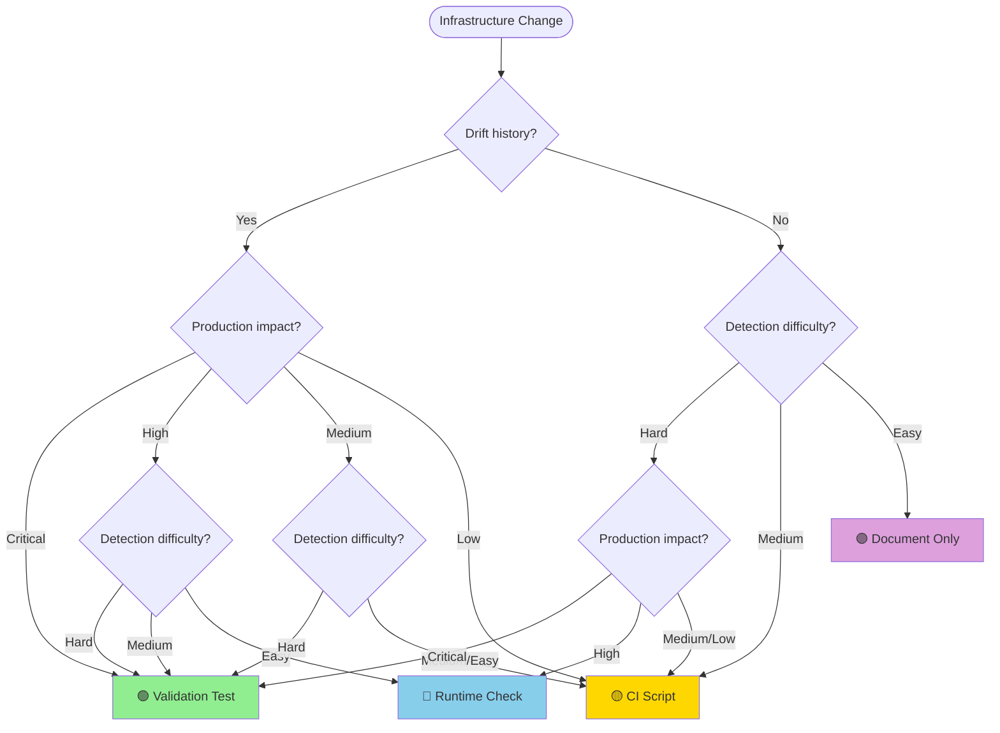

# Validation Test Decision Matrix

**Quick Reference Guide for Infrastructure Validation Strategy**

Use this matrix during task planning to quickly determine the appropriate validation approach.

## Decision Flowchart

## Quick Decision Table

| Drift History | Production Impact | Detection Difficulty | Recommendation                      |
| ------------- | ----------------- | -------------------- | ----------------------------------- |
| ✅ Yes        | 🔴 Critical       | Any                  | 🟢 **Validation Test**              |
| ✅ Yes        | 🟠 High           | 🔴 Hard              | 🟢 **Validation Test**              |
| ✅ Yes        | 🟠 High           | 🟡 Medium            | 🟢 **Validation Test**              |
| ✅ Yes        | 🟠 High           | 🟢 Easy              | 🔵 **Runtime Check**                |
| ✅ Yes        | 🟡 Medium         | 🔴 Hard              | 🟢 **Validation Test**              |
| ✅ Yes        | 🟡 Medium         | 🟡 Medium            | 🟡 **CI Script**                    |
| ✅ Yes        | 🟡 Medium         | 🟢 Easy              | 🟡 **CI Script**                    |
| ✅ Yes        | 🟢 Low            | Any                  | 🟡 **CI Script** or 🟣 **Document** |
| ❌ No         | 🔴 Critical       | 🔴 Hard              | 🟢 **Validation Test** (preventive) |
| ❌ No         | 🔴 Critical       | 🟡 Medium            | 🔵 **Runtime Check**                |
| ❌ No         | 🔴 Critical       | 🟢 Easy              | 🔵 **Runtime Check**                |
| ❌ No         | 🟠 High           | 🔴 Hard              | 🔵 **Runtime Check**                |
| ❌ No         | 🟠 High           | 🟡 Medium            | 🟡 **CI Script**                    |
| ❌ No         | 🟠 High           | 🟢 Easy              | 🟡 **CI Script**                    |
| ❌ No         | 🟡 Medium         | Any                  | 🟣 **Document Only**                |
| ❌ No         | 🟢 Low            | Any                  | 🟣 **Document Only**                |

## Common Scenarios

### Scenario 1: New ESLint Rule

- **Drift History:** ❌ No
- **Production Impact:** 🟡 Medium (CI failures)
- **Detection:** 🟢 Easy (linter catches it)
- **→ Recommendation:** 🟣 **Document + Code Review**

### Scenario 2: Monorepo Version Consistency

- **Drift History:** ✅ Yes (has drifted before)
- **Production Impact:** 🔴 Critical (breaks builds)
- **Detection:** 🔴 Hard (multiple files)
- **→ Recommendation:** 🟢 **Validation Test**

### Scenario 3: Environment Variables

- **Drift History:** ❌ No
- **Production Impact:** 🔴 Critical (app won't start)
- **Detection:** 🟢 Easy (clear error at startup)
- **→ Recommendation:** 🔵 **Runtime Check**

### Scenario 4: Package.json Scripts

- **Drift History:** ❌ No
- **Production Impact:** 🟢 Low (developer convenience)
- **Detection:** 🟢 Easy (manual check)
- **→ Recommendation:** 🟣 **Document Only**

### Scenario 5: TypeScript Config Consistency

- **Drift History:** ✅ Yes
- **Production Impact:** 🟠 High (compilation issues)
- **Detection:** 🔴 Hard (multiple files, complex options)
- **→ Recommendation:** 🟢 **Validation Test**

### Scenario 6: Build Output Structure

- **Drift History:** ❌ No
- **Production Impact:** 🟠 High (deployment issues)
- **Detection:** 🟡 Medium (check output directories)
- **→ Recommendation:** 🟡 **CI Script** + 🔵 **Runtime Check**

### Scenario 7: File Naming Conventions

- **Drift History:** ✅ Yes (caught violations)
- **Production Impact:** 🟡 Medium (test organization)
- **Detection:** 🟡 Medium (requires scanning)
- **→ Recommendation:** 🟢 **Thin Wrapper Test**

### Scenario 8: Documentation Completeness

- **Drift History:** ❌ No
- **Production Impact:** 🟢 Low (information quality)
- **Detection:** 🟢 Easy (visual inspection)
- **→ Recommendation:** 🟣 **Document Only** (code review)

## Impact Definitions

### 🔴 Critical Impact

- Application won't start
- Data loss or corruption
- Security vulnerabilities
- Complete feature breakage

### 🟠 High Impact

- Significant performance degradation
- Major feature degradation
- User-visible errors
- Build/deployment failures

### 🟡 Medium Impact

- Development workflow disruption
- CI/CD failures
- Non-critical feature issues
- Developer experience problems

### 🟢 Low Impact

- Documentation inconsistencies
- Cosmetic issues
- Optional optimizations
- Development convenience features

## Detection Difficulty Definitions

### 🔴 Hard to Detect

- Requires comparing multiple files across packages
- Involves complex patterns or regex
- Requires running application and observing behavior
- Affects only edge cases or specific conditions
- Not obvious from error messages

### 🟡 Medium Difficulty

- Requires checking 2-3 related files
- Involves straightforward comparisons
- Can be found with simple file search
- Some manual inspection needed

### 🟢 Easy to Detect

- Single file to check
- Obvious at application startup
- Caught by linter or TypeScript compiler
- Clear error messages guide to problem
- Visual inspection sufficient

## Validation Strategy Characteristics

### 🟢 Validation Test

- Full Vitest test suite
- Comprehensive assertions
- Can use fixtures and mocks
- Runs in CI pipeline
- Detailed failure diagnostics
- **Use when:** Proven drift + (Critical/High impact OR Hard detection)

### 🔵 Runtime Check

- Lightweight assertion at startup
- Fails fast with clear message
- Zero test maintenance
- Prevents bad config from running
- **Use when:** Critical/High impact + Easy detection + No drift history

### 🟡 CI Script

- Simple shell script
- Basic file checks
- No test framework overhead
- Easy to maintain
- **Use when:** Medium impact OR Low detection difficulty + Some drift concern

### 🟣 Document Only

- Clear documentation
- Manual code review verification
- No automated validation
- Lowest maintenance burden
- **Use when:** No drift history + Low impact + Easy detection

## Decision Checklist

When planning infrastructure changes, ask:

- [ ] **Has this type of config drifted before?**
  - Check git history for unintended changes
  - Review bug reports related to misconfiguration
  - Check task completion reports

- [ ] **What's the production impact if it drifts?**
  - Will the application fail to start?
  - Will users be affected?
  - Will builds/deployments break?

- [ ] **How difficult is manual detection?**
  - How many files need checking?
  - Is it obvious from error messages?
  - Does it require running the application?

- [ ] **Have I considered alternatives?**
  - Could documentation suffice?
  - Could a runtime check catch it?
  - Could a simple CI script work?

## Anti-Patterns to Avoid

❌ **Don't:**

- Create validation test by default for every infrastructure change
- Test implementation details with complex mocking
- Use test framework for simple file existence checks
- Add tests for first-time configs without drift history

✅ **Do:**

- Use decision framework to choose validation strategy
- Test behavior/outcomes, not implementation
- Use shell scripts for simple file system checks
- Start with lightweight approaches (doc → runtime → CI → test)

## Resources

- **Full Guide:**
  [Pragmatic Infrastructure Testing Guide](./pragmatic-infrastructure-testing-guide.md)
- **Testing Standards:** [Testing Standards](./testing-standards.md)
- **Comprehensive Guide:** [Comprehensive Testing Guide](./comprehensive-testing-guide.md)

---

**Quick Tip:** When in doubt, start with the lightest validation approach. You can always add more
comprehensive validation later if drift occurs.
